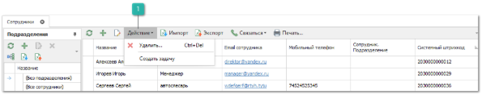

Справочник **Сотрудники** содержит список сотрудников организации.

Справочник имеет стандартный вид.

Панель действий содержит стандартные команды и некоторые уникальные.

 **Действие**

При вызове команды **Прочее** доступен новый пункт:

- **Создать задачу** – позволяет поставить задачу для определенного сотрудника, которые будут отображены в журнале Задачи.

Сотрудник может быть указан для учетной записи пользователя базы данных.

