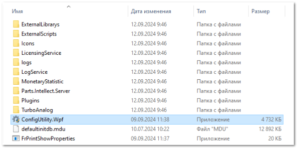
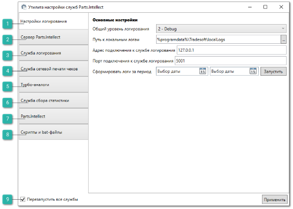
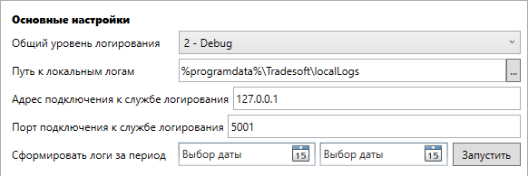
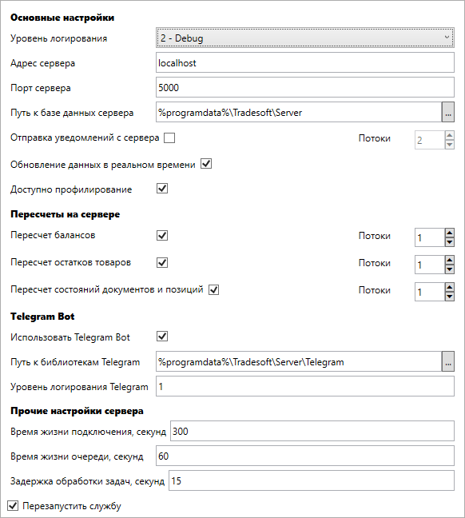
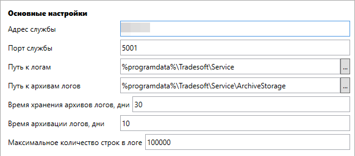
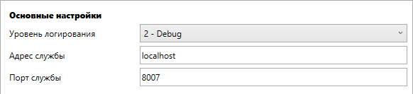
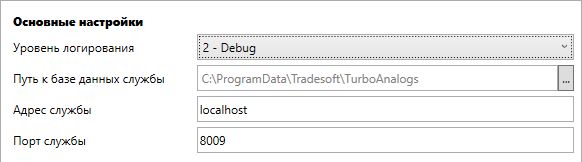
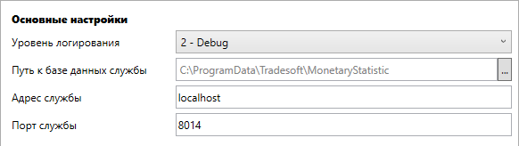
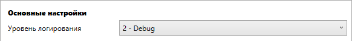
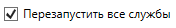

Позволяет упростить процесс настройки различных служб программы, а также, создавать и редактировать различные конфигурационные файлы служб **Parts.Intellect**, не прибегая к ручному редактированию файлов конфигурации.

При запуске утилиты открывается файл **ConfigUtility.Wpf.exe** из каталога **Parts.Intellect** 

Утилита содержит несколько вкладок. Каждая вкладка за настройку определенной службы и имеет собственные параметры:

 **Настройки логирования**

Блок содержит следующие параметры:

- **Общий уровень логирования** – указывается уровень детализации логов, по умолчанию задается значение – **1-Info**;

- **Путь к локальным логам** – указывается полный путь к папке с логами на компьютере. Настройка необходимая для ведения журнала логирования локально, по умолчанию задается значение – **%programdata%\Tradesoft\localLogs**;

- **Адрес подключения к службе логирования** – указывается IP-адрес устройства, на котором развернута служба логирования. Настройка необходимая для обмена сообщениями со службой, по умолчанию задается значение – **127.0.0.1**;

- **Порт подключения к службе логирования** – указывается порт компьютера в цифровой сети для обмена сообщениями со службой, по умолчанию задается значение – **5001** (также можно выбрать другой свободный порт).

 **Сервер Parts.Intellect**

Вкладка содержит следующие блоки настроек:

- **Основные настройки**:

    - **Уровень логирования** – указывается уровень детализации логов, по умолчанию задается значение – 1-Info;

    - **Адрес сервера** – указывается IP-адреса устройства, на котором установлен сервер Parts.Intellect, по умолчанию задается значение – 127.0.0.1;

    - **Порт сервера** – указывается порта сервера, по умолчанию задается значение – 5000;

    - **Путь к базе данных сервера** – указывается полный путь к папке, где расположена база данных сервера, по умолчанию задается значение – %programdata%\Tradesoft\Server;

    - **Отправка уведомлений с сервера** – регулирует отправку email и SMS уведомлений через сервер, по умолчанию отключен;

    - **Обновление данных в реальном времени** – регулирует автоматическое обновление информации в открытых окнах в реальном времени, по умолчанию включен;

    - **Доступно профилирование** – регулирует доступ к профилированию для сервера, по умолчанию включен.

- **Пересчеты на сервере**:

    - **Пересчет балансов** – регулирует автоматический пересчет балансов в программе в фоновом режиме, по умолчанию включен;

    - **Пересчет остатков товаров** – регулирует автоматический пересчет остатков товаров в программе в фоновом режиме, по умолчанию включен;

    - **Пересчет состояний документов и позиций** – регулирует автоматический пересчет состояний документов и позиций в программе в фоновом режиме, по умолчанию включен.

::: note Заметка

Параметры **Обновление данных в реальном времени**, **Пересчет балансов**, **Пересчет остатков товаров** и **Пересчет состояний документов и позиций** имеют параметр **Потоки** – количество параллельно обрабатываемых задач, количество заданное по умолчанию менять не рекомендуется.

:::

- **Telegram Bot**:

    - **Использовать Telegram Bot** – регулирует обмен сообщений в чат-боте Telegram, по умолчанию включен;

    - **Путь к библиотекам Telegram** – указывается путь к папке где хранятся библиотеки для Telegram, по умолчанию задается значение –  **%Programdata%\Tradesoft\Server\Telegram**;

    - **Уровень логирования Telegram** – уровень логирования библиотек Telegram, по умолчанию задается значение – **1**, ограничено пределами от 1 до 1023.

::: info Примечание

Для работы сервиса отправки уведомлений и сообщений через Telegram-бот необходимо:

- подключение дополнительной услуги. За подключением услуги обратитесь в отдел продаж Компании Tradesoft;

- созданный и настроенный Telegram-бот;

- установленный и подключенный **Сервер Parts.Intellect**.

Подробнее о работе модуля читайте в [руководстве пользователя](https://product-doc.tradesoft.ru/ai/telegram/index.htm).

:::

- **Прочие настройки сервера**:

    - **Время жизни подключения, секунд** – время существования подключения сервера к базе данных Parts.Intellect, по умолчанию задается значение – **300 секунд**, ограничено пределами от 30 до 3600 секунд;

    - **Время жизни очереди, секунд** – время существования очереди после обработки запроса, по умолчанию задается значение – **60 секунд**, ограничено пределами от 30 до 3600 секунд;

    - **Задержка обработки задач, секунд** – время задержки обработки незавершенных задач после перезапуска сервера, по умолчанию задается значение – **15 секунд**, ограничено пределами от 1 до 3600 секунд.

 **Служба логирования**

Вкладка содержит следующие опции:

- **Адрес службы** ­– указывается IP-адрес по которому запускается служба логирования, по умолчанию задается значение – **localhost**;

- **Порт службы** – указывается порт службы логирования, по умолчанию задается значение – **5001**;

- **Путь к логам** – указывается путь к папке, где хранятся архивы логов, по умолчанию задается значение – **%programdata%\Tradesoft\Service**;

- **Путь к архивам логов** – указывается путь к папке, где хранятся логи, записанные через службу логирования, по умолчанию задается значение – **%programdata%\Tradesoft\Service\ArchiveStorage**;

- **Время хранения архивов логов, дни** – указывается количество дней, через которое удаляются архивы логов, по умолчанию задается значение – **30 дней**, ограничено пределами от 7 до 365 дней;

- **Время архивации логов, дни** – указывается количество дней, через которое происходит архивация логов, по умолчанию задается значение – **10 дней**, ограничено пределами от 1 до 50 дней;

- **Максимальное количество строк в логе** – указывается количество строк, после которого будет архивироваться лог, по умолчанию задается значение – **100000 строк**, ограничено пределами от 10000 до 2147483647 строк.

 **Служба сетевой печати чеков**

` `

Вкладка содержит следующие опции:

- **Уровень логирования** – указывается уровень детализации логов, по умолчанию задается значение – **1-Info**;

- **Адрес службы** – указывается IP-адрес по которому запускается служба сетевой печати чеков, по умолчанию задается значение – **localhost**;

- **Порт службы** – указывается порт службы сетевой печати чеков, по умолчанию задается значение – **8007**.

 **Турбо-аналоги**

Вкладка содержит следующие опции:

- **Уровень логирования** – указывается уровень детализации логов, по умолчанию задается значение – **1-Info**;

- **Путь к базе данных службы** – указывается путь к папке, где расположена база данных службы Турбо-аналоги, по умолчанию задается значение– **C:\ProgramData\Tradesoft\TurboAnalogs**;

- **Адрес службы** – указывается IP-адрес по которому запускается служба Турбо-аналоги, по умолчанию задается значение – **localhost**;

- **Порт службы** – указывается порт службы Турбо-аналоги, по умолчанию задается значение – **8009**.

 **Служба сбора статистики**

Вкладка содержит следующие опции:

- **Уровень логирования** – указывается уровень детализации логов, по умолчанию задается значение – **1-Info**;

- **Путь к базе данных службы** – указывается путь к папке, где расположена база данных службы сбора статистики, по умолчанию задается значение– **C:\ProgramData\Tradesoft\MonetaryStatistic**;

- **Адрес службы** – указывается IP-адрес по которому запускается служба сбора статистики, по умолчанию задается значение – **localhost**;

- **Порт службы** – указывается порт службы сбора статистики, по умолчанию задается значение – **8014**.

 **Parts.Intellect**

Вкладка содержит параметр **Уровень логирования** – указывается уровень детализации логов, по умолчанию задается значение – **1-Info**.

 **Скрипты и bat-файлы**

Вкладка содержит параметр **Уровень логирования** – указывается уровень детализации логов, по умолчанию задается значение – **1-Info**.

 **Перезапустить все службы**

Позволяет перезапустить все службы при применении измененных параметров.

Чтобы перезапустить только отредактированные службы, сделайте следующее:

1. Выключите опцию **Перезапустить все службы**;

2. Включите опцию **Перезапустить службу** у тех служб, которые редактировали и которые нужно перезапустить.

::: info Примечание

При отсутствии части настроек файла конфигурации, нарушения структуры файла конфигурации или отсутствия файла конфигурации – утилита запускается и в разделе с ошибками применяются настройки по умолчанию.

:::

