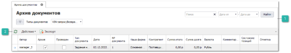

Данный журнал является хранилищем документов, которые закончили свой жизненный цикл. Для помещения документа в журнал **Архив** вручную следует воспользоваться командой над документом **Действие** – **Добавить в Архив выполненные документы**. В журнале расположены документы, помещенные в архив.

 **Блок фильтров**

Позволяет осуществить фильтрацию списка документов.

Панель действий содержит стандартные команды и некоторые уникальные.

 **Действие**

При вызове команды **Действие** доступны новые пункты:

- **Извлечь из архива** – позволяет восстановить документ из архива в случае необходимости;

- **Добавить в Архив выполненные документы** – позволяет добавить в архив все завершенные документы, согласно правилам перемещения в архив.

::: info Примечание

Перемещение документов в архив доступно при условии, что документы внесены в **Список документов для добавления в Архив** в меню **Управление** – **Настройки программы** – вкладка **Управление** – блок настроек **Документы**.

:::
Правила перемещения документов в **Архив**:

- **VIN-запросы** – проведен;

- **Возвраты от клиента** – долг 0%;

- **Возвраты поставщику** – долг 0%;

- **Задания на инвентаризацию** – состояние **Выполнено**;

- **Задания на отгрузку товара** – состояние **Выполнено**;

- **Задания на разбор товара** – состояние **Выполнено**;

- **Заказ-Наряды** – состояние **Закрыт** и долг по документу 0%;

- **Заказы клиента** – долг 0% и нет позиций в состояниях, отличных от: **Отказ клиента**, **Расход**, **Возврат клиента** и **Заказ-наряд** (ЗН должен быть в статусе "Закрыт");

- **Заказы поставщику** – долг 0% и нет позиций в состоянии **заказ поставщику**;

- **Наши заказы** – все позиции в состояниях, отличных от: **наш заказ на склад**, **заказ поставщику**, **отказ поставщика**;

- **Отгрузки на реализацию** – нет позиций в состоянии **на реализации**.

- **Отказы клиента**;

- **Отказы поставщика**;

- **Отмены резерва**;

- **Перемещения денежных средств** – состояние **Средства зачислены**;

- **Перемещения товара** – состояние **Товары приняты**;

- **Платежные поручения** – остаток по накладным 0;

- **Платежные поручения входящие** – остаток по накладным 0;

- **Приходные кассовые ордера** – остаток по накладным 0;

- **Приходные накладные** – долг 0% и нет позиций в состоянии: **приход**, **резерв**, **резерв из наличия**;

- **Расходные кассовые ордера** – остаток по накладным 0;

- **Расходные накладные** – долг 0%;

- **Резервирования** – нет позиций в состоянии: **резерв**.

Также процесс архивации документов можно автоматизировать, создав bat-файл и поместив его в Планировщик заданий Windows, чтобы помещение в архив происходило по расписанию (например, каждый вечер). При создании bat-файла указывается количество дней, которое должно пройти с момента проводки документа или перевода его в конечное состояние. А также список документов, которые требуется автоматически помещать в архив.