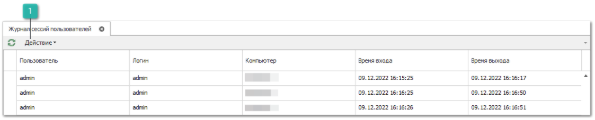
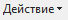

В журнале ведется информация о том, кто, когда, с какого компьютера вошел в базу данных и вышел из нее.

Панель действий содержит стандартные команды и некоторые уникальные.

 **Действие**

При вызове команды **Действие** доступен новый пункт:

- **Закрыть сессию** – позволяет завершить сеанс использования Parts.Intellect у выбранного пользователя.