Для создания нового документа **Заказ-наряд** выполните следующие действия:

**»**  В **Главном меню** выберите пункт **Автосервис** ► **Заказ-наряды**. Отобразятся элементы выбранного пункта.

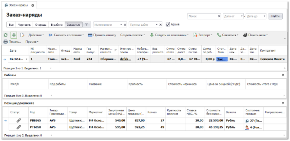

**»**  Для добавления нового документа нажмите кнопку **Новый** на панели управления. Отобразится окно инспектора для добавления нового заказ-наряда.

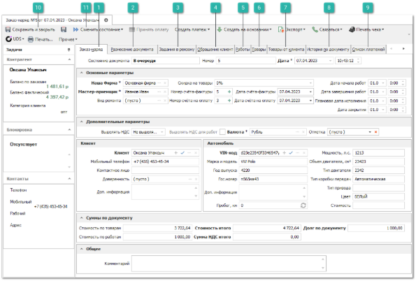

 **Заказ-наряд** 

На вкладке заполняются основные параметры документа, информация по клиенту и его автомобилю.

::: info Примечание

Поля **Клиент** и **VIN-код** связаны как друг с другом, так и с соответствующими справочниками программы. При выборе клиента и автомобиля, несвязанных ранее в программе и переводе документа в состояние **В очереди** или **В работе** произойдет их автоматическое связывание.

:::

 **Разнесение документа** 

На вкладке отображается список документов, доступных для разнесения (взаимозачета). Подробнее данный процесс описан в разделе **Разнесение оплат по документам**.

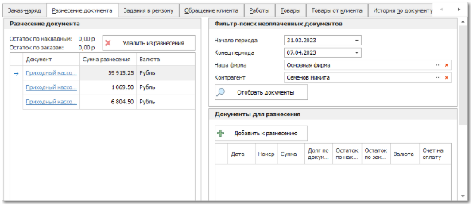

 **Задания в ремзону** 

На вкладке отображается список заданий в ремзону, которые прикреплены к данному документу.

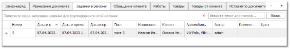

 **Обращение клиента** 

Позволяет заполнить **Неисправности со слов клиента** и по результатам осмотра, а также указать типовое изображение для акта осмотра автомобиля к **Заказ-наряду**. В случае необходимости заполнить особые отметки, а по завершению работ написать рекомендации к последующим ремонтам автомобиля.

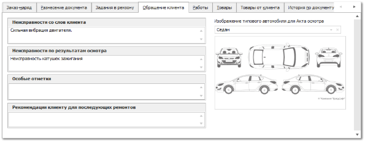

::: info Примечание

Значение из поля **Рекомендации клиенту для последующих ремонтов** отображается в колонке **Рекомендации** раздела **Автосервис ► Заказ-наряды**.

:::

 **Работы** 

На вкладке добавляются фиксированные и нормированные работы из справочника работ и/или через импорт файлов из AutoData.

Для ввода скидки на работы в валюте либо % используйте команду **Скидка, %**. Данная команда заполняет поле со скидкой в работах. Для ввода наценки на работы, используйте команду **Наценка, %**. Данная команда увеличивает стоимость работы на указанный %, влияя на стоимости работы относительно фиксированная стоимость работы, стоимости норма-часа (нормированная работа), коэффициентов сложности или квалификации.

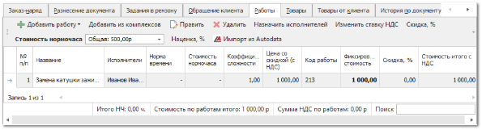

 **Товары** 

На вкладке добавляются товары, которые необходимы для наряда из наличия или из документа **Заказ клиента**.

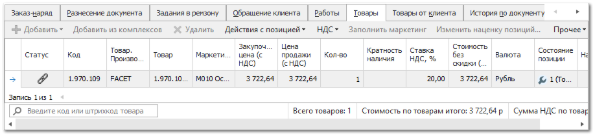

- **Добавить** – опция позволяет добавить товары в документ. Доступны следующие источники позиций:

    - **Из справочника** – позиция будет добавлена в документ без цен из справочника **Товары**;

    - **Из справочника через проценку –** позицию можно будет выбрать вначале в справочнике товаров, а затем она будет передана в **Проценку** для подбора предложений;

    - **Из проценки** – программа откроет окно Проценки для подбора позиций в документ;

    - **Из корзины** – позиции будут добавлены из корзины;

    - **Копия позиции** – создастся копия выделенной позиции документа;

    - **Копия заказов клиента** – все позиции **Заказа клиента** будут скопированы в **Заказ-наряд**;

    - **На основании заказов клиента** – документ будет создан на основании выбранного **Заказа клиента**;

    Данные по позиции заполняются автоматически на основе информации из родительского заказа клиента или источника, из которого происходило добавление. При необходимости, заполните/измените данные по позиции.

- **Добавить из комплексов** – позволяет добавить товар в соответствии с комплексом проводимых работ;

::: info Примечание

Задать соответствие комплекса проводимых работ и товаров, которые необходимы в процессе выполнения работ, можно в разделе **Автосервис ► Комплексы**.

:::

- **Заполнить маркетинг** – позволяет автоматически подставить информацию о позиции из существующих **Маркетингов**. Доступна подстановка:

    - **Закупочной цены** **(с НДС)** – цена закупа детали у поставщика;

    - **Цены продажи (с НДС)** – цена на товар с учетом маркетинга;

    - **Направления/ склада** – направление поставки или склад из прайс-листа;

    - **Приоритетного склада для списания** – склад, с которого требуется осуществлять списание товара;

    Заполнить маркетинг можно как для одной позиции из документа, нажав кнопку **Обновить**, так и для всех, нажав кнопку **Для всех** в открывшемся окне.

::: info Примечание

Функция **Заполнить маркетинг** в **Заказ-нарядах** доступна только для позиций с пустым полем **Маркетинг** из источника – **Прайс-лист наличия**.

Функция активна только для документов с состоянием **Черновик**.

:::

::: info Примечание

Для подстановки цен по позиции выполняется проценка с поиском позиции в источниках (из маркетинга, из наличия). Проценка осуществляется в 3 этапа, аналогичным при проценке в документе **Заказ клиента**.

:::

- **Приоритетный** **склад для списания** – с помощью данного поля указывается склад, с которого требуется осуществлять списание товара.

::: info Примечание

В разрешениях пользователя (**Управление ► Настройки программы ► Роли пользователей ► Разрешения для роли пользователей ►** группа **Автосервис ► Заказ-наряд** доступна опция **Списание/резервирование товаров со складов, отличных от приоритетного**, которая активирует проверку доступного количества товара на складе при проводке документа. Если количество товара из наличия недостаточно, то программа выдаст уведомление.

:::

Указать приоритетный склад для списания можно как в самой позиции документа, так и сразу для нескольких позиций с помощью команды **Действия с позицией** пункт **Приоритетный склад** на панели инструментов.

- **Наценка/ Скидка** – позволяет установить наценку, либо скидку на выделенные позиции;

На форме указывается от какой цены необходимо начислять наценку или скидку, а также размер скидки/ наценки: фиксированный; из карточки товара. Далее с помощью опции **применить правила округления валюты** можно округлить полученное значение.

 **Товары от клиента** 

На вкладке добавляются товары, предоставленные самим клиентом.

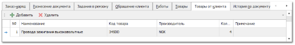

 **История по документу** 

На вкладке отображается история по документу, все переходы между состояниями и описание этих переходов.

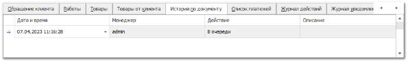

 **Список платежей** 

На вкладке отображаются платежи, привязанные к данному "Заказ-наряду".

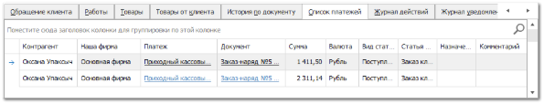

 **Сохранить и закрыть/Сохранить**

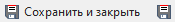

Позволяет сохранить и закрыть/сохранить документ без проводки.

 **Сменить состояние**

Позволяет осуществить проводку документа или отменить ее, в случае необходимости.  А так же добавить документ в архив или извлечь его из архива.

- **Черновик** – в этом состоянии документ наполняется информацией о клиенте, его автомобиле, причине обращения в автосервис, требуемых работах и сопутствующих товарах из наличия, из **Заказа клиента**, из **Проценки** и т.д. Если товар из документа полностью или частично отсутствует на доступных складах, то на основании **Заказ-наряда** можно создать **Заказ клиента** для заказа недостающих позиций. Документ в этом состоянии еще не вступил в силу и доступно редактирование всех его разделов;

- **Отказ клиента** *­–* если клиент дал отказ по **Заказ-наряду**, то документ переводится в состояние "отказ клиента". В дальнейшем по этому состоянию можно осуществлять аналитику: выяснять общие причины отказов и т.д.;

- **В очереди** *–* когда вся информация по **Заказ-наряду** занесена, документ можно переводить в очередь на выполнение. Некоторые из разделов документа становятся недоступными для редактирования. При переходе в это состояние товар списывается со склада. Сумма по документу отражается на балансах клиента и Нашей фирмы.;

- **В работе** *–* в случае согласия клиента на ремонт по **Заказ-наряду**, менеджер осуществляет приемку автомобиля и направляет автомобиль в ремзону, распечатываю сопутствующие печатные бланки (акт сдачи-приемки автомобиля, акт осмотра автомобиля, договор по заказ-наряду, задание на ремонт в ремзону);

::: info Примечание

При переводе в состояние **В очереди** или **В работе** выполняется проверка на заполнение обязательных полей в соответствии с настройкой **При переводе в очередь или в работу**.

:::

::: info Примечание

Проверка количества товара на соответствие кратности осуществляется при переводе в состояние **В очереди** или **В работе**.

:::

- **Работы приостановлены** *–* в случае, если дальнейшее продолжение работ невозможно по каким-либо причинам, **Заказ-наряд** переводится в состояние **Работы приостановлены** до устранения причин остановки. При этом позиции документа останутся зарезервированы под клиента;

- **Работы завершены** – как только работы по **Заказ-наряду** завершены, он переводится в состояние **Работы завершены**. Затем клиент оповещается о завершении работ по **Заказ-наряду** и приглашается на осмотр результатов и прием автомобиля;

- **Закрыт** *–* работы выполнены, клиент принял отремонтированный автомобиль. Доступна возможность оплатить **Заказ-наряд** или привязать уже существующие платежи. Возможность возврата в предыдущие состояния документа включается каждому пользователю индивидуально в разрешениях пользователя.

В разрешениях пользователя присутствует возможность указать доступные варианты переходов между состояниями документа. Например, рядовым сотрудникам разрешить только прямой путь документа: **Черновик, В очереди, В работе, Работы завершены, Закрыт**. И только руководителю направления дать право приостанавливать работы, возвращать закрытый документ в работу и т.д.

При переходе в состояния **В работе, Работы завершены, Закрыт** доступна возможность указать обязательные для заполнения свойства документа. Например, информация о клиенте, автомобиле, исполнителях работ и т.д.

**»**  Заполните необходимую информацию на вкладках документа.

**»**  Для того чтобы сохранить и закрыть документ (можно и без проведения) воспользуйтесь кнопкой **Сохранить и закрыть** (F2).

**»**  Для запуска документа в работу и далее, используйте смену состояния документа.

::: info Примечание

Для документов **Заказ-наряд** доступна возможность использовать функционал сервиса **UDS** по начислению/списанию баллов клиента, предоставлению скидки на товар и/или оказанные услуги.

Доступность данной функции определяется состоянием подписки и наличием подключенной услуги. Условия подключения можно узнать у наших менеджеров (контактные данные можно найти по адресу [www.tradesoft.ru/about/contacts](http://www.tradesoft.ru/about/contacts/)).

Подробнее о работе с сервисом **UDS** читайте в [руководстве пользователя](https://product-doc.tradesoft.ru/ai/uds/index.htm).

:::

::: details Читайте также

- [Документы Заказ-наряды](../../specification/avtoservis/zakaz-naryady.md)

- [Разнесение оплат по документам](../vzaimoraschety/raznesenie/ruchnoe_raznesenie_platezhej_na_dokumenty.md)

- [Интеграция с AutoData Online](./integratsiya_s_autodata_online.md)

- [Справочник Товары](../../specification/tovary_i_tseny/tovary/README.md)

- [Инструмент Проценка](../../specification/prodazhi/protsenka.md)

- [Нижнее меню - Корзина](../../specification/obshchie_printsipy/window/nizhnee_menju.md)

- [Справочник Комплексы](../../specification/avtoservis/kompleksy.md)

- [Прайс-лист наличия](../../specification/tovary_i_tseny/prajs_list_nalichija.md)

- [Работа с инструментом Проценка](../../work/protsenka/rabota_s_protsenkoj.md)

- [Создание нового заказа клиента](../../work/zakazy/formirovanie_zakaza/sozdanie_novogo_zakaza_klienta.md)

- [Настройки программы - Роли пользователей - Автосервис - Заказ-наряды](../../specification/upravlenie/nastrojki_programmy/roli_polzovatelej/avtoservis/zakaz-naryady.md)

- [Настройки программы - Настройки - Автосервис](../../specification/upravlenie/nastrojki_programmy/nastrojki/avtoservis.md)

- [Настройки программы - Настройки - Документы](../../specification/upravlenie/nastrojki_programmy/nastrojki/dokumenty.md)

:::