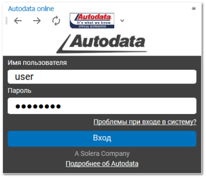
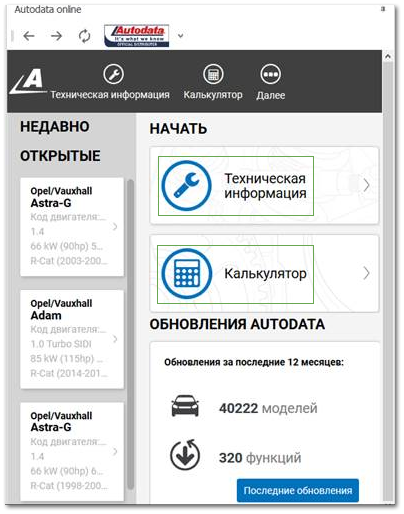
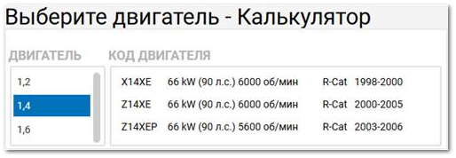
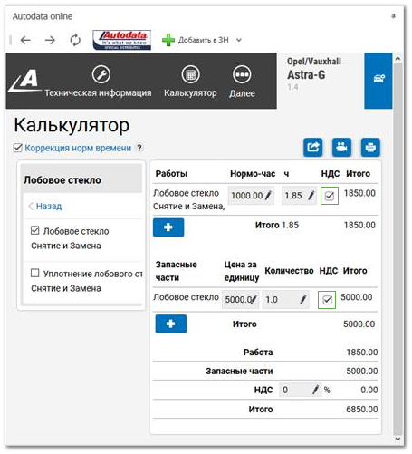

Инструмент, предоставляющий доступ к данным более 40 тыс. моделей от 142 производителей, позволяет сократить время на диагностику и ремонт авто. Сервис содержит виды работ по ремонту и диагностике автомобилей с указанием нормочасов.

В программе произведена интеграция модуля **Автосервис** с **AutoData Online**. На боковой панели доступна возможность войти под своею учетной записью в **AutoData Online** и осуществлять подбор работ в калькуляцию, а затем "в один клик" добавить подобранные работы из калькуляции в **Заказ-Наряд**.

**»**  При первом входе необходимо указать имя пользователя и пароль от Вашей учетной записи для сервиса **AutoData Online**.

::: info Примечание

C учетом особенностей предоставления доступа к ресурсу, после окончания работы с **AutoData Online**, необходимо воспользоваться кнопкой **Выход**.

:::

**»**  После авторизации доступен просмотр **Технической информации** об автомобиле и **Калькулятор** работ.

**»**  Затем необходимо уточнить дополнительную информацию по выбранному авто.

**»**  Далее в иерархии работ указываются галочкой требуемые работы. После этого выбранные работы передаются в калькуляцию.

**»**  Из калькуляции выбранные работы можно передать в **Заказ-наряд** с помощью команды **Добавить в ЗН** на панели инструментов вкладки. Если текущая вкладка в программе – инспектор заказ-наряда, то работы добавляются в него. Иначе, открывается новый заказ-наряд, в который попадают работы из калькуляции.