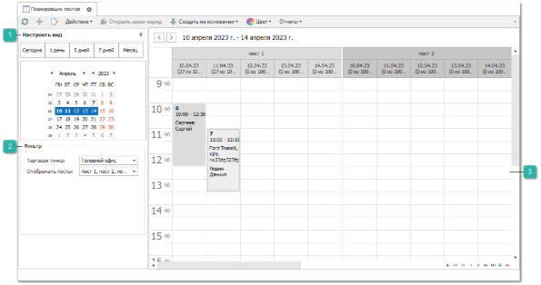

Инструмент **Планировщик постов** предназначен для управления загруженностью постов заданиями в ремзону. Инструмент поддерживает одновременную работу нескольких пользователей с обновлением информации в реальном масштабе времени (только для СУБД MS SQL). Например, в ремзоне можно повесить телевизор, на который выводить окно планировщика из Parts.Intellect на текущий день. Тем самым работники смогут в реальном времени видеть планируемую загрузку своих постов.

 **Настроить вид**

Позволяет отобразить в планировщике конкретный день, неделю, месяц, в зависимости от поставленной задачи. По умолчанию отображается текущий день.

 **Фильтр**

Позволяет выбрать торговую точку, планирование загрузки постов по которой будет осуществляться в инструменте, а также фильтр постов, который позволяет убрать из планировщика посты выбранной ТТ, планирование по которым не требуется в данный момент.

 **Рабочая область**

Содержит задания в ремзону, расположенные под постами во временной сетке. Временная сетка имеет шаг от 5 до 60 минут. Для изменения шага достаточно покрутить скролом мышки с зажатой кнопкой "CTRL", либо вызвать контекстное меню на обозначении шкалы времени.

Для создания заданий достаточно выделить требуемое количество ячеек времени и воспользоваться командой **Новый** (доступна по нажатию на правую кнопку мыши в рабочей зоне). При этом с уже созданными заданиями можно выполнять следующие действия:

- перемещать задание как внутри поста, так и между постами;

- изменять время исполнения задания, перемещая верхнюю или нижнюю границу элемента;

- копировать задания, перемещая их с зажатой кнопкой "CTRL";

- создавать на основании заданий документ. Команда расположена в контекстном меню, пункт **Создать на основании**;

- открывать **Заказ-наряды**, привязанные к заданиям, с помощью команды **Открыть заказ-наряд**.

- из планировщика можно расцветить **Задание в ремзону**, вызвав команду **Цвет** из контекстного меню;

- доступно построение отчета по **Загруженности постов** с помощью команды **Отчеты** на командной панели.