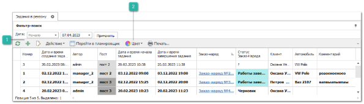
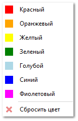
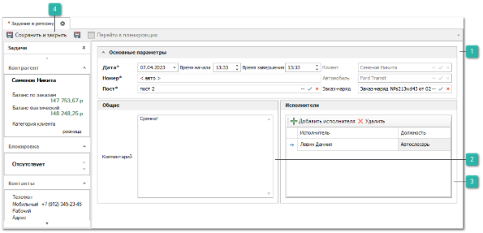
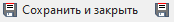

Для создания нового **Задания в ремзону** выполните следующие действия:

**»**  В **Главном меню** выберите пункт **Автосервис** ► **Задания в ремзону**. Отобразятся элементы выбранного пункта.

 **Новый**

Позволяет открыть инспектор для добавления нового документа.

 **Цвет**

Позволяет отметить документы цветом или снять отметку цветом.

**»**  Для добавления нового документа нажмите кнопку **Новый** на панели управления. Отобразится окно инспектора для добавления нового заказ-наряда.

 **Основные параметры**

Блок содержит параметры:

- **Дата –** позволяет указать дату проведения работ;

- **Время** **начала/завершения работ –** позволяет задать период времени когда будут выполняться работы;

- **Номер** – позволяет задать системный порядковый номер задания, не подлежит вводу и изменению;

- **Пост** – позволяет указать пост, для которого размещается задание;

- **Клиент** – позволяет указать клиента, для которого запланировано задание;

- **Автомобиль** – позволяет указать автомобиль для которого запланировано задание. Если выбран клиент, то при выборе автомобиля срабатывает фильтр по выбранному клиенту;

- **Заказ-наряд** – позволяет указать связь с документом **Заказ-наряд**. Если выбран документ **Заказ-наряд**, то клиент и автомобиль из **ЗН** заменяют клиента и автомобиль из задания, а также блокируется их смена в задании.

 **Общие**

Блок содержит поле **Комментарий** – произвольный текстовый комментарий к документу.

 **Исполнители**

Позволяет указать исполнителей работ.  При нажатии на кнопку **Добавить исполнителя**, открывается справочник сотрудников для выбора исполнителя. Кнопка **Удалить** позволяет удалить добавленного ранее исполнителя из документа.

 **Сохранить и закрыть/сохранить** 

Позволяет сохранить и закрыть/сохранить документ.

**»**  Заполните необходимые данные на форме задания (поля, выделенные жирным шрифтом обязательные для заполнения):

**»**  Для того чтобы сохранить и закрыть документ (можно и без проведения) воспользуйтесь кнопкой **Сохранить и закрыть** (F2).

::: info Примечание

К ограничениям заданий в ремзону можно отнести то, что:

Допускается создавать и изменять задания в рамках текущих суток и в будущем. Но это ограничение можно снять, если в разрешениях пользователя для документа **Задание в ремзону** включить соответствующее разрешение. Тем самым можно разрешить пользователю управлять заданиями в прошлом (создавать и изменять);

- Допускается создавать задания в рамках одних суток (времени работы поста), без перехода на следующий день. Если задание распространяется на более чем один день, то необходимо создавать отдельные задания.

:::

::: details Читайте также

- [Документы Заказ-наряды](../../specification/avtoservis/zakaz-naryady.md)

- [Настройки программы - Роли пользователей - Автосервис - Задания в ремзону](../../specification/upravlenie/nastrojki_programmy/roli_polzovatelej/avtoservis/zadaniya_v_remzonu.md)

:::