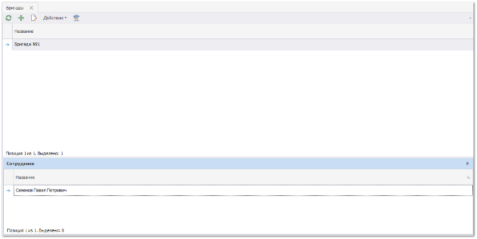
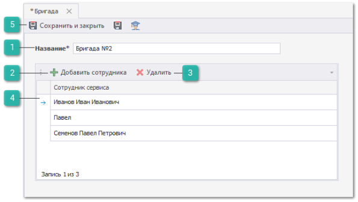

Для создания новой бригады сотрудников выполните следующие действия:

**»** В **Главном меню** выберите пункт **Автосервис** ► **Справочники** ► **Бригады**. Отобразятся элементы выбранного пункта.

**»** Для добавления новой бригады нажмите кнопку **Новый** на панели управления. Отобразится окно инспектора для добавления нового состава бригады.

 **Название**

Позволяет указать наименование бригады.

 **Добавить сотрудника**

Позволяет добавить сотрудника в табличную часть. Выбор производится из справочника **Сотрудники** раздела **Управление ► Справочники**.

 **Удалить**

Позволяет удалить выделенные записи из табличной части.

 **Табличная часть**

Отображает сотрудников находящихся в данной бригаде.

 **Панель действий**

Содержит следующие команды:

- **Сохранить и закрыть/Сохранить** – позволяет **Сохранить и закрыть** или **Сохранить** запись в справочник **Бригады**;

- **Помощь** – позволяет открыть руководство пользователя на странице описания раздела **Бригады**.

::: details Читайте также

- [Справочник Бригады](../../../specification/avtoservis/spravochniki/brigady.md)

:::