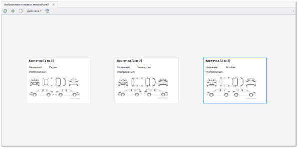
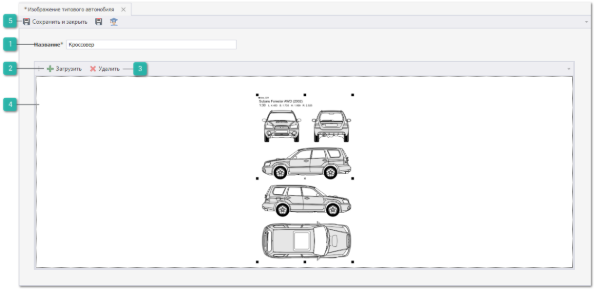
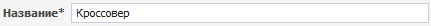
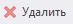
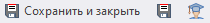

Для добавления изображения типового автомобиля выполните следующие действия:

**»** В **Главном меню** выберите пункт **Автосервис** ► **Справочники** ► **Изображения типовых автомобилей**. Отобразятся элементы выбранного пункта.

**»** Для добавления нового изображения нажмите кнопку **Новый** на панели управления. Отобразится окно инспектора для добавления нового изображения.

 **Название**

Позволяет указать наименование изображения автомобиля.

 **Загрузить**

Отображает системное окно для выбора изображения. После выбора данное изображение отображается в поле **Изображение**.

 **Удалить**

Позволяет удалить загруженное изображение.

 **Изображение**

Отображает загруженное изображение.

 **Панель действий**

Содержит следующие команды:

- **Сохранить и закрыть/Сохранить** – позволяет **Сохранить и закрыть** или **Сохранить** запись в справочник **Изображения типовых автомобилей**; 

- **Помощь** – позволяет открыть руководство пользователя на странице описания раздела **Изображения типовых автомобилей**.

::: note Замечание

Наименование типа и изображение после создания будет доступно к выбору в документе **Заказ наряды** раздела **Автосервис** на вкладке **Обращение клиента**.

:::

::: details Читайте также

- [Общие принципы работы в системе](../../../specification/obshchie_printsipy/README.md)

:::