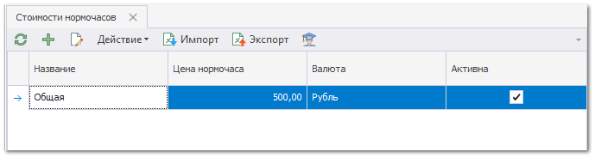
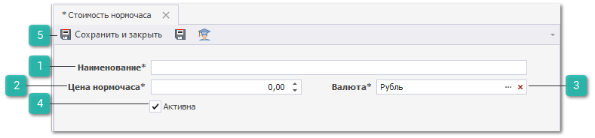
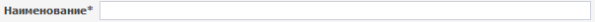
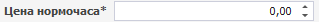
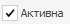

Для создания новой стоимости нормочасов выполните следующие действия:

**»** В **Главном меню** выберите пункт **Автосервис** ► **Справочники** ► **Нормочасы**. Отобразятся элементы выбранного пункта.

**»** Для добавления новой стоимости нажмите кнопку **Новый** на панели управления. Отобразится окно инспектора для добавления нового документа.

 **Наименование**

Наименование стоимости нормочаса.

 **Цена нормочаса**

Цена стоимости нормочаса.

 **Валюта**

Валюта стоимости нормочаса.

 **Активна**

Позволяет активировать запись для выбора в других источниках. При отключении данного параметра запись не будет отображаться.

 **Панель действий**

Содержит следующие команды:

- **Сохранить и закрыть/Сохранить** – позволяет сохранить и закрыть/сохранить запись в справочник **Нормочасы**;

- **Помощь** – позволяет открыть руководство пользователя на странице описания раздела **Нормочасы**.

::: note Замечание

Записи справочника после создания будут доступны к выбору в поле **Стоимость нормочаса** документа **Заказ наряды** раздела **Автосервис** на вкладке **Работы**.

:::

::: details Читайте также

- [Справочник Нормочасы](../../../specification/avtoservis/spravochniki/normochasy.md)

- [Заказ-наряды](../../../specification/avtoservis/zakaz-naryady.md)

:::