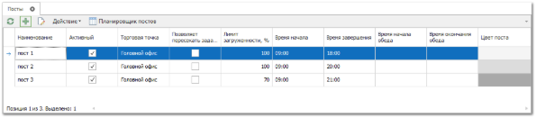
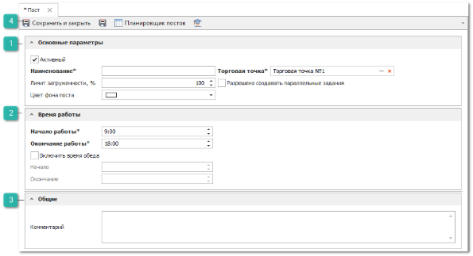

Для создания нового поста выполните следующие действия:

**»** В **Главном меню** выберите пункт **Автосервис** ► **Справочники** ► **Посты**. Отобразятся элементы выбранного пункта.

**»** Для добавления нового поста нажмите кнопку **Новый** на панели управления. Отобразится окно инспектора для добавления нового документа.

 **Основные параметры**

Блок содержит параметры:

- **Активный** – опция включения и выключения поста из работы;

::: note Пример

Когда пост становится неактуальным (один из подъемников упразднили в пользу диагностического стенда), необходимо выключить активность поста. Тем самым при выборе постов в заданиях, планировщике и т.д. – пост не будет присутствовать в предлагаемом списке

:::

- **Наименование** – наименование поста. Наименование должно быть уникальным в рамках одной торговой точки;

- **Торговая точка** – торговая точка, к которой относится пост. Каждый пост принадлежит одной торговой точке;

- **Лимит загруженности** – допустимый максимум загрузки поста по времени в течении рабочего дня. По умолчанию, 100%; 

::: note Пример

Необходимо запретить добавлять новые задания, когда загрузка поста по времени в течении дня превысила 80% (20% запас на незапланированные обстоятельства, внутренние работы и т.д.), то указывается требуемый лимит 80%.

:::

::: note Замечание

Регулировать возможность создавать задания в ремзону в обход ограничений лимита можно с помощью опции **Разрешено создавать задания вне рабочего времени** в меню **Управление ► Настройки программы ► Роли пользователей ► Разрешения для роли пользователей ►** группа **Автосервис ► Задания в ремзону**.

:::

- **Разрешено создавать параллельные задачи** – опция, по умолчанию выключена. Если опция включена, то допускается размещение нескольких заданий поста параллельно по времени;

- **Цвет фона поста** – указывается цвет фона поста в планировщике.

 **Время работы**

Блок содержит параметры:

- **Начало работы** – время начала работы поста, т.е. с какого времени допускается добавлять задания;

- **Окончание работы** - время конца работы поста, т.е. до какого времени допускается добавлять задания;

- **Включить время обеда** - позволяет добавить обеденное время для поста; 

- **Начало** -  время начала обеденного времени поста;

- **Окончание** - время окончания обеденного времени постав.

::: note Замечание

Время обеда должно входить в границы времени работы, не пересекаясь с ними.

:::

 **Общие**

Блок содержит поле **Комментарий** – произвольный текстовый комментарий к посту.

 **Панель действий**

Содержит следующие команды:

- **Сохранить и закрыть/Сохранить** – позволяет сохранить и закрыть/сохранить мастер создания поста, с последующим добавление новой записи в справочник **Посты**;

- **Планировщик постов** – позволяет открыть **Планировщик постов**;

- **Помощь** – позволяет открыть руководство пользователя на странице описания раздела **Посты**.

::: details Читайте также

- [Справочник Посты](../../../specification/avtoservis/spravochniki/posty.md)

:::