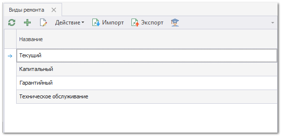
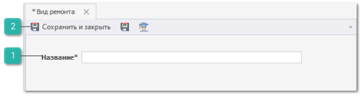

Для создания нового вида ремонта выполните следующие действия:

**»** В **Главном меню** выберите пункт **Автосервис** ► **Справочники** ► **Виды ремонта**. Отобразятся элементы выбранного пункта.

**»** Для добавления нового вида ремонта нажмите кнопку **Новый** на панели управления. Отобразится окно инспектора для добавления нового документа.

 **Название**

Позволяет указать наименование вида работ.

 **Панель действий**

Содержит следующие команды:

- **Сохранить и закрыть/Сохранить** – позволяет сохранить и закрыть/сохранить запись в справочник **Виды ремонта**;

- **Помощь** – позволяет открыть руководство пользователя на странице описания раздела **Виды ремонта**.