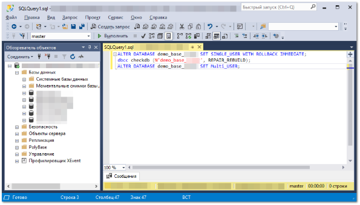

При работе с базами данных в случае сбоев в работе сервера (выход из строя жесткого диска и другого оборудования, сбой электросети, программные ошибки операционной системы и т.д.) может возникнуть ситуация, когда часть данных не сохраняется в базу, не считывается и т.п. СУБД, как правило, самостоятельно пытается решить такие проблемы, но не всегда успешно, поэтому настоятельно рекомендуется регулярно создавать резервные копии баз данных, периодически проверять резервные копии, а также проверять целость базы (рекомендуется выполнять проверку минимум раз в месяц).

::: warning Внимание!

Перед выполнением действий, описанных в данном разделе, необходимо создать резервную копию базы данных.

:::

Для проверки целостности базы данных выполните следующие действия:

**»** Запустите Microsoft SQL Management Studio, перейдите в раздел **Базы данных**, выберите необходимую базу и выполните команду **Создать запрос**, откроется окно для ввода SQL-запроса.

::: warning Внимание!

Все пользователи, работающие с базой, обязательно должны выйти из программы.

:::

**»** Выполните следующий запрос: "dbcc checkdb" – проверяет логическую и физическую целостность всех объектов в выбранной базе данных.

Если в результате выполнения запроса на проверку целостности базы выявлены ошибки, необходимо выполнить следующие действия в Microsoft SQL Management Studio:

**»** В открытом ранее окне для ввода SQL-запроса выполните следующий скрипт :

`ALTER DATABASE ИМЯ\_БД SET SINGLE\_USER WITH ROLLBACK IMMEDIATE; dbcc checkdb (N'ИМЯ\_БД', REPAIR\_REBUILD); ALTER DATABASE ИМЯ\_БД SET Multi\_USER;`

::: warning Внимание!

Все пользователи, работающие с базой, обязательно должны выйти из программы.

:::

::: note Замечание

При выполнении данного скрипта нельзя гарантировать 100% вероятность решения, результат зависит от степени повреждения базы данных.

:::

Если при выполнении скрипта произошли ошибки, то рекомендуется восстановить базу данных из резервной копии и продолжить работу в восстановленной базе.

::: info Примечание

Резервная копия базы данных должны создаваться регулярно и периодически проверяться.

:::

Если необходимо продолжить работу в поврежденной базе данных, в Microsoft SQL Management Studio для нее необходимо дополнительно выполнить запрос:

`ALTER DATABASE ИМЯ\_БД SET Multi\_USER;`

::: details Читайте также

- [Создание резервной копии базы данных MS SQL](../../../guide/database/backup_database/sozdanie_rezervnoj_kopii_bazy_dannyh_ms_sql.md)

- [Восстановление базы данных из резервной копии MS SQL](../vosstanovlenie/vosstanovlenie_bd_iz_rezervnoj_kopii_ms_sql.md) 

:::