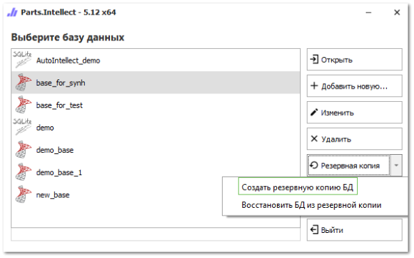

При работе с любым, даже технически совершенным, оборудованием или программным обеспечением существует вероятность сбоев, которые могут привести к потере информации:

- физический дефект или поломка жесткого диска;

- сбои операционных систем;

- вирусы;

- стихийные бедствия (пожар, наводнение, сбои в сети электропитания);

- небрежное обращение, послужившее причиной непреднамеренного разрушения данных со стороны операторов или пользователей системы;

- незаконные действия третьих лиц (кража, порча);

- и т.п.

Поэтому необходимо отнестись со всей ответственностью к защите рабочих баз данных. Настоятельно рекомендуется регулярно создавать резервные копии (далее РК) важной для Вас информации. Это займет всего пару минут в день, но застрахует Ваш бизнес от досадных неприятностей. Обязательно при этом стоит помнить, что РК необходимо размещать "в дали" от основной базы. Если РК находятся на том же винчестере, что и основная база, то поломка винчестера "заберет" и основную базу, и все РК. Для предотвращения этого сценария, необходимо (в порядке повышения надежности): размещать РК на другом винчестере; на внешнем диске; на другом компьютере в сети: локальной сети в офисе, FTP-сервере в интернете, облачном диске.

Управление резервными копиями базы данных в программе предусмотрено через **Мастер работы с резервными копиями БД**.

Для имеющихся БД (строк подключения) доступна возможность создания резервных копий, либо создание bat-файлов для автоматизированного создания РК баз по расписанию. Для этого необходимо выделить базу данных (строку подключения) в **Стартовом окне**, нажать на кнопку **Резервная копия** и в раскрывающемся списке выбрать команду **Создать резервную копию БД**.

Также для БД доступна возможность восстановления из резервной копии, при наличии РК для данной БД (причем резервные копии подходят только для той СУБД, на которой они были сделаны). При этом требуется действующее подключение к БД в списке подключений. По информации из подключения к БД программа определяется дополнительную информацию для восстановления, предварительно остановив веб-службу.