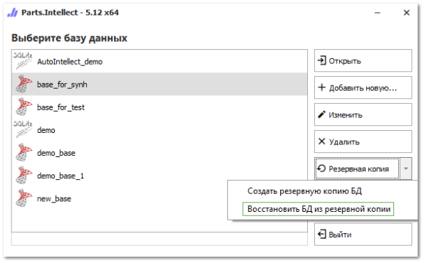
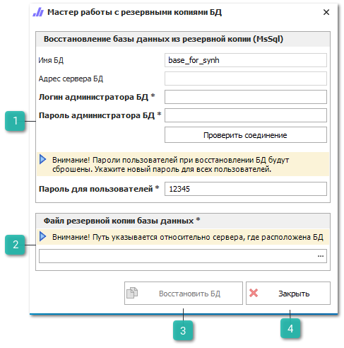

Если произошел серьезный сбой, и информация о подключении утеряна, БД можно восстановить из резервной копии (при ее наличии), для этого необходимо:

**»** Создать новую БД с именем, отличным от имени восстанавливаемой БД. Отличающиеся имена являются обязательным условием.

**»** Выделить требуемую БД (строку подключения), нажать на кнопку **Резервная копия** и в раскрывающемся списке выбрать команду **Восстановить БД из резервной копии**.

**»** Откроется окно **Мастер работы с резервными копиями БД** для базы MS SQL.

 **Восстановление базы данных из резервной копии (MsSql)**

Блок позволяет указать данные, необходимые для восстановления базы данных:

- **Имя БД** – наименование базы данных;

- **Адрес сервера БД** – IP-адреса устройства, на котором установлен сервер базы данных;

- **Логин администратора БД** – логин учетной записи администратора базы данных, для подключения к ней;

- **Пароль администратора БД** – пароль от учетной записи администратора базы данных, для подключения к ней;

::: warning Внимание!

Логин и пароль администратора SQL Сервера хранятся в открытом виде.

:::

- Кнопка **Проверить соединение** – позволяет осуществить проверочное соединение к базе данных;

- **Пароль для пользователей** – новый пароль для пользователей БД.

::: info Примечание

Восстановить прежние пароли для пользователей системы не представляется возможным ввиду текущей политики безопасности. Новый пароль будет служить всем пользователям для входа в восстановленную БД. В дальнейшем его необходимо сменить для каждого пользователя индивидуально.

:::

 **Файл резервной копии базы данных**

Позволяет указать расположение файла резервной копии базы данных. Файл указывается относительно компьютера, где расположен SQL Сервер и база данных. 

 **Восстановить БД**

Позволяет выполнить восстановление резервной копии базы данных.

::: warning Внимание!

После восстановления БД из резервной копии в некоторых случаях авторизация становится невозможной. В данной ситуации требуется запустить процедуру восстановления существующей базы в режиме миграции в мастере создания баз данных.

:::

 **Закрыть**

Позволяет закрыть окно **Мастера работы с резервными копиями БД**.

**»** В диалоговом окне, в блоке **Создание резервной копии баз данных**, заполните информацию необходимую для подключения к базе данных. После заполнения данных нажмите кнопку **Проверить соединение** на панели инструментов инспектора. В случае, если соединение не установлено, проверьте корректность введенных данных и повторите проверку.

**»** В поле ввода **Пароль для пользователей**, укажите новый пароль для всех существующих пользователей базы данных.

**»** В блоке **Файл резервной копии базы данных**, укажите адрес расположения резервной копии базы данных.

**»** Нажмите кнопку **Восстановить БД**. Восстанавливаемая БД будет заменена файлом резервной копии.

::: details Читайте также

- [Установка MS SQL Сервера и создание базы данных на нем](../../../guide/database/create_database/ustanovka_ms_sql_servera_i_sozdanie_bazy_dannyh_na_nem.md)

- [Восстановление базы данных MS SQL и PostgreSQL в режиме миграции](./vosstanovlenie_bd_v_rezhime_migratsii.md) 

:::