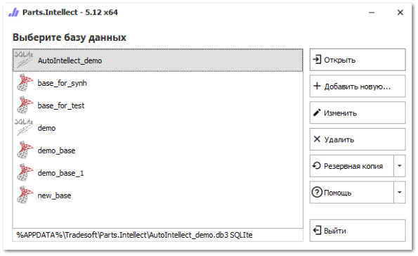
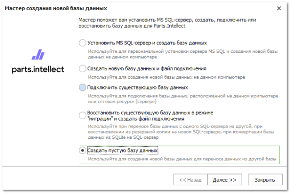
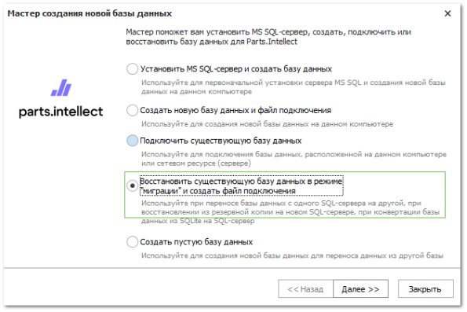

При переносе базы данных с одного SQL Сервера на другой, при восстановлении базы данных из резервной копии на новом SQL-сервере, при конвертации базы данных из SQLite в SQL версию существует процедура восстановления базы данных в режиме "миграции".

**»** Подготовьте файл резервной копии базы данных и разместите на компьютере, где установлен SQL-сервер.

**»** Запустите программу с ярлыка на рабочем столе **Parts.Intellect** (от имени администратора), либо через меню **Пуск ► Все программы ► Parts.Intellect ► Запустить Parts.Intellect**. Откроется **Стартовое окно** программы со списком подключений к базам данных, доступным в программе.

**»** Нажмите кнопку **Добавить новую** и выберите пункт **Создать пустую базы данных**. Пройдите процедуру, аналогичную простому созданию новой базы.

**»** Далее восстановите резервную копию в новую пустую базу, которую только что создали через команду **Резервная копия**.

**»** После завершения процедуры восстановления, удалите базы из списка подключений и выполните миграцию данных. Нажмите кнопку **Добавить новую** и выберите пункт **Восстановить существующую базу данных в режиме** "**миграции**" **и создать файл подключения**.

**»** Программа произведет сброс настроек базы данных и создаст файл подключения.

**»** Для подключения к базе данных выберите необходимую строку и нажмите кнопку **Открыть**.

::: details Читайте также

- [Установка MS SQL Сервера и создание базы данных на нем](../../../guide/database/create_database/ustanovka_ms_sql_servera_i_sozdanie_bazy_dannyh_na_nem.md)

- [Восстановление базы данных из резервной копии MS SQL](./vosstanovlenie_bd_iz_rezervnoj_kopii_ms_sql.md) 

:::