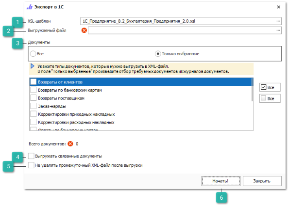
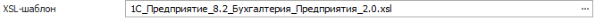
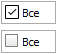
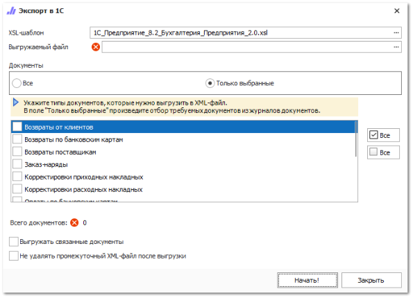
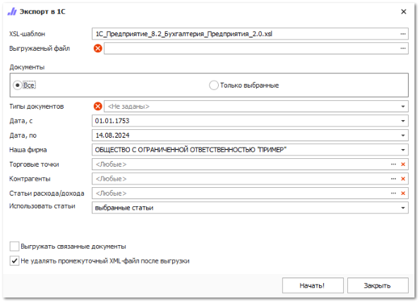
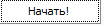
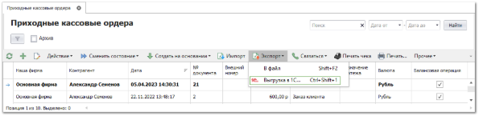
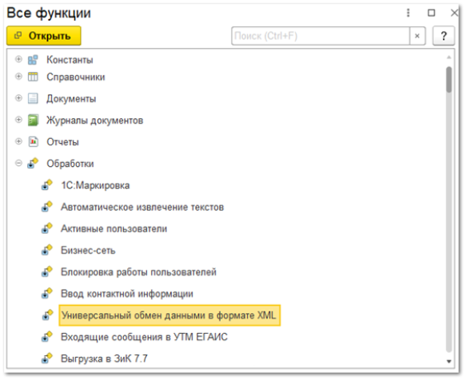
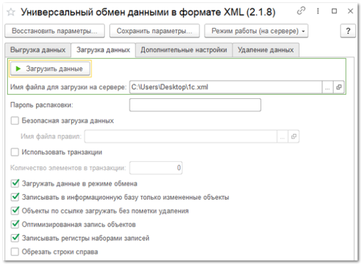
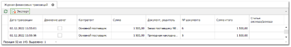

Интеграция с программой 1С Бухгалтерия осуществляется на уровне экспорта и импорта документов из программы Parts.Intellect в программу 1**С:Бухгалтерия предприятия**.

Наиболее удобным вариантом передачи документов с хозяйственными операциями является инструмент **Выгрузка в 1С Бухгалтерия**. В выгрузку попадают проведенные документы, в том числе архивные, отобранные в соответствии с настройками фильтров.

Для формирования XML файла выполните следующие действия:

**»** В разделе **Финансы** выберите пункт **Выгрузка в 1С Бухгалтерия**. В **Рабочей области** появятся элементы выбранного пункта.

 **XSL-шаблон**

Позволяет выбрать конфигурацию, определяющую формат и правила выгрузки ([XSL-шаблон](http://ru.wikipedia.org/wiki/XSL)).

Вместе с программой поставляется XSL-шаблоны, совместимые с:

- 1С Платформой 8.2, конфигурацией Бухгалтерия предприятия 2.0;

- 1С Платформой 8.2, конфигурацией Бухгалтерия предприятия 3.0.17.11;

- 1С Платформой 8.2, конфигурацией Бухгалтерия предприятия 3.0.24.11;

- 1С Платформой 8.2, конфигурацией Бухгалтерия предприятия 3.0.35.28;

- 1C Предприятие 8.3, конфигурацией Бухгалтерия предприятия 3.0.52.42;

- 1C Предприятие 8.3, конфигурацией Бухгалтерия предприятия 3.0.67.63;

- 1C Предприятие 8.3, конфигурацией Бухгалтерия предприятия 3.0.71.89;

- 1C Предприятие 8.3, конфигурацией Бухгалтерия предприятия 3.0.77.89.

Шаблоны расположены:

`%ProgramData%\Tradesoft\Parts.Intellect\XslTo1CXml`

 **Выгружаемый файл**

Позволяет указать путь, по которому будет расположен итоговый файл выгрузки.

 **Документы**

Позволяет указать какие документы необходимо выгрузить:

- **Только выбранные** – в рабочем окне необходимо выбрать тип и список выгружаемых документов, кнопки  позволяют установить/снять отметки на все документы. В результате выгружаться будут только выбранные документы.

- **Все** – в рабочем окне необходимо выбрать типы документов для выгрузки из программы **Parts.Intellect**. По итогу выгружаться будут все документы выбранных типов в соответствии с заданными параметрами.

Параметры выгрузки:

- **Типы документов** – позволяет отметить необходимые для выгрузки типы документов;

::: info Примечание

Документ **Корректировка приходных накладных** доступен для выгрузки только в XLS-шаблонах с конфигурацией Бухгалтерии предприятия 3.0.71.89 и выше.

Документ **Заказ-наряд** доступен для выгрузки только в XLS-шаблонах с конфигурацией Бухгалтерии предприятия 3.0.77.89 и выше.

При выгрузке **Заказ-нарядов** выгружаются документы только в статусе **Закрыт**. Отбор документов для выгрузки ведется по параметру **Дата закрытия** и заданному **Диапазону дат**. Из документа будет загружен общий перечень товаров с указанием оказанной в рамках заказ-наряда услуги.

Выбор услуги, которая будет загружена в **1С** на общую стоимость работ по документу **Заказ-наряд**, осуществляется с помощью настройки **Услуга для выгрузки работ по ЗН в 1С**.

:::

- **Дата, с/Дата, по** – позволяет указать период за который необходимо выгрузить документов;

- **Наша фирма** – позволяет выбрать нашу фирму;

- **Торговые точки** – позволяет выбрать торговые точки, с которых необходимо осуществить выгрузку документы;

::: info Примечание

Для выбора доступны торговые точки с типом **Торговая точка / склад** с учетом разрешения **Список складов/ТТ, доступных для работы** (меню **Управление ►** **Настройки программы ► Роли пользователей ► Разрешения для роли пользователей ►** группа **Словари ► Склады/Торговые точки**).

:::

- **Контрагенты** – позволяет выбрать контрагентов, в контексте всех контрагентов, набора контрагентов, либо конкретного контрагента;

- **Статьи расхода/дохода** – позволяет указать список статей** расхода/дохода;

- **Использовать статьи** – позволяет указать правило выгрузки по статьям расходов/доходов, доступны значения: выбранные стать, кроме выбранных.

 **Выгружать связанные документы**

Позволяет вместе с выбранными документами выгружать другие, связанные с ними документы. Связанные документы выгружаются при условии, что они проведены, а **Заказ-наряды** имеют статус **Закрыт**.

::: warning Внимание!

Значения всех фильтров в параметрах выгрузки влияют только на отбор первоначальных документов, все связанные документы выгружаются без учета данных фильтров. Например, в выгрузку могут добавится товарные документы, даже если они не попали в заданный диапазон дат, или финансовые документы со статьями расхода/дохода, исключенными при фильтрации.

:::

::: info Примечание

Для товарных документов выгружаются связанные с ними финансовые и товарные документы (предшествующие и последующие). Далее для всех связанных товарных документов выгружаются все связанные финансовые документы.

Для финансовых документов не происходит выгрузка связанных с ними документов.

:::

 **Не удалять промежуточный XML-файл после выгрузки** 

Промежуточный XML-файл содержит первичную информацию, которая впоследствии обрабатывается XSL-шаблоном для получения XML-файла, пригодного для импорта в **1С**. Включайте эту опцию только в случае, если предполагаете разрабатывать свою собственную конфигурацию выгрузки (XSL-шаблон). По умолчанию опция выключена.

 **Начать**

Позволяет запустить процесс выгрузки документов.

**»** Задайте параметры выгружаемого файла, а так же отметьте необходимые для выгрузки документы.

::: warning Внимание!

Важным моментом является обязательность заполнения **Международного кода** валюты выгружаемых документов. Если код не заполнен, выгрузка будет прервана. Редактирование **Валют** производится в меню **Финансы ► Валюты и курсы**.

:::

::: info Примечание

При выгрузке данных производится очистка от непечатаемых символов.

:::
Экспорт в **1С** также можно выполнить непосредственно из списка документов определенного типа (**РН**, **ВК**, **ВП**, **ЗН**, **Перемещение товара**, **ВБК**, **ОБК**, **ПКО**, **РКО**, **ПН**, **Кор. прихода**, **Кор. расхода**) либо из самого документа. Экспорт производится при выполнении команды на панели инструментов **Экспорт ► Выгрузка в 1С**.

Импорт сформированного XML-файла в **1С**:

**»** Для импорта в 1С необходимо перейти в меню **Все функции ► Обработки ► Универсальный обмен данными в формате XML**.

**»** В появившемся мастере необходимо выбрать вкладку **Загрузка данных**, указать полученный из **Parts.Intellect** файл и нажать **Загрузить данные**.

Другим вариантом выгрузки в **1С** является выгрузка товарных и финансовых транзакций. Для этого необходимо перейти в раздел меню **Управление ►** **Журналы** ► **Финансовые транзакции** или **Товарные транзакции**.

Для всего списка транзакций можно настроить фильтр в соответствии с требованиями. Например, отфильтровать транзакции по дате, типу операции "БФ" (баланс фактический), движению денег (галка означает, что транзакция создана на основании платежного документа).

Для выгрузки в файл полученного списка транзакций нажать **Экспорт в файл** на панели инструментов.

::: details Читайте также

- [Выгрузка 1С Бухгалтерия](../../specification/finansy/vygruzka_1s_buhgalterija.md)

- [Настройки программы - Настройки - Автосервис](../../specification/upravlenie/nastrojki_programmy/nastrojki/avtoservis.md)

- [Настройки программы - Роли пользователей - Словари - Склады/Торговые точки](../../specification/upravlenie/nastrojki_programmy/roli_polzovatelej/slovari/sklady_torgovye_tochki.md)

- [Справочник Валюты и курсы](../../specification/finansy/valjuty_i_kursy/README.md)

- [Фильтрация данных в таблицах](../../specification/obshchie_printsipy/dataFilters/panel_filtra_zapisej.md)

:::