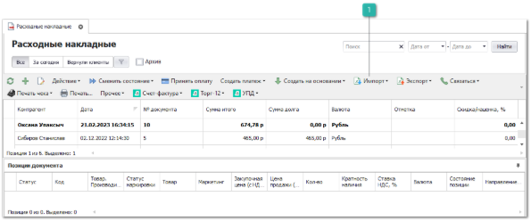
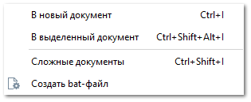

Для загрузки информации в программу существует **Мастер импорта данных**. Для импорта следует нажать кнопку **Импорт** на панели инструментов требуемого раздела.

 **Импорт**

Позволяет импортировать данные в программу вручную или автоматически. Автоматическа загрузка осуществляется путем создания в программе bat-файла и помещения его в планировщик заданий (например, планировщик Windows). Для создания bat-файла импорта документов в систему следует нажать кнопку **Создать bat-файл** на панели инструментов требуемого раздела.

При выполнении импорта в систему (вручную или через bat-файл) запускается внешний обработчик, выполняющий автоматическое пересохранение файла в формат ".xlsx" в случаях, когда исходный файл расширения ".xls\*" не может быть распознан программой. Пересохранение выполняется над копией исходного файла, которая располагается во временной папке. Если пересохранение выполнено успешно и файл распознан системой, будет запущен **Мастер импорта**, иначе, будет выведено соответствующее уведомление, а при импорте через bat-файл информация запишется в log-файл процесса.

::: info Примечание

Для пересохранения файлов в формат .xlsx обязательно требуется установленное ПО Microsoft Excel 2007 и выше.

:::
::: warning Внимание!

Работа с файлами Excel, защищенными паролем, в системе не предусмотрена.

:::

