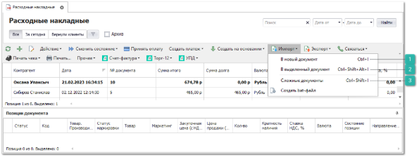
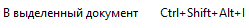

Для некоторых документов можно выбрать метод импорта:

 **В новый документ**

Позволяет загрузить импортируемый файл во вновь созданный документ.

 **В выделенный документ**

Позволяет загрузить импортируемый файл в выбранный документ.

 **Сложные документы**

Данный метод используется для импорта в том случае, если импортируемый файл необходимо загрузить в разные документы. Либо если необходимо импортировать очень большой документ в систему, тогда имеет смысл разбить содержимое одного файла на несколько документов.

Мастер разбивает все содержимое на несколько документов, критерием разбиения служат колонки **Шапка. № документа** и **Шапка. Клиент** (колонки обязательны для заполнения).

Колонка **Шапка. Клиент** заполняется значением из справочника контрагентов или выбирается столбец с контрагентом из файла, в этом случае контрагент при импорте идентифицируется следующим образом:

- сравниваются значения поля **Шапка. Клиент**, указанные при импорте, и значения поля **Отображать как** в карточке контрагента справочника **Контрагенты**, если значения совпали, выбирается контрагента из справочника;

- если значения поля **Шапка. Клиент** не найдены в списке значений поля **Отображать как**, они сравниваются со значениями **Наименование контрагента** в карточке контрагента, если значения совпали, выбирается контрагента из справочника, если значение не найдено, создается новый контрагент.

Разбиение всех записей в файле на несколько документов осуществляется по алгоритму:

- Программа находит все уникальные (не повторяющиеся) значения в колонке **Шапка. № документа**;

- Затем внутри каждой уникальной группы (т.е. в строках с одинаковым значением поля **Шапка. № документа**) просматриваются значения колонки **Шапка. Клиента**. В ней так же выделяются уникальные группы, и на их основании происходит разбивка на отдельные документы.

::: note Замечание

В файле есть 10 уникальных групп по выбранной колонке **Шапка. № документа**, а в каждой группе по 2 уникальной подгруппы по колонке **Шапка. Клиент**. В итоге файл будет импортирован в 20 отдельных документов.

:::