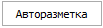
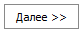

Помимо ввода произвольного текста, существует возможность ввода **формул** для требуемых преобразований. Часть формул позволяет использовать регулярные выражения.


 **MD5**


Данная функция, получив на вход любую строку/текст, возвращает на выходе строку из 32 символов (при помощи md5 шифрования). Так называемый хэш. Причем подав на вход несколько раз одну и ту же строку/текст, на выходе будет один и тот же хэш. А подав разные текста (если отличие даже в одном символе), хэш на выходе будет разным.

Синтаксис:

`= MD5 (ЗНАЧЕНИЕ)`

::: note Пример 

Поставщик в своих прайс-листах не предоставляет артикулы товаров, только производителя, расширенное наименование и характеристики товара. В частности, прайс-лист шин/дисков. Необходимо иметь возможность работать с такими прайс-листами. Для этого при импорте в качестве артикула указывается функция MD5 от названия товара и ключевых характеристик (через функцию СЦЕПИТЬ). Тем самым мы получаем идентификатор конкретной записи прайс-листа, т.е. конкретного товара. При первом использовании позиций такого прайс-листа будут созданы карточки товаров с ХЭШЕМ вместо артикула. Но даже после многократного обновления прайс-листа, ХЭШ позиций нового прайс-листа будет совпадать с ХЭШЕМ в артикуле имеющихся карточек товара.

:::

 **ЕСЛИ**


Отвечает за условное присвоение значения свойства. Первым аргументом является логическое условие (например, Col3 = 0); вторым аргументом является значение, если логическое условие верно; а последним аргументом значение, если логическое условие неверно. 

::: note Примеры

`=ЕСЛИ(Col3 < 0, "0", Col3)` Если значение из Col3 меньше 0, то в свойство записываем "0", иначе значение из колонки Col3.

`=ЕСЛИ(Col1 >= 150.00, "*Больше либо равно 150.00*", "*Меньше 150.00*")` Если значение в Col1 больше или равно 150.00, то в свойство вставляем текст "*Больше либо равно 150.00*", иначе текст "*Меньше 150.00*".

`=ЕСЛИ(Col1 != "Пропуск", Col2, Col3)` Если значение в Col1 не равно тексту "Пропуск", то берем значение из Col2, иначе из Col3.

:::

 **ЗАМЕНИТЬ**


Отвечает за замену значений в выбранном столбце на требуемые значения. 

Синтаксис:

`=ЗАМЕНИТЬ (ИМЯ\_ПОЛЯ, "ШАБЛОН\_ПОИСКА", "ШАБЛОН\_ЗАМЕНЫ", "0\_1 ИСПОЛЬЗОВАТЬ\_МНОЖЕСТВЕННУЮ\_ЗАМЕНУ")`

Последний параметр не является обязательным и равен 1. В этом случае допустимо разделять значения шаблонов поиска и замены символом "/", но обязательным условием является совпадение количества ограничителей в шаблоне поиска и замены.

::: note Пример

Формула `=ЗАМЕНИТЬ(col3, "++/+", ">100/>1")` заменит в колонке col3 все значения `++` на `>100`, а `+` на `>1`. Данную формулу можно записать и так `=ЗАМЕНИТЬ(col3, "++/+", ">100/>1", 1)`, указав последний параметр явно.

Если последний параметр указан и равен 0, то множественные замены недопустимы. Но допускается обработка строк, содержащих символ "/".

:::

 **ЗАМЕНИТЬШАБЛОН**


Формула возвращает строку с замененным текстом. При этом в качестве шаблона поиска используется регулярное выражение.

`= ЗАМЕНИТЬШАБЛОН (Col1, «\D», «0») // Заменит в колонке Col1 все нецифровые символы на нули`

 **НАЙТИПОШАБЛОНУ**


Функция возвращает строку, соответствующую регулярному выражению.

`=НАЙТИПОШАБЛОНУ (Col1, «(\w+@[a-zA-Z\_]+?\.[a-zA-Z]{2,6})») // Вернет email адрес`

 **ОКРУГЛИТЬ**


Функция позволяет округлить считываемое значение до указанного количества знаков после запятой. Первым аргументом указывается колонка, из которой читаются данные, а вторым аргументом – число разрядов для округления. 

::: note Пример

`=ОКРУГЛИТЬ( Col1, 2) // Функция берет значение из Col1 и округляет его до двух знаков после запятой.`

`=ОКРУГЛИТЬ( Col7, 0) // Функция берет значение из Col7 и округляет его до целых чисел.`

:::

 **ОЧИСТИТЬ**


Отвечает за очистку выбранных значений у обновляемых записей: товаров, контрагентов, прайс-листов от поставщиков. Данная формула работает при импорте файла в режиме обновления для программы на базе MS SQL или PostgreSQL.

`=ОЧИСТИТЬ`

Поля у обновляемых записей, в которых указана данная функция, будут очищены.

 **ПОВТОРИТЬ**


Повторяет выбранную строку указанное количество раз.

`=ПОВТОРИТЬ (Col1,5) // Строка, содержащая пять значений из колонки Col1 подряд.`

`=ПОВТОРИТЬ («АА»,2) // Строка "АААА".`

 **ПОДСТРОКА**


Отвечает за извлечение подстроки из искомой строки. Например, в Счете-Фактуре нет выделенной колонки с артикулом товара, вместо этого артикул товара находится в колонке с названием товара. Для выделения артикула из колонки с названием можно воспользоваться функцией "=ПОДСТРОКА".

::: note Синтаксис:

Первый аргумент содержит наименование колонки, из которой выделяется подстрока.

Второй аргумент указывает функции, где расположена подстрока: в начале или конце искомой строки. Значение "0" если в начале и "1" если в конце.

Третий аргумент указывает функции один или два символа-разделителя.

:::

Примеры:

- " " – искомая подстрока выделена символом "пробел",

- "\" – искомая подстрока выделена символом "\",

- "()" – искомая подстрока находится внутри круглых скобок,

- "{}" – искомая подстрока находится внутри фигурных скобок.

Например, для выделения подстроки с начала искомой строки до символа "пробел":

`=ПОДСТРОКА(Col2, "0", " ")`

 **ПРОИЗВОЛЬНО\_ЗНАЧЕНИЕ**


Отвечает за установку произвольных значений у обновляемых записей: товаров, контрагентов, прайс-листов от поставщиков. Данная формула работает при импорте файла в режиме обновления для программы на базе MS SQL или PostgreSQL.

`=ПРОИЗВОЛЬНОЕ\_ЗНАЧЕНИЕ`

Поля у обновляемых записей, в которых указана данная функция, примут произвольные значения.

 **СОДЕРЖИТСТРОКУ**


Функция возвращает ПРАВДУ, если в искомой строке найдена указанная подстрока.

`= СОДЕРЖИТСТРОКУ (Col1, «ремень») // Вернет ПРАВДУ, если в ячейке из Col1 текст содержит слово "ремень".`

 **СОДЕРЖИТШАБЛОН**


Функция возвращает ПРАВДУ, если в искомой строке найдено соответствие указанному регулярному выражению.

`=СОДЕРЖИТШАБЛОН (Col1, «^((8|\+7)[\- ]?)?(\(?\d{3}\)?[\- ]?)?[\d\- ]{7,10}$») // Вернет ПРАВДУ, если в ячейке из Col1 содержится номер телефона.`

 **СЦЕПИТЬ**


С помощью данной функции можно сцеплять произвольное количество текстовых строк. 

::: note Пример

`=СЦЕПИТЬ(Col1, " руб")` Добавит после к значению из Col1 текст "руб".

`=СЦЕПИТЬ(Col1, Col2)` Сцепит две строки из Col1 и Col2.

`=СЦЕПИТЬ( "Итого: ", Col1, "руб за ", Col2, "штук.")`  Выведет текст, подставив значения из Col1 и Col2.

:::

 **ЯЧЕЙКА**


Формула позволяет использовать при импорте значение из конкретной ячейки импортируемой таблицы. Координаты ячейки задаются в виде имени столбца и номера строки. 

::: note Пример

`=ЯЧЕЙКА(Col5, 14)`

`=ЯЧЕЙКА(F11, 2)`

:::

Мастер импорта сначала считывает значения используемых ячеек (даже если они не попадают в импортируемый диапазон строк), а затем использует эти значения при импорте табличной части документа. Тем самым, нельзя использовать внутри формулы ЯЧЕЙКА другие формула. Но при этом формулу ЯЧЕЙКА можно использовать внутри других формул.

- **Арифметические формулы** – операции над числами: ‘+’, ‘–‘, ‘\*’, ‘/’ и приоритет операции в "()". 

::: note Примеры

`=Col1 + 100` Складываем значение из Col1 с числом 100

`=Col1 \* Col2 – 10` Перемножаем значение в Col1 и Col2, а из результата вычитаем 10

`=(Col1/(Col1+Col2))\*100` Вычисляем процент Col1 от Col1+Col2.

:::

Многие формулы можно вкладывать друг в друга, где результат вложенной формулы будет аргументом для вышестоящей формулы. А также использовать && и || в качестве логических "И" и "ИЛИ" соответственно.

Ниже пример использования нескольких формул при импорте. Формула разбита на абзацы для лучшего восприятия, после "//" идет комментарий, в колонке Col1 цена за штуку, в Col2 количество товара. На выходе формулы либо текст со стоимостью и количеством, либо сообщение об ошибке:

```:no-line-numbers
=ЕСЛИ //Функция если
(
  Col1 != "" && Col2 != "", //Проверяем, что обе колонки заполнены
  СЦЕПИТЬ // Если обе колонки заполнены, выводим текст «Итого: Х руб за Y штук.», где X это сумма, а Y количество покупаемого товара
    (
    "*Итого*: ",
    Col1 \* Col2, // Перемножаем цену на количество
    "*руб* *за* ",
    Col2,
    "*штук*."
    ),
  СЦЕПИТЬ // Если хотя бы одна колонка имеет пустое значение, то формируем строку с ошибкой
    (
    "*Внимание! Не заполнены обязательные поля:* ",
    ЕСЛИ
      (
      Col1 = "",
      "*ЦЕНА*", // Выводим ЦЕНА, если не заполнена колонка с ценой
      ""
      ),
  ЕСЛИ
      (
      Col1 = "" && Col2= "",
      " *и* ", // Выводим союз «и», если не заполнены обе колонки
      ""
      ),
  ЕСЛИ
      (
      Col2 = "",
      "*КОЛИЧЕСТВО*",// Выводим КОЛИЧЕСТВО, если не заполнена колонка с кол-вом
      ""
      )
    )
)
```


 **Табличная часть** 

Содержит список записей импортируемых из документа, с названием колонок для установки разметки.  каждой колонке можно осуществить фильтрацию данных.

 **Разметка колонок**

Позволяет установить соответствия колонок в файле с типом данных в программе в колонке **Значение из файла/формула**. Некоторые значения (валюта, страна и т.п.) можно установить из соответствующего справочника в программе в колонке **Фиксированное значение из справочника**.

::: info Примечание

Поля **Базовая валюта**, **Товар.Производитель**, **Товар.Код –** обязательные для разметки при импорте.

:::

::: info Примечание

При разметке файлов при импорте можно использовать предустановленные в программе специальные формулы для упрощения процесса импорта. 

:::

 **Авторазметка**



Позволяет автоматически сопоставить название столбцов в файле и название колонок в программе. В случае совпадения программа автоматически назначает соответствующей колонке совпадающий столбец файла.

 **Очистить** 


Позволяет сбросить ранее заданное соответствие колонок в файле и в программе.

 **Ранее созданные разметки**

Блок содержит ранее созданные и сохраненные разметки документов. Если импорт в приход из аналогично размеченного файла уже осуществлялся, и в программе сохранена эта разметка, то рекомендуется выбрать ее в списке, не создавая новую. Блок содержит **Панель действий** с командами:

- **Обновить** – позволяет обновить список разметок;

- **Новая** – позволяет добавить новую разметку;

- **Копировать** – позволяет копировать существующую разметку, для дальнейшего редактирования;

- **Сохранить** – позволяет сохранить созданную или отредактированную разметку, которая будет доступна для последующего использования, в том числе для автоматизации импорта заказов клиентов с использованием bat-файла;

- **Удалить** – позволяет удалить существующую разметку.

 **Примечание**

Позволяет оставить текстовое примечание для разметки.

 **Информация об импортируемом файле**

Блок содержит:

- **Обновить** – которая позволят обновить данные о загруженном документе; 

- **Исходный файл** – содержит полный путь на компьютере до импортируемого файла, при необходимости его можно заменить;

- **Дата модификации** – отображается последняя дата изменения документа.

 **Таблицы/листы документа**


Отображаются вкладки таблиц/листов документа, который хранит импортируемые данные. При необходимости, выберите необходимую вкладку.

 **Диапазон записей**


Позволяет указать количество верхних/нижних строк, данные из которых не будут импортированы. Обычно данный параметр используется для того, чтобы предотвратить загрузку заголовка и названия колонок импортируемой таблицы.

 **Далее**



Позволяет перейти к вкладке с информацией о текущей конфигурацией.

Если осуществляется импорт очень большого объема информации (например, 15 миллионов аналогов в справочник "Аналоги"), рекомендуется осуществлять порционный импорт по 200 - 600 тысяч записей за раз. Для этого рекомендуется: вызвать импорт – выбрать файл – создать и сохранить разметку для файла – указать диапазон "0 - 500 000" – осуществить импорт. Далее снова: вызвать импорт – указать тот же файл – выбрать уже сохраненную разметку – указать следующий диапазон "500 001 – 1 000 000" – осуществить импорт. И так до полного импорта содержимого файла в программу.

В качестве подсказки программа выделяет цветом строки в разметке: красный – ошибка, зеленый – значение проверено, розовый – стандартное значение, синий – поле обязательное для заполнения.

Нажав кнопку **Далее**, мастер импорта предложит ознакомиться с текущей конфигурацией. 


 **Начать**


Позволяет начать импорт в документ.

В случае одобрения нажать кнопку **Начать**. Данные из файла будут загружены в программу. 

По окончанию импорта выводится статистика:

- **Добавлено** – количество записей, выбранных из файла для импорта;

- **Обновлено** – количество позиций, которые были обновлены;

- **Пропущено** – количество позиций, которые не были импортированы;

- **Выбрано из файла** – количество позиций, которые были выбраны для импорта;

- **Всего в файле** – количество позиций в файле (активной таблице/листе).

