Перед вставкой позиций в документ программа осуществляет проверку позиций. 

**»** Проверяются производители товара. Если в выбранных позициях присутствуют новые производители, которых нет в программе, отобразится окно. 

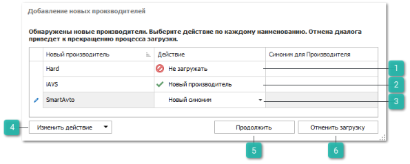

 **Не загружать**

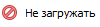

Позволяет не загружать производителя в программу.

 **Новый производитель**

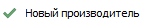

Позволяет добавить нового производителя в справочник **Производители**.

 **Новый синоним** 

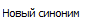

Выбранный производитель является синонимом уже существующего производителя в системе. При выборе действия, в колонке **Синоним для Производителя** указывается производитель из справочника **Производители**, для которого новый синоним является производителем. 

 **Изменить действие**

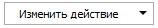

Позволяет сразу для нескольких выделенных позиций выбрать действие: **Новый производитель**, **Не загружать**, **Новый синоним**.

 **Продолжить**

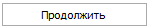

Позволяет продолжить обработку новых производителей и выполнить выбранные действия.

 **Отменить загрузку**

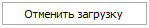

Позволяет отменить добавление новых производителей и отменить процесс загрузки.

**»** После проверки производителей осуществляется проверка товара на предмет существования карточек в программе. Если в выбранных позициях присутствуют новые товары, карточек которых нет в программе, отобразится окно. 

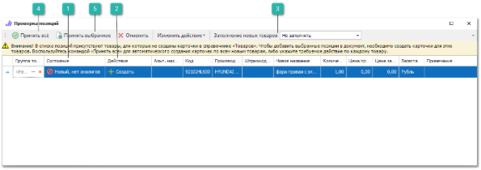

 **Состояние**

Отображается наличие товара в справочнике **Товары** и наличие его аналогов.

 **Действие**

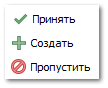

Позволяет задать действие новым товарам. Для нового товара, у которого выбрано действие **Пропустить**, не будет создана карточка товара. Данный товар попадет в документ. Но проводка документа будет запрещена, так как позиция не может находиться в документе без ссылки на карточку товара.

 **Заполнение новых товаров**

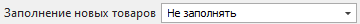

Позволяет указать источник заполнения дополнительных свойств из сервиса **Веб-инфо**.

 **Принять все**

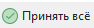

Позволяет принять все новые товары.

 **Принять выбранные**

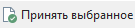

Позволяет принять выделенные товары.