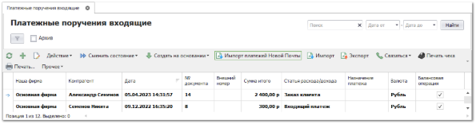
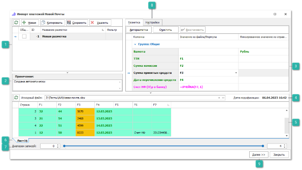
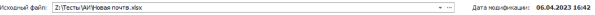
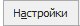
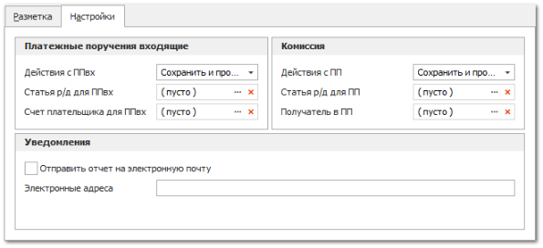
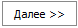

Данный инструмент позволяет автоматически обработать реестр платежей, оплаченных через сервис "Новая почта" с разнесением этих платежей на соответствующие **Расходные накладные**.

Подбор **Расходных накладных** осуществляется посредством сверки номера товарно-транспортной накладной в импортируемом файле и документах, созданных в программе. При этом на накладные в автоматическом режиме создаются и разносятся **Платежные поручения входящие**.

После обработки реестра платежей происходит подсчет общей суммы комиссии по платежам, которую заказчик должен перечислить компании "NovaPay" за произведение транзакции, доступно автоматическое создание **Платежного поручения** на итоговую сумму комиссии.

::: warning Внимание!

Функционал требует активного тарифа обслуживания.

:::

Для осуществления импорта выполните следующие действия:

**»** В **Главном меню** перейдите в раздел **Финансы** **► Оплаты контрагентов ► Платежные поручения входящие** и выберите на панели инструментов действие **Импорт платежей Новой почты**.

**»** Выберите импортируемый файл с компьютера и настройте разметку в окне для разметки файла. 

**»** Заполните поля на вкладке **Настройки**.

**»** В полях **Диапазон записей** укажите количество верхних/нижних строк, данные из которых не будут импортированы.

 **Ранее созданные разметки**

Блок  **Ранее созданные разметки**, содержит ранее созданные и сохраненные разметки документов. Если импорт в приход из аналогично размеченного файла уже осуществлялся, и в программе сохранена эта разметка, то рекомендуется выбрать ее в списке, не создавая новую. Блок содержит **Панель действий** с командами:

- **Обновить** – позволяет обновить список разметок;

- **Новая** – позволяет добавить новую разметку;

- **Копировать** – позволяет копировать существующую разметку, для дальнейшего редактирования;

- **Сохранить** – позволяет сохранить созданную или отредактированную разметку, которая будет доступна для последующего использования, в том числе для автоматизации импорта заказов клиентов с использованием bat-файла;

- **Удалить** – позволяет удалить существующую разметку.

 **Примечание**

Блок позволяет оставить текстовое примечание для разметки.

 **Разметка колонок**

Позволяет установить соответствия колонок в файле с типом данных в программе в колонке **Значение из файла/формула**. Некоторые значения (валюта, страна и т.п.) можно установить из соответствующего справочника в программе в колонке **Фиксированное значение из справочника**.

::: info Примечание

При разметке файлов при импорте можно использовать предустановленные в программе специальные формулы для упрощения процесса импорта. 

:::

- **Валюта** – выбор валюты из справочника, в соответствии со значением валюты в импортируемом документе;

- **ТТН** – размечается колонка **№ ЕН НП** с номерами товарно-транспортных накладных;

::: info Примечание

По данному полю будет осуществляться подбор документов **Расходная накладная**.

:::

- **Сумма комиссии** – размечается колонка **Сума утриманої винагороди** в импортируемом документе.

::: info Примечание

По данному полю будет рассчитана сумма комиссии для дальнейшего создания **Платежного поручения**.

:::

- **Сумма принятых средств** – размечается колонка **Сума принятих коштів** в импортируемом документе;

- **Дата перечисления средств** – размечается колонка **Дата перерахунку коштів** в импортируемом документе;

- **Счет НФ (П\р в банку)** – номер счета банка получателя. Для корректной обработки необходимо разметить соответствующую ячейку в документе.

::: info Примечание

Разметка осуществляется с помощью подстановки формулы **=ЯЧЕЙКА(FХ, Х)**, где FX – номер колонки, в которой содержится номер счета;  Х – номер строки, в которой содержится номер счета.

Более подробное использование формул в разметке импорта описано в разделе **Использование формул при импорте**.

:::

::: info Примечание

Предварительно необходимо добавить счет с соответствующим номером в раздел **Финансы** **►** **Счета и кассы**. Для всех счетов Наших фирм, по которым будут проходить платежи, необходимо указывать соответствующую Нашу фирму из справочника **Наши фирмы** (раздел **CRM** **►** **Клиенты** **► Наши фирмы**) в поле **Тип контрагент**.

:::

 **Информация об импортируемом файле**

Блок содержит:

- Команду **Обновить** – которая позволят обновить данные о загруженном документе; 

- **Исходный файл** – содержит полный путь на компьютере до импортируемого файла, при необходимости его можно заменить;

- **Дата модификации** – отображается последняя дата изменения документа.

 **Табличная часть** 

Содержит список записей импортируемых из документа, с названием колонок для установки разметки.

 **Таблицы/листы документа**

Отображаются вкладки таблиц/листов документа, который хранит импортируемые данные. При необходимости, выберите необходимую вкладку.

 **Диапазон записей**

Позволяет указать количество верхних/нижних строк, данные из которых не будут импортированы. Обычно данный параметр используется для того, чтобы предотвратить загрузку заголовка и названия колонок импортируемой таблицы.

 **Настройки** 

Вкладка содержит параметры:

- **Действия с ППвх** – настройка позволяет выбрать действия с создаваемыми документами **Платежное поручение входящее**. Доступные значения: **Сохранить**/ **Сохранить и провести** (значение по умолчанию);

- **Статья р/д для ППвх** – статья расхода/ дохода, которая будет подставляться в документы **Платежные поручения входящие**. Для выбора доступны статьи из справочника **Статьи расходов/ доходов** (в разделе **Финансы** ). Поле обязательно для заполнения.

- **Счет плательщика для ППвх** – выбор счета плательщика из справочника **Счета и кассы** (в разделе **Финансы**). Для подстановки доступны только счета без привязки к контрагенту. Поле обязательно для заполнения.

- **Действия с ПП** – настройка позволяет выбрать действия по документу **Платежное поручение**, которое создается на итоговую сумму комиссии из импортируемого документа. Доступные значения: **Сохранить**/ **Сохранить и провести** (значение по умолчанию)/ **Не создавать**;

- **Статья р/д для ПП** – статья расхода/ дохода, которая будет подставляться в документы **Платежные поручения**. Для выбора доступны статьи из справочника **Статьи расходов/ доходов** (в разделе **Финансы**). Поле обязательно для заполнения, если в настройке **Действия с ПП** выбрано **Сохранить**/ **Сохранить и провести**;

- **Получатель в ПП** – выбор контрагента из справочника **Контрагенты** (раздел **CRM** **► Клиенты**), который будет являться получателем при создании **Платежного поручения**. В карточке выбранного контрагента обязательно должно быть заполнено поле **Счет по умолчанию**. Поле **Получатель ПП** обязательно для заполнения, если в настройке **Действия с ПП** выбрано **Сохранить**/ **Сохранить и провести**;

- **Отправить отчет на электронную почту** – при активном значении ответственному лицу на электронную почту будет отправлен отчет о проведенном импорте. По умолчанию флажок не проставлен. Зависит от значения основной настройки **Использовать отправку уведомлений по** **email** в разделе **Управление** **►** **Настройки программы ►** **Настройки ►** группа **CRM ►** **Уведомления ► Основные настройки отправки** **email**, для корректной отправки обе настройки должны быть активны.

- **Электронные адреса** – в поле указывается адрес электронной почты, на которую необходимо отправить отчет о проведенном импорте (при активном значении флажка **Отправить отчет на электронную почту**). Возможно указание нескольких адресов электронной почты через разделитель – запятую.

 **Далее**

Позволяет перейти к вкладке с информацией о текущей конфигурацией.

**»** Для продолжения загрузки нажмите кнопку **Далее.** Откроется окно с параметрами загрузки. Для изменения параметров нажмите кнопку **Назад**. Для начала процесса импорта нажмите **Начать**!

Общий алгоритм обработки файла реестра платежей:

- Проверка на наличие счета в разделе **Финансы** **►** **Счета и кассы**, соответствующего **Счету НФ (П\р в банку)** из разметки;

::: info Примечание

В случае, если значение не будет найдено – обработка файла будет завершена. В лог будет выведена ошибка "Не найден счет или НФ", при этом письмо на почту ответственному сотруднику выслано не будет, вне зависимости от активности настройки **Отправить отчет на электронную почту**.

:::

- Соотнесение значения из колонки **ТТН** в размеченном файле и значения **Номер бланка ТН/ТТН** из **Расходных накладных**, созданных в программе:

    - Если совпадения найдены – на основании **Расходных накладных** будут созданы **Платежные поручения входящие** (в соответствии с параметрами, заданными на вкладке **Настройки**);

    - Если совпадения не найдены – данные будут выведены в лог, при этом **Сумма комиссии** будет рассчитана по значениям из размеченного файла;

    - Если найдено несколько **Расходных накладных** с одинаковым **Номер бланка ТН/ТТН**, разнесение денежных средств будет произведено на **Расходную накладную** с наибольшей суммой долга;

::: info Примечание

Сохраненные, но не проведенные **Платежные поручения входящие**, не разносятся на **Расходные накладные**.

При создании **Платежного поручения входящего** происходит сопоставление **Расходных накладных** и **Заказов клиентов**, если сопоставить **Расходную накладную** с **Заказом клиента** не удалось – разнесения **Платежного поручения входящего** на документ не происходит.

:::

::: warning Внимание!

Документ **Платежное поручение входящее** создается строго на сумму из **Расходной накладной**.

- В случае, если в импортируемом файле сумма больше, чем в **Расходной накладной** – лишняя сумма поступления попадет на баланс данного клиента и платеж будет отражен в Parts.Intellect;

- В случае, если сумма по **Расходной накладной** разнесена полностью – без остатка, повторного разнесения не происходит, существующие разнесения не удаляются;

- В случае частичной оплаты – происходит разнесение на остаток.

:::

- Расчет **Суммы комиссии** на основании значений из размеченного файла;

- Создание документа **Платежное поручение** на **Сумму комиссии** (по настройкам, заданным на вкладке **Настройки**). Документ **Платежное поручение** создается в случае, если на вкладке **Настройки** при разметке документа для **Действия с ПП** выбрано **Сохранить**/ **Сохранить и провести**;

- Логирование результатов импорта, формирование отчета для ответственного сотрудника на электронную почту (при активном значении настройки **Отправить отчет на электронную почту**).

::: info Примечание

В лог выводится информация: **Обработано строк всего**, **Строк с ошибкой**, **Созданных ППвх** (количество), **Общая сумма комиссий для ПП, Платежное поручение** (состояние документа).

В отчете для пользователя содержится информация: **Обработано строк всего**, **Строк с ошибкой**, **Необработанные ТТН**, **Созданных ППвх** (количество), **Общая сумма комиссий для ПП, Платежное поручение** (состояние документа).

:::

::: details Читайте также

- [Документы Расходные накладные](../../specification/prodazhi/rashodnaja_nakladnaja.md)

- [Документы Платежные поручения входящие](../../specification/finansy/oplaty_kontragentov/platezhnye_poruchenija_vhodjaschie.md)

- [Справочник Валюты и курсы](../../specification/finansy/valjuty_i_kursy/README.md)

- [Использование формул при импорте](./import/ispolzovanie_formul_pri_importe.md)

- [Справочник Счета и кассы](../../specification/finansy/scheta_i_kassy.md)

- [Добавление данных об организации](../svoe_nalichie/dobavlenie_firmy/zapolnenie_dannykh/README.md)

- [Справочник Статьи расходов/доходов](../../specification/finansy/stati_rashodov_dohodov.md)

- [Справочник Контрагенты](../../specification/crm/klienty/README.md)

- [Настройки программы - Настройки - CRM - Уведомления. Электронная почта](../../specification/upravlenie/nastrojki_programmy/nastrojki/crm/uvedomleniya_elektronnaya_pochta.md)

- [Документы Заказы клиентов](../../specification/crm/zakazy_klientov.md)

:::