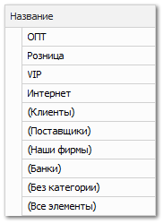
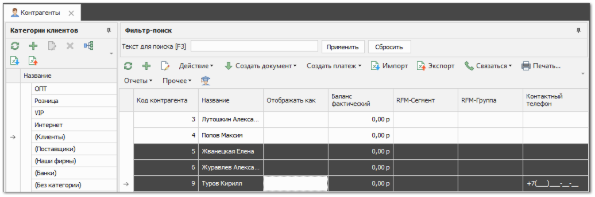
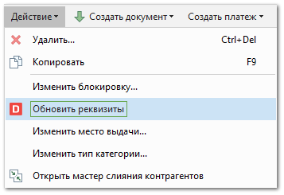
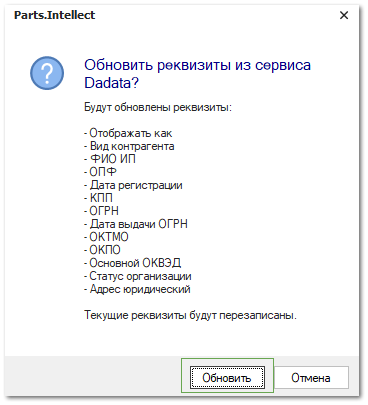
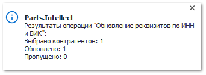

**»** Перейдите в журнал **Контрагенты**.

**»** Перейдите в нужную группу контрагентов.

**»** Выберите контрагентов, у которых необходимо заполнить/обновить реквизиты. Массовый выбор доступен с помощью зажатой клавиши Shift или Ctrl и клика левой кнопкой мыши.

**»** Нажмите команду **Действие ► Обновить реквизиты**.

**»** Нажмите **Обновить** в открывшемся окне**.**

::: warning Внимание!

При обновлении убедитесь, что вы правильно заполнили реквизиты и выставили нужный **Тип контрагента**. Для контрагентов типа **Банк** недоступно обновление реквизитов по **ИНН**, которые принадлежат не банкам.

:::

После успешного заполнения/обновления реквизитов высветится уведомление в правом нижнем углу программы.

::: info Примечание

Заполнение карточки из сервиса Dadata может быть недоступно в случаях, если:

- в разделе **Управление** **►** **Настройки программы ►** **Настройки**, группа **CRM** **► Контрагенты**, в опции **API-ключ** не указан или указан некорректно API-ключ;

- некорректно указан или не указан **ИНН** или **БИК** в карточке контрагента;

- установлен некорректный **Тип контрагента**. Для контрагентов типа **Банк** недоступно обновление реквизитов по ИНН не банков;

- превышено количество запросов к сервису. Пользователи, использующие стандартный **API-ключ**, могут выполнить до 10000 запросов в сутки. Подробнее о повышении количества запросов можно узнать на сайте сервиса DaData;

- отсутствует подтверждения адреса электронной почты в личном кабинете на сайте Dadata. Пункт необходим только для пользователей с персональным **API-ключом**.

:::