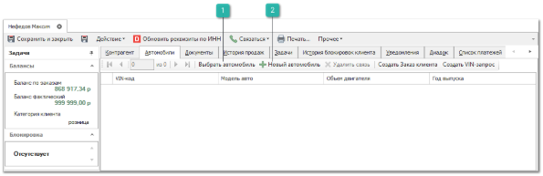
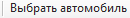
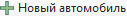
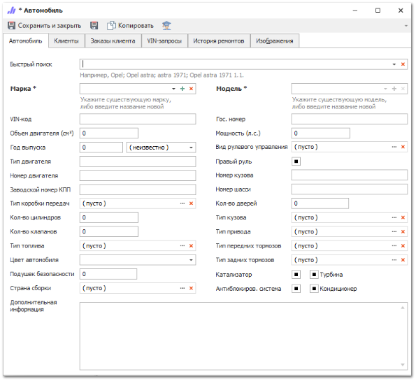
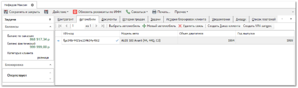

Программа Parts.Intellect позволяет ввести единожды и хранить данные о машине клиента: марку, модель, год выпуска, VIN-код и пр., а затем выбирать их из списка по имеющимся машинам.

Данные о машинах добавляются в систему в следующих случаях:

- ввод данных по автомобилю клиента при формировании **VIN-запроса**;

- добавление новой записи в справочнике **Автомобили**;

- в карточке контрагента на вкладке **Автомобили**.

Рассмотрим добавление машины клиента через карточку в справочнике **Контрагенты**. Для этого выполните следующие действия:

**»** В **Главном меню** выберите раздел **CRM** **► Клиенты**.

**»** Перейдите в карточку контрагента, открыв ее двойным щелчком левой кнопки мыши или с помощью команды **Править**. В открывшемся окне карточки контрагента перейдите во вкладку **Автомобиль**. Появятся элементы из справочника **Автомобили** для выбранного клиента.

 **Выбрать автомобиль**

Позволяет выбрать автомобиль из справочника **Автомобили**.

 **Новый автомобиль**

Позволяет создать новый автомобиль. После нажатия откроется форма добавления автомобиля.

**»** Заполните обязательные поля **Марка** и **Модель**. Остальные поля заполняются, если есть необходимая информация о машине клиента.

::: info Примечание

В меню **Управление ►** **Настройки программы ► Настройки ►** группа **CRM** **► Контрагенты** можно настроить дополнительные обязательные поля для автомобиля.

:::

Для параметров с форматом выбора состояния "галочка" доступно для выбора значение "Информация отсутствует", которое рекомендуется использовать в случае, если Вы не располагаете информацией о наличии какого-либо компонента в создаваемом автомобиле.

**»** Нажмите кнопку **Сохранить и закрыть**.

**»** В карточке контрагента на вкладке **Автомобили** отобразится информация о машинах текущего клиента.

