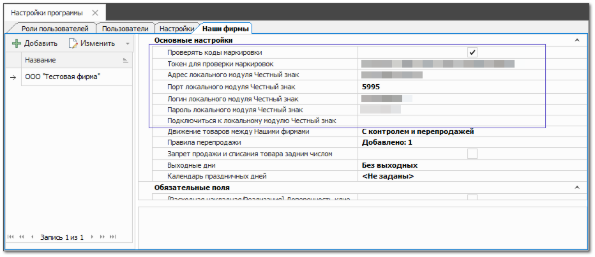
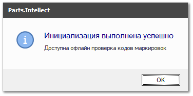

Чтобы подключить функционал кодов маркировки, сделайте следующее.

**»** Перейдите в раздел **Управление** **►** **Настройки программы** **►** вкладка **Наши фирмы**.

**»** Включите опцию **Проверять коды маркировки**.

**»** В поле **Токен для проверки маркировок** введите токен, полученный в личном кабинете на [сайте «Честный знак»](https://xn--80ajghhoc2aj1c8b.xn--p1ai/).

::: info Примечание

Для работы с маркировкой достаточно этих опций. Вы сможете проверять коды маркировки с помощью онлайн-сервиса «Честного знака».Также вы можете подключить локальный модуль «Честный знак», чтобы не прерывать продажу маркированных товаров при сбоях Интернета. Для этого заполните следующие опции.

:::

**»** В поле **Адрес локального модуля Честный знак** введите IP-адрес компьютера, на котором установлен локальный модуль ЧЗ

::: note Замечание

Значение необходимо вводить без префиксов «https//:» и «http//:»

:::

**»** Заполните поле **Порт локального модуля Честный знак**.

::: note Замечание

По умолчанию стоит значение **5995**

:::

**»** Заполните поля **Логин локального модуля Честный знак** и **Пароль локального модуля Честный знак**.

**»** Нажмите кнопку **Подключиться** в поле **Подключиться к локальному модулю Честный знак**.

При успешном подключении выведется следующее уведомление

::: warning Внимание!

В случае проблем с установкой и запуском локального модуля «Честный знак» необходимо обратиться в техническую поддержку сервиса «Честный знак».

:::

::: info Примечание

Локальный модуль «Честный знак» предназначен для работы в ситуациях, когда сервис «Честный знак» и онлайн-проверка кодов маркировки недоступны. Не рекомендуется использовать локальный модуль без подключения к Интернету более 72 часов!

:::

**»** Закройте вкладку **Настройки программы** для сохранения настроек.