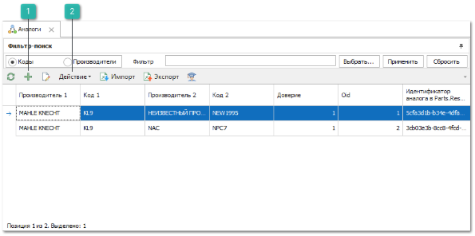
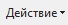
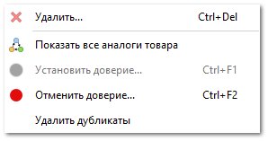
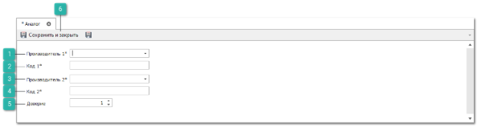
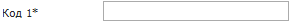
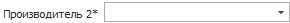
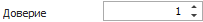

**»** В **Главном меню** выберите раздел **Товары и цены** ► **Аналоги** (сочетание клавиш Ctrl+Alt+A). В **Рабочей области** появятся элементы выбранного пункта.

 **Новый**

Позволяет добавить новый аналог в справочник.

 **Действие**

Содержит команды:

- **Удалить** – позволяет удалить запись из справочника;

- **Показать все аналоги товара** – позволяет открыть окно со схемой аналогов товара в графическом виде;

- **Установить доверие** – позволяет установить доверие для выбранных позиций справочника;

- **Отменить доверие** – позволяет отменить доверие для выбранных позиций справочника;

- **Удалить дубликаты** – позволяет удалить повторяющие записи справочника аналогов. Допускается остановка выполнения операции. При повторном вызове очистка дубликатов начинается с предыдущего места остановки.

**»** Нажмите кнопку **Новый**. В **Рабочей области** отобразятся элементы для добавления новой записи в справочник.

 **Производитель 1**

Позволяет указать наименование производителя детали, для которой добавляется аналог. Производитель может быть выбран из одноименного справочника или введен вручную.

 **Код 1**

Позволяет указать артикул детали, для которой добавляется аналог.

 **Производитель 2**

Позволяет указать наименование производителя детали-аналога. Производитель также может быть выбран из одноименного справочника или введен вручную.

 **Код 2**

Позволяет указать артикул детали-аналога.

 **Доверие**

Если доверие установлено в "1": при поиске в аналогах, находится не только аналог искомой детали, но и аналоги ее аналога. 

::: note Пример

- A и B с доверием (0);

- А и С с доверием (1);

- С и D с доверием (1);

- B и Z с доверием (1).

При поиске детали A программа выдаст аналоги B, C, D. Отсутствие Z вызвано тем, что A и B – пара с нулевым доверием.

:::

 **Сохранить и закрыть/Сохранить**

Позволяет сохранить и закрыть/сохранить запись в справочнике.

**»** Задайте параметры аналогов. 

**»** Нажмите кнопку **Сохранить и закрыть (F2)** для сохранения записи в справочнике.