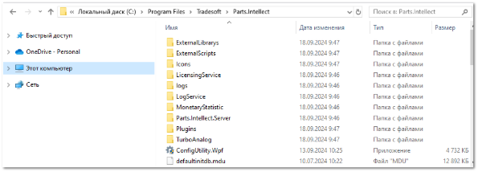
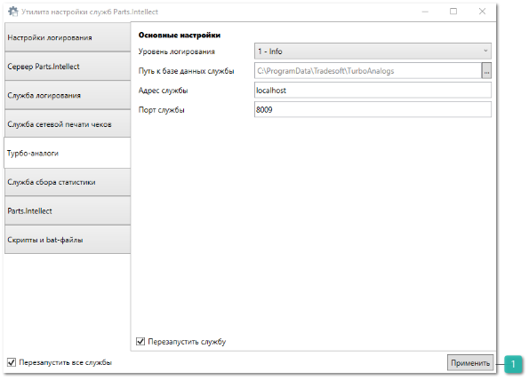
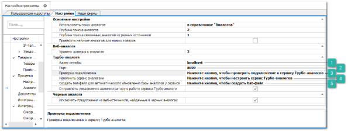
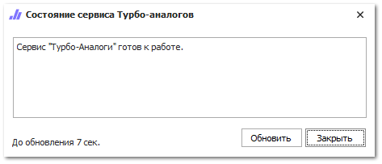
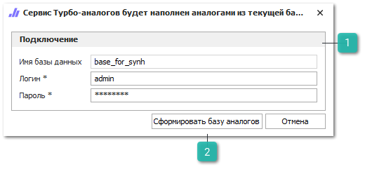
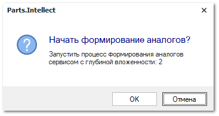

Сервис **Турбо-аналоги** является инструментом, который позволяет максимально быстро получать аналоги для запрошенных товаров. Источником аналогов для генерации базы сервиса является справочник **Аналоги** в программе. При этом можно полностью переключить поиск аналогов в программе со справочника **Аналогов** на базу сервиса **Турбо-аналогов**, что значительно сократит время поиска при использовании большой базы аналогов.

Для запуска сервиса в работу необходимо:

**»** На сервере установить программу **Parts.Intellect** в режиме **Полной** установки. В этом режиме на компьютере регистрируется новая служба "*Tradesoft. Сервис Турбо-аналоги*" ("*Tradesoft.TurboAnalogs.Service*"). Необходимо лишь убедиться, что она успешно зарегистрирована и запущена ("Работает").

**»** Для редактирования настроек службы запустите **Утилиту настройки служб** **Parts.Intellect**, для запуска утилиты перейдите в каталог **Parts.Intellect** и откройте файл "ConfigUtility.Wpf". 

**»** Перейдите на вкладку **Турбо-аналоги**.

 **Применить**

Позволяет сохранить заданные параметры, для применения настроек будет осуществлен перезапуск службы логирования*.*

**»** Измените **Порт службы**, если это необходимо, по умолчанию сервис работает на 8009 порту.

**»** Сохраните заданные параметры нажатием кнопки **Применить***.*

::: info Примечание

По умолчанию база данных сервиса разворачивается в каталоге %programdata%\tradesoft\TurboAnalogs. Для смены этого пути (например, при переносе базы на другой винчестер) необходимо в поле **Путь к базе данных службы**  новый путь к базе.

:::

**»** Для настройки и формирования базы сервиса Турбо-аналоги на основании данных справочника **Аналогов** перейдите в меню **Управление ► Настройки программы ► Настройки ►** группа **Проценка ►** **Аналоги**. В данном разделе сосредоточены элементы управления работой с сервисом.

 **Адрес службы**

Позволяет указать адрес компьютера, на котором установлена служба.

 **Порт**

Позволяет указать порт для работы службы, по умолчанию 8014, если он занят, используйте другой.

 **Проверка подключения**

Позволяет осуществить проверку связи со службой. В случае возникновения ошибок подключения необходимо еще раз внимательно проверить настройки.

 **Наполнить сервис аналогами** 

Позволяет запустить процесс наполнения базы сервиса информацией об аналогах данными из справочника.

 **Создать bat-файл для автоматического обновления базы аналогов у сервиса**

Позволяет создать исполняемый файл, который будет запускать процесс наполнения базы сервиса на основании справочника аналогов.

**»** В первую очередь необходимо задать настройки подключения к сервису: **Адрес** **службы** – адрес компьютера на котором запущен сервис, и его **Порт**.

**»** Затем проверить связь с сервисом, используя команду **Проверка подключения**. В случае возникновения ошибок подключения, необходимо еще раз внимательно проверить настройки. А если сервис доступен, то выводится окно с информацией о доступности сервиса.

::: info Примечание

Количество записей в справочнике **Аналогов** и сервисе Турбо-аналоги отличается, представлены записи вида

"*Товар1* = аналог *Товар2*" и сравнивать их с количеством уникальных товаров в сервисе некорректно. В справочнике **Аналогов** одна запись, а в сервисе получается две (два товара).

:::

**»** Как только связь с сервисом установлена, необходимо запустить процесс наполнения базы сервиса информацией об аналогах данными из справочника. Для этого в поле **Наполнить сервис аналогами** необходимо нажать кнопку **Настроить**. Откроется окно для ввода логина и пароля пользователя для подключения к базе данных.

 **Подключение**

Позволяет задать параметры для подключения к базе данных, такие как: Имя базы данных, Логин и Пароль пользователя от лица которого будет осуществлено подключение.

 **Сформировать базу аналогов**

Позволяет осуществить формирование базы аналогов.

**»** Введите данные для подключения к базе данных и нажмите кнопку **Сформировать базу аналогов**. Выйдет окно для подтверждения формирования базы и с глубиной вложенности, которая соответствует настройке **Глубина поиска аналогов** в разделе меню **Управление ► Настройки программы ► Настройки ►** группа **Проценка ► Аналоги**.

::: warning Внимание!

Процесс наполнения может занимать продолжительный промежуток времени, от нескольких минут до нескольких часов в зависимости от объема справочника Аналогов и глубины поиска в нем.

:::

**»** По завершению процесса формирования базы программу выдаст уведомление о готовности сервиса к работе.

**»** Стоит обратить внимание, что в случае изменения справочника **Аналогов** новая информация **не попадет** автоматически в базу сервиса **Турбо-аналогов**. Для этого необходимо заново запускать процесс наполнения базы у сервиса.

Процесс наполнения базы сервиса для актуализации данных можно запускать вручную, либо формировать актуальную базу автоматическом через запуск исполняемого bat-файла. В настройках сервиса доступна команда **Создать bat-файл для автоматического обновление базы аналогов у сервиса**. После создания bat-файла, его можно поместить в планировщик Windows (или любой другой планировщик) для запуска по расписанию (например, каждую ночь).

::: warning Внимание!

Пароль к базе данных в bat-файле хранится в открытом виде.

:::

**»** После завершения наполнения базы сервиса **Турбо-аналогов** можно установить в опции **Использовать поиск аналогов** значение **В сервисе** "**Турбо-аналоги**". Тем самым в рамках текущей базы при использовании поиска в источнике "в аналогах" (Проценка, МЗМО и т.д.) будет использоваться сервис **Турбо-аналоги**.