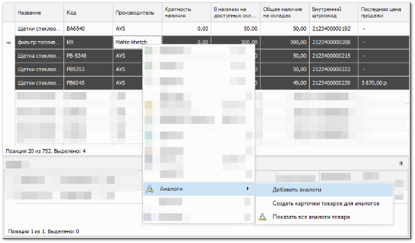
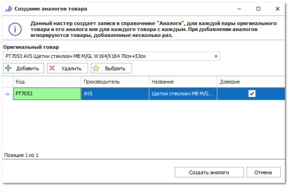
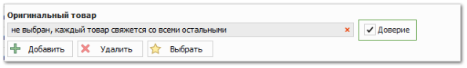

Мастер добавления аналогов позволяет массово создать записи аналогов. С помощью мастера можно добавить несколько аналогов к одному товару или связать все выбранные товары друг с другом.

**»** Перейдите в справочник **Товары** и выберите необходимые товары.

**»** Нажмите команду на панели инструментов **Аналоги ► Добавить аналоги**. Откроется окно мастера добавления аналогов.

**»** Добавьте новые аналоги при необходимости:

- нажмите команду **Добавить**. В табличной части добавится новая строка;

- заполните данные в колонках **Код** и **Производитель**

::: note Замечание

Для удаления товара из табличной части мастера нажмите **Удалить**.

:::

**»** Кликните левой кнопкой мыши по оригинальному товару в табличной части и нажмите **Выбрать**. Товар добавится в поле **Оригинальный товар**.

::: note Замечание

Если вы хотите связать все товары друг с другом, то нажмите  в поле **Оригинальный товар**.

:::

**»** Установите доверие к аналогам в колонке **Доверие**.

::: note Замечание

Если вы хотите связать все товары друг с другом, то:

- удалите товар из поля **Оригинальный товар** с помощью команды ;

- установите доверие для всех товаров табличной части в поле **Доверие**.

:::

**»** Нажмите команду **Создать аналоги**.** Записи аналогов добавятся в справочник **Аналоги**.