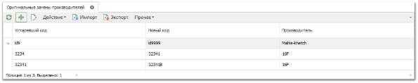
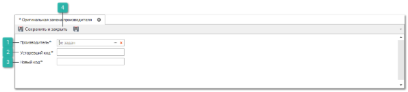
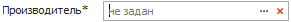
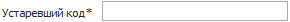
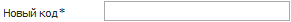
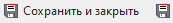

Информация о заменах деталей в программе хранится в справочнике **Оригинальные замены производителей**.

Для добавления новой записи в справочник выполните следующие шаги:

**»** В **Главном меню** выберите раздел **Товары и цены** ► **Оригинальные замены производителей**. В **Рабочей области** появятся элементы выбранного пункта.

**»** Нажмите кнопку **Новый**. В **Рабочей области** отобразятся элементы для добавления новой записи в справочник.

 **Производитель**

Позволяет указать наименование производителя детали.

 **Устаревший код**

Позволяет указать  код устаревшей детали.

 **Новый код**

Позволяет указать  код детали, являющейся заменой.

 **Сохранить и закрыть/Сохранить**

Позволяет сохранить и закрыть/сохранить новую запись в справочнике.

**»** Укажите сведения о новой замене.

**»** Нажмите кнопку **Сохранить и закрыть (F2)** для сохранения записи в справочнике.