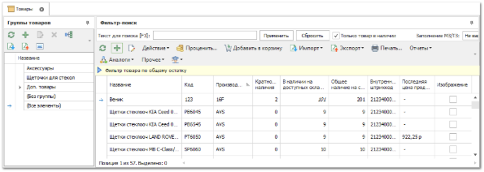
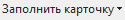

Карточки деталей попадают в справочник **Товаров** несколькими путями:

- при создании проведении документа на товар;

- при импорте данных в справочник **Товары**;

- при ручном добавлении новых товаров в справочник.

Чтобы добавить новый товар, выполните следующие действия:

**»** В **Главном меню** выберите **Товары и цены ► Товары** (Ctrl+T) отобразятся элементы выбранного пункта. 

**»** Нажмите кнопку **Новый** на панели инструментов. Возникнут элементы для добавления нового товара.

 **Основная информация**

Позволяет задать основную информацию о товаре:

- **Наименование** – название товара, которое отображается в результатах проценки и документах. Может быть использовано для поиска товара в **Проценке**;

- **Тип товара** – определяет принадлежность товара к определенному виду, который позволят присвоить дополнительные свойства товара. Заполнение дополнительный свойств товару описано в разделе **Дополнительные свойства товаров**;

::: info Примечание

В системе содержится ограниченный набор расширенных типов товара. Для пользователей в программе не предусмотрена возможность их добавления.

:::

- **Альт. наименование** – не обязательное для заполнения поле, может использоваться для занесения дополнительного наименования товара (например в случае, если клиенты часто видоизменяют/сокращают название позиции). По альтернативному наименованию можно осуществлять поиск в **Проценке**;

- **Код** – код детали, является обязательным для заполнения полем.

- **Производитель** – производитель товара (обязательное для заполнения поле). В паре с **Кодом** является идентифицирующим полем; 

::: info Примечание

Программа работает с конкретной деталью как с парой сведений **Код / Производитель**. Если неизвестно одно из них, то определение детали невозможно. Пара **Код / Производитель** может встречаться только один раз.

:::

- **Внутренний код** – внутренний код товара;

- **Штрих-код производителя** – штрих-код, присвоенный производителем. По штрих-коду доступен поиск товара в **Проценке**;

- **Штрих-код внутренний** – внутренний штрих-код товара в текущей базе данных. Допускается как ручной ввод штрих-кода, так и автоматический (в карточке, либо в справочнике). Для автоматической генерации штрих-кода используйте команду **Присвоить штрихкод** на панели инструментов списка деталей, либо уже в карточке товара нажать на многоточие в строке;

- **Подакцизный товар** – **Признак предмета расчета**, который задается для подакцизного товара и настраиваете в разделе **Печать чеков по СНО**;

- **Ставка НДС, %** – значение ставки в процентах, которое используется по умолчанию в документах в колонке **Ставка НДС, %**;**Стандартная наценка** – стандартная наценка может быть использована в документах (**Приходная накладная**, **Заказ клиентов**) для расчета **Цены продажи** с помощью команды **Наценка/Скидка** пункт **Использовать стандартную наценку из карточки товаров**;

- **Не уменьшать цену продажи** – опция влияет на формирование цены продажи в **Приходной накладной** (только для Гибкой СЦО) с помощью команды **Наценка/Скидка**. Если опция включена, то с помощью команды нельзя будет установить **Наценку, %**, меньше, чем текущее значение в документе.

 **Характеристики**

Позволяет задать значения различных характеристик товара: **Единиц измерения** (из справочника), **Кратности наличия**, **Длины**, **Ширины**, **Высоты**, **Кода ТНВЭД**, **Веса** (единица измерения из справочника), **Объема** (единица измерения из справочника), **Страны изготовителя** (из справочника), **Страны поставщика** (из справочника), **URL – ссылка** в интернете на описание товара (например, картинка либо детальное описание товара на сайте производителя), **Маркированный товар** – признак, который задается для товаров, подлежащих обязательной маркировке, **Описание товара** – произвольное текстовое описание.

::: info Примечание

Для товаров с признаком **Маркированный товар** в документах **Расходная накладная**, **Корректировка расходной накладной** и **Возврат клиента** необходимо заполнять код маркировки, иначе проведение документа будет недоступно.

:::

::: info Примечание

- **Вес** из карточки товара можно присвоить позициям в прайс-листах поставщиков. Подробнее читайте в разделе [Присваивание веса позициям прайс-листа поставщиков](../../prajsy_postavshchikov/zagruzka/prisvaivanie_vesa_pozitsiyam.md).

:::

 **Цены в наличии**

Содержит текущие цены на товар из прайс-листов из наличия:

- Для **Расширенной** и **Партионной** схем ЦО отображаются текущие данные по детали в прайс-листе из наличия;

- Для **Гибкой схемы ценообразования** для товаров в наличии по каждому прайс-листу из наличия.

Данная вкладка носит информационный характер и показывает наличие товара в прайс-листах, цену закупа, цену продажи и валюту прайс-листа.

 **Аналоги товара** 

Позволяет добавить аналоги товара при помощи кнопки **Добавить ** или удалить аналоги для товара при помощи кнопки **Удалить **. Данные на вкладке дублируются из справочника аналогов.

 **Дополнительные группы**

Позволяет связать товар с дополнительными группами. Для добавления подгруппы ее следует выбрать в дереве **Все доступные группы**, а затем нажать кнопку **Добавить**. Выбранная подгруппа переместиться в **Список дополнительных групп товара**. Для удаления дополнительной группы у товара ее необходимо выбрать в **Списке дополнительных групп товара** и нажать **Удалить**.

- **Дополнительные группы** позволяют увидеть карточку товара в справочнике не только при просмотре основной группы, но и при переходе в любую из дополнительных групп.

- **Мастер заказов на склад** использует информацию о дополнительных группах при инициализации списка товаров на выделенной группе.

::: info Примечание

Добавление **Дополнительной группы** у товара или нескольких возможно и в самом справочнике **Товаров**. Для этого необходимо схватить одну или несколько карточек товара, зажать кнопку "Alt", перенести товары в требуемую группу, отпустить левую кнопку мыши, отпустить клавишу "Alt". Указанная группа будет добавлена в качестве дополнительной. При этом если не зажимать клавишу "Alt", то выделенные товары сменят основную группу, а не получат дополнительную

:::

 **Применяемость**

Позволяет указать, в каких моделях и их модификациях используется товар из карточки. Для добавления модификации, в которой используется деталь из карточки, необходимо на форме справа выбрать модификацию и нажать **Добавить**. Для удаления – выбрать модификацию на форме слева и нажать **Удалить**.

В колонке **Модификация модели** применяется следующий формат отображения данных: 

::: note Пример

{Марка} {Модель} {Название модели}, {Мощность в киловаттах} – {Мощность в Л.С.}, {Тип кузова}, {Год начала выпуска}.{Месяц начала выпуска}-{Год окончания выпуска}.{Месяц окончания выпуска}.

:::

 **Сезонность товара**

Позволяет задать месяцы высокого и низкого спроса на товар. Эта информация используется в **Мастере заказов на склад** указывая из какой колонки брать МЗ/ТЗ – из высокого или низкого спроса. Что позволит поддерживать количество товара на каждом складе в соответствии с сезонностью спроса на него.

Месяцы ранжируются по **высокому** и **низкому** **спросу** на товар с учетом времени, требуемого на доставку товара от поставщика. То есть месяцы ранжируются на момент заказа товара поставщику.

Если доставка товара осуществляется в течение месяца, а товар имеет повышенный спрос в марте, то в карточке необходимо указать февраль как **Месяц высокого спроса**. Остальные месяцы переместить в список **Месяцев низкого спроса**.

 **Минимальные остатки и места хранения**

Позволяет указать значения мест хранения по умолчанию, минимальные запасы и точки заказа, которые используются в **Мастере заказов по минимальным остаткам**. 

 **Печать**

Позволяет настроить стратегию печати этикеток для данного товара. Выбор количества для печати, одна этикетка на каждую:

- **Единицу товара в позиции** – при печати этикеток на одну единицу товара будет распечатана одна этикетка. Т.е. если был приход с данным товаром одной позицией на 5шт, то будет распечатано 5 этикеток;

- **Позицию с товаром** – при печати этикеток на одну позицию будет распечатана одна этикетка. Т.е. если был приход с данным товаром одной позицией на 5шт, то будет распечатана 1 этикетка;

- **Партию в позиции с товаром** – при печати этикеток на одну партию в позиции будет распечатана одна этикетка. Размер партии задается в свойстве "Количество товара в партии", на этой же вкладке "Печать". Т.е. если был приход с данным товаром одной позицией на 5шт, а размер партии 3шт, то будет распечатано 2 этикетки.

::: info Примечание

Для того, чтобы использовать эту информацию из карточки товара необходимо либо при использовании команды "Печать этикеток" выбирать стратегию с использованием карточки товара. Либо в редакторе требуемого печатного шаблона воспользоваться функцией "Tradesoft.Autovision.BusinessApplication.GetWareAmount (CurrentObject\_Items.Ware\_, CurrentObject\_Items.Amount)". А для вывода в этикетку расширенных свойств товара, необходимо воспользоваться свойствами товара "Ware.WareType" и "Ware.AdditionalProperties".

:::

Пример использования данной функции для шаблона "Ценник 49х39 (по кол-ву).mrt".

**»** Открыть шаблон на редактирование.

**»** Выделить элемент "Данные 1; …".

**»** Отобразить его события .

**»** Для события "Before print" ("Перед печатью") прописать следующее выражение:

::: note Пример

Данные2.CountData = Tradesoft.Autovision.BusinessApplication.GetWareAmount(CurrentObject\_Items.Ware\_, CurrentObject\_Items.Amount)

:::

**»** Сохранить шаблон (Ctrl+S).

 **SEO**

Содержатся поля, которые выгружаются вместе с каталогом товаров на сайт интернет-магазина Parts.Resource, используемые для поисковой оптимизации. Благодаря им, выгруженный на сайт каталог лучше индексируется поисковыми роботами.

 **Изображения**

На вкладке **Изображения** доступна возможность управлять прикрепленным к товару изображениями. На панели расположены команды:

- **Обновить** – обновить информацию по прикрепленным изображениям;

- **Добавить** – добавить новое изображение. В случае совпадения имен нового и уже существующего файла появится диалог с возможностью заменить старый файл новым, добавить новый фал (к нему допишется окончание), использовать уже имеющийся файл изображения;

- **Удалить** – удаляя изображение, программа осуществляет поиск товаров, в которых указана ссылка на это же изображение. Если таких товаров найти не удалось, то выдается запрос на окончательное удаление файла из каталога с изображениями;

- **По умолчанию** – установить выбранное изображение, как изображение по умолчанию. Используется как основное изображение товара. При удалении данного изображения данное свойство переходит к первому в списке оставшихся изображений;

- **Открыть в проводнике папку с изображениями** – позволяет открыть папку с изображениями.

С помощью элемента  масштабируется размер изображений (горячая комбинация клавиш "Ctrl + прокрутка колеса мыши"). У каждого изображение присутствует поле для ввода произвольного текстового комментария. Горячей клавишей для вызова (в Проценке, в Мастерах оформления документов и т.д.) панели с изображениями товара является "Alt+P".

Помимо добавления вручную, присутствует возможность импорта изображений для существующих карточек товара. Для этого в табличной части справочника **Товаров** используется команда **Импорт** пункт **Изображения**, где указывается файл, содержащий колонки **Код-Производитель-Путь к изображению** и режим импорта.

 **Действие**

Содержит команды:

- **Проценить** – позволяет запустить процедуру проценки;

- **Подобрать названия товара** – позволяет выбрать название товара из результатов проценки по Коду/Производителю при добавлении/редактировании карточки товара. Для подбора названий используются следующие источники:

    - **Прайс-лист из наличия**;

    - **Прайс-листы поставщиков**;

    - **Аналоги**. Подбор названий по аналогам происходит с учетом глобальной настройки **Глубина поиска аналогов**.

::: info Примечание

При наличии одного варианта названия товара, поле **Наименование** будет заполнено автоматически найденным значением. При наличии двух и более вариантов, откроется всплывающее окно со списком вариантов названий товара.

:::

- **Открыть мастер заказов на склад** – запускает для товара **Мастер заказов по минимальным остаткам**.

::: info Примечание

Для корректной работы **Подбора названий товара** должны быть настроены разрешения для пользователя к проценке по соответствующим опциям поиска.

:::

 **Заполнить карточку** 

Позволяет на основании поля **Код** или **Штрихкод производителя** заполнить остальные поля в карточке из сервиса **Веб-инфо**.

::: info Примечание

При заполнении карточки из сервиса **Веб-инфо** информация, внесенная по товару вручную, будет подменена на информацию из сервиса. В случае, если какие-либо параметры имели незаполненное (пустое) значение в **Веб-Инфо** поля в карточке товара останутся пустыми, либо в них сохраниться введенное вручную значение.

:::

 **Сохранить и закрыть/Сохранить** 

Позволяет сохранить и закрыть/сохранить карточку товара.

**»** Заполните необходимую информацию для товара.

::: info Примечание

Редактирование свойств товара определяется разрешениями пользователя в блоке настроек **Доступные для редактирования свойства товара**.

:::

**»** Сохраните и закройте карточку товара, воспользуйтесь кнопкой **Сохранить и закрыть** (F2).