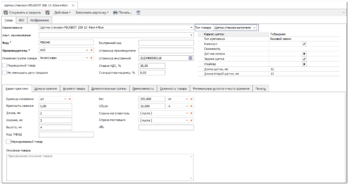
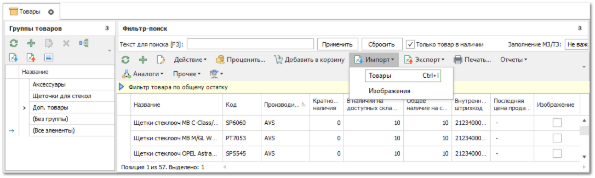
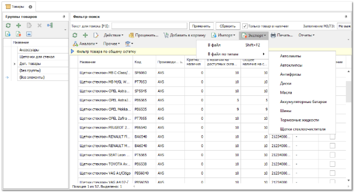

Для любого товара в справочнике можно указать его тип: шины, диски, масла и т.д. Указав тип товара, появляется возможность внести дополнительные свойства товара, характерные для его типа. При этом в **Настройках** раздел **Управление** **► Настройки программы** доступна возможность задать для каждого типа товара список обязательных для заполнения полей. Основные моменты при работе с дополнительными свойствами у товара:

**»** В карточке товара расположена панель с выбором **Типа товара**, значение "не задан" свидетельствует о том, что товар не причислен к тому или иному типу. При выборе какого-либо типа (из предустановленных) появляется возможность заполнить дополнительные свойства. **Дополнительные свойства** выбираются из имеющихся значений в других карточках товара этого же типа, либо вводятся новые. При этом допускается ввод нескольких значений, разделенных символом "точка с запятой".

**»** Для импорта карточек товара с дополнительными свойствами (либо обновления уже имеющихся карточек товара) необходимо вызвать на панели инструментов табличной части справочника **Товаров** команду **Импорт** пункт **Товары** (Ctrl+I) и в появившемся окне указать тип импортируемого/обновляемого товара. При этом в разметке мастера импорта появятся дополнительные свойства выбранного типа. Один тип за одну процедуру импорта.

**»** Для экспорта карточек товара со значениями дополнительных свойств необходимо воспользоваться командой **Экспорт** пункт **В файл по типам**, где в раскрывающемся меню указать тип экспортируемых товаров. Если на панели отсутствует команда, то необходимо сбросить панель либо вытащить эту команду на панель. Выгружается один тип товара за одну процедуру экспорта.

**»** Для вывода расширенных свойств на печать можно включить опцию **Добавлять к наименованиям товаров свойства их типа** в разделе меню **Управление ► Настройки программы ► Настройки ►** группа **Товары и цены ► Товары**.

Тогда к названиям товара добавляются его основные расширенные свойства. Эта опция влияет на отображение названия товара во всех модулях программы (документы, отчеты, Проценка и т.д.), в том числе при печати.

Вывести при печати свойство товара "*Ware.WareType*", в котором находится тип товара, и "*Ware.AdditionalProperties*", котором находятся основные расширенные свойства со значениями. 

::: note Пример

`{CurrentObject\_Items.Ware.WareType}` – тип товара: **Масла**.

`{CurrentObject\_Items.Ware.AdditionalProperties}` – свойства данного типа: **Полусинтетическое/10W-30**.

:::