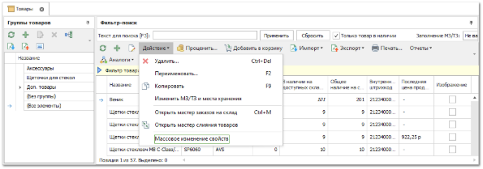
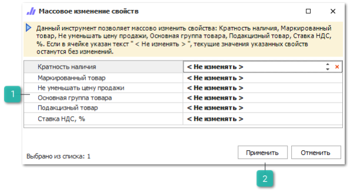
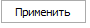
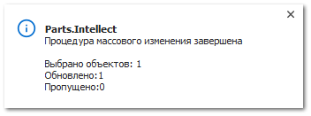
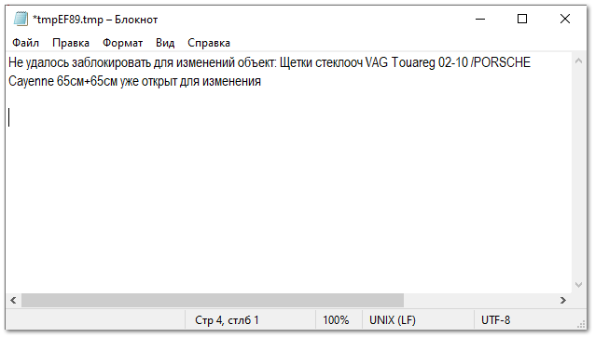

Для всех позиций в справочник **Товаров** доступно **Массовое изменение свойств** – команда, которая позволяет массово изменить значение параметров.

**»** Для выполнения массового изменения свойств товаров перейдите в справочник **Товары**  в разделе **Товары и цены.**

**»** В представленном справочнике отметьте позиции у которых необходимо изменить свойства. На панели команд нажмите на пункт **Действие** из списка команд выберете команду **Массовое изменение свойств**. После чего откроется одноименное окно.

 **Свойства**

Для изменения доступны свойства:

- **Кратность наличия** – коэффициент, согласно которому может быть выбрано количество для заказа из наличия. Также выполняет роль минимального количества к заказу;

- **Маркированый товар** – признак, который задается для товаров, подлежащих обязательной маркировке;

- **Не уменьшать цену продажи** – опция влияет на формирование цены продажи в **Приходной накладной** (только для Гибкой СЦО) с помощью команды **Наценка/Скидка**;

- **Основная группа товара** – принадлежность товара к группе из справочника товаров. Кроме всех имеющихся групп, добавлен пункт **Без группы**, который позволяет сбросить группу товара;

- **Подакцизный товар** – **Признак предмета расчета**, который задается для подакцизного товара и настраиваете в разделе **Печать чеков по СНО**;

- **Ставка НДС, %** – значение ставки в процентах, которое используется по умолчанию в документах в колонке **Ставка НДС, %**.

 **Применить**

Позволяет применить внесенные изменения.

**»** Внесите требуемые изменения. 

**»** Для применения внесенных изменений необходимо нажать кнопку **Применить**, после чего запустится обновление свойств. По завершению процесса в нижнем правом углу программы отобразится уведомление, содержащее отчет о результатах проведенной процедуры. Отчет содержит запись о: количестве выбранных для изменения объектов, количестве обновленных объектов, количестве пропущенных объектов.

В случае, наличия пропущенных объектов, откроется текстовый файл логирования, в котором находятся записи с причиной пропуска.

::: details Читайте также

- [Заполнение кодов маркировки](../../zakazy/vydacha/zapolnenie_kodov_markirovki.md)

- [Гибкая схема ценообразования](../../svoe_nalichie/osobennosti_formirovaniya/gibkaya_skhema_tsenoobrazovaniya.md)

:::