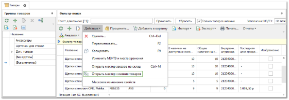
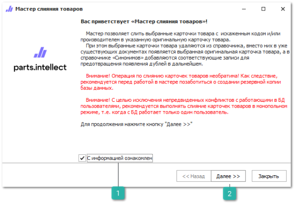
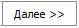
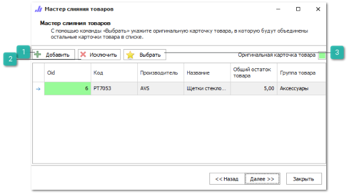
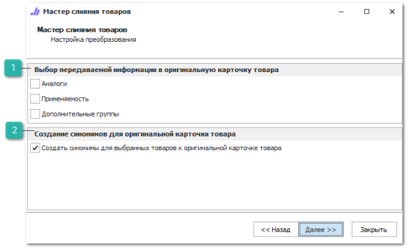
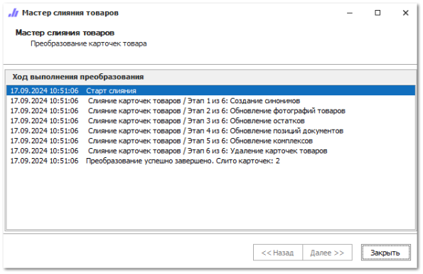

В случае, если в справочнике появились дубликаты карточек на фактически один товар, их необходимо слить в одну основную карточку по данному товару. Это позволит качественнее производить аналитику, поиск этого товара и т.д.

Для этого необходимо воспользоваться **Мастером слияния товаров**. Вызвать мастер можно на панели инструментов справочника **Товаров** с помощью команды **Действие** пункт **Открыть мастер слияния товаров**. 

Слияние карточек товаров производится в несколько шагов:

**»** Необходимо выделить требуемые для слияния карточки товаров (в справочнике **Товаров** или из **Корзины**, не менее двух карточек).

**»** Вызовите мастера и ознакомьтесь с особенностями мастера и перейдите на второй шаг мастера, установив галку **С информацией ознакомлен** и нажав кнопку **Далее**.

::: info Примечание

Если команда **Мастером слияния товаров** присутствует, но не активная, то у пользователя недостаточно разрешений на использование этого мастера. Чтобы добавить разрешение на вызов мастера, необходимо перейти в меню **Управление ► Настройки программы ► Роли пользователей** ► **Справочники ► Товары** и включить разрешение **Можно вызывать** "**Мастер слияния товаров**".

:::

 **С информацией ознакомлен**

Позволяет подтвердить ознакомление с информацией о работе с мастером.

 **Далее**

Позволяет перейти к следующему шагу.

::: info Примечание

Кнопка становится доступной после установки отметки об ознакомлении с информацией о работе с мастером.

:::

**»** На втором шаге мастера с помощью команды **Выбрать** указывается основная карточка для товара, в которую будут слиты остальные выбранные карточки.

 **Добавить** 

Позволяет добавить к слиянию карточки товаров из справочника **Товары**.

 **Исключить**

Позволяет удалить выделенную карточку из списка на слияние.

 **Выбрать**

Позволяет указать оригинальную карточку товара, в которую будут объединены остальные карточки товара в списке.

::: note Замечание

Оригинальная карточка товара будет выделена бледно-зеленым цветом.

:::

**»** На третьем шаге мастера указывается информация, которую необходимо передать в оригинальную карточку товара. Создание синонимов для выбранных товаров к оригинальной карточке товара позволит избавиться от дублей по этим артикулам в будущем.

 **Выбор передаваемой информации в оригинальную карточку товара**

Позволяет отметить какую информацию необходимо передать из карточке синонимов в оригинальную карточку товаров.

 **Создание синонимов для оригинальной карточки товара**

Позволяет задать действие **Создание синонимов для выбранных товаров к оригинальной карточке товара**.

**»** На следующем шаге отображается ход выполнения процедуры слияния карточек товара. Во время слияния все выбранные карточки подменяются в документах на оригинальную карточку, затем из них переносится выбранная информация в оригинальную карточку товара, а в конце процедуры лишние карточки удаляются и добавляются в качестве синонимов для оригинальной карточки товара.

**»** Для завершения работы мастера нажмите кнопку **Закрыть**.