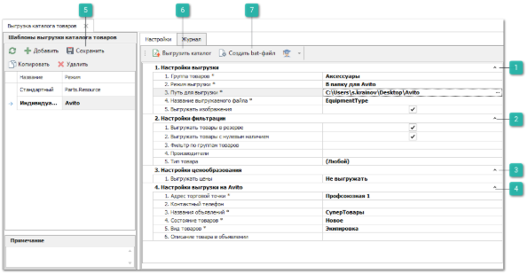

Для настройки выгрузки шаблона в файл для загрузки на сайт **Avito** необходимо выполнить следующее:

**»** На первом шаге осуществляется настройка выгрузки:

::: info Примечание

При выгрузке каталога возможно создание нескольких шаблонов выгрузки, а также отображение хронологии процесса обработки каталога на сайте.

Подробнее о режиме выгрузки В папку для Avito читайте в [отдельном руководстве пользователя](https://product-doc.tradesoft.ru/ai/marketplace/iz_fajla_xml.htm?ms=AwgI&st=MA%3D%3D&sct=MA%3D%3D&mw=MzIw).

:::

 **Настройка выгрузки**

- **Группа товаров** – указывается группа товаров в качестве основной группы товаров для выгрузки. Например, в справочнике групп товаров можно завести группы в соответствии с требуемыми каталогами на сайте. Одна группа – один каталог. А затем с помощью дополнительных групп у товаров наполнить требуемые каталоги;

- **Режим выгрузки*** – для выгрузки в файл для загрузки на сайт **Avito** указывается значение **В папку для Avito**. При выгрузке каталога товары будут загружены в файл с расширением XML;

- **Путь для выгрузки** – указывается директория на диске, в которую будет выгружен каталог;

- **Название выгружаемого файла** – название сформированного файла с каталогом товаров для **Avito**. Доступен макрос **{ДАТА}** для добавления даты формирования файла. Для ввода запрещены символы «/», «\», «:», «\*», «?», «<», «>», «|»;

::: note Замечание

Если в директории выгрузки уже существует файл с таким же названием, он будет перезаписан при выгрузке каталога.

:::

- **Выгружать изображения** – при включении опции выгружаются изображения товаров из сервиса **Веб-Инфо**.

 **Настройки фильтрации**

- **Выгружать товары в резерве** – фильтр определяет выгрузку позиции в резерве под клиентов;

- **Выгружать товары с нулевым наличием** – если опция включена, то в каталог попадают товары, отсутствующие на доступных складах (т.е. имеющие нулевое наличие);

- **Фильтр по группам товаров** – указываются группы товаров для выгрузки в каталог. При этом «пустые» группы удаляются уже на этапе формирования файла с каталогом;

- **Производители** – указываются производители товаров для выгрузки в каталог;

- **Тип товара** – позволяет произвести фильтрацию выгружаемых товаров по указанному типу.

 **Настройки ценообразования**

- **Выгружать цены** – определяется режим выгрузки цен на товар: 

    - **Не выгружать** – цены на товары не будут выгружены в каталог;

    - **По категории клиента** – цены выгружаются для категории клиента, указанной в опции **Категория клиентов для выгрузки**;

- **Категории клиентов для выгрузки** – указываются категории, цены для которых необходимо выгружать на сайт в каталоге. Настройка обязательна для заполнения;

- **Валюта** – валюта для цен на товары в выгружаемом каталоге;

::: note Замечание

Значение валюты определяется кодом из справочника **Финансы** ► **Валюты и курсы**. По умолчанию настройка **Валюта** принимает значение **Российский рубль** с кодом **643**. Если в справочнике отсутствует валюта с этим кодом, настройка остается пустой.

:::

- **Приоритет цен** – указывается значение цены, выгружаемой в случае формирования нескольких цен для категории клиентов на один товар, в каталог выгружается минимальная или максимальная цена для клиента, в зависимости от значения опции;

- **Метод округления цен** – метод округления цены до целого при выгрузке каталога на **Avito**. Цены выгружаются на **Avito** в формате целого числа. Содержит значения:

    - **Математический** – значение по умолчанию. При выгрузке каталога цены округляются до целого по математическим правилам;

    - **В большую сторону** – при выгрузке каталога цены округляются до целого в большую сторону;

    - **В меньшую сторону** – при выгрузке каталога цены округляются до целого в меньшую сторону.

::: warning Внимание!

Цены, равные 0, не выгружаются в каталог товаров.

:::

 **Настройки выгрузки на Avito**

- **Адрес торговой точки** – адрес места выдачи товара, который будет отражен в объявлениях на **Avito**;

- **Контактный телефон** – контактный телефон, который будет отражен в объявлениях на **Avito;**

- **Названия объявлений** – название объявления на **Avito**. Доступны макросы:

    - **{АРТИКУЛ}** – добавляет артикул из карточки товара;

    - **{ПРОИЗВОДИТЕЛЬ}** – добавляет производителя из карточки товара;

    - **{НАИМЕНОВАНИЕ}** – добавляет наименование из карточки товара. Если в карточке товара наименование отсутствует, то в объявлении отобразятся артикул и производитель товара;

- **Состояние товаров** – состояние товаров, которое будет отображено в объявлениях на **Avito**. Содержит значения**:**

    - **Новое**;

    - **Б\У**;

- **Вид товаров** – вид товара на **Avito**, с которым будут выгружены товары. При выборе некоторых значений открываются дополнительные настройки:

    - **Аксессуары для** – отображается, когда настройка **Вид товаров** принимает значение **Аксессуары**. При значениях: **Защита и декор**, **Для салона**, **Для колёс**, **Набор автомобилиста**, **Уход** отображается настройка **Тип аксессуара**;

    - **Вид аудио- и видеотехники** – отображается, когда настройка **Вид товаров** принимает значение **Аудио- и видеотехника**;

    - **Виды багажников и фаркопов** – отображается, когда настройка **Вид товаров** принимает значение **Багажники и фаркопы**; 

    - **Запчасти для** – отображается, когда настройка **Вид товаров** принимает значение **Запчасти**.

        При выборе значения **Для автомобилей** открывается дополнительная настройка **Область применения запчастей**, отображающая дополнительные настройки при выборе следующих значений:

        - **Двигатель** – отображает настройку **Детали двигателя**;

        - **Кузов** – отображает настройку **Детали кузова**;

        - **Трансмиссия и привод** – отображает настройку **Тип детали трансмиссии**.

        При выборе значения **Для грузовиков и спецтехники** открывается дополнительная настройка **Область применения запчастей**, отображающая дополнительные настройки при выборе следующих значений:

        - **Двигатели и комплектующие** – отображает настройку **Детали двигателя**;

        - **Трансмиссия** – отображает настройку **Детали трансмиссии**;

        - **Подвеска и рулевое управление** – отображает настройку **Детали подвески и рулевого управления**;

        - **Кабина** – отображает настройку **Детали кабины**;

        - **Рамы, кузова и надстройки** – отображает настройку **Детали рам, кузовов и надстроек**;

        - **Электроника и свет** – отображает настройку **Детали электроники и света**;

        - **Гидравлические и пневмосистемы** – отображает настройку **Детали гидравлической и пневмосистемы**;

        - **Тормозная система** – отображает настройку **Детали тормозной системы**.

    - **Вид масла и автохимии** – отображается, когда настройка **Вид товаров** принимает значение **Масла и автохимия**;

    - **Вид прицепов** – отображается, когда настройка **Вид товаров** принимает значение **Прицепы**;

    - **Вид противоугонного устройства** – отображается, когда настройка **Вид товаров** принимает значение **Противоугонные устройства**.

- **Описание товара в объявлении** – текст, который будет отображен на **Avito** в описании товара. Если поле остается пустым, в описании отобразятся артикул, производитель и наименование товара. Для форматирования используются HTML-теги. Доступны макросы:

    - **{АРТИКУЛ}** – добавляет артикул товара в описание объявления;

    - **{ПРОИЗВОДИТЕЛЬ}** – добавляет производителя товара в описание объявления;

    - **{НАИМЕНОВАНИЕ}** – добавляет наименование товара в описание объявления;

    - **{ОПИСАНИЕ}** – Добавляет описание из карточки товара. Если описания в карточке товара нет, то в текст выводятся артикул, производитель и наименование.

 **Сохранить**

Позволяет сохранить изменения в шаблоне.

::: note Замечание

Нельзя выполнить команды **Выгрузить каталог** и **Создать bat-файл**, если изменения шаблона не сохранены.

:::

 **Выгрузить каталог**

Позволяет осуществить выгрузку каталога товаров.

 **Создать bat-файл** 

Позволяет создать исполняемый файл для автоматизации процесса выгрузки каталогов.

::: warning Внимание!

Товары группы, указанной в настройке **Группа товаров**, должны соответствовать виду товаров из настройки **Вид товаров** и дополнительных настроек. Если выгружаемый товар не соответствует указанному виду товаров, объявление с таким товаром будет удалено с сайта **Avito** модераторами.

На сайте **Avito** есть свой список производителей запчастей: [https://autoload.avito.ru/format/PartsBrands.xml](https://autoload.avito.ru/format/PartsBrands.xml). В выгружаемом каталоге товаров производители должны совпадать с производителями с сайта **Avito**. Объявление с незнакомым производителем не будет загружено на сайт **Avito**.

:::

**»** Вызовите команду **Выгрузить каталог** на панели инструментов. Каталог товаров будет выгружен в файл XML. В дальнейшем файл необходимо самостоятельно выгрузить на сайт **Avito**.

Для автоматизации данной процедуры, можно воспользоваться командой **Создать bat-файл**. С ее помощью создается исполняемый bat-файл, который запускает программу, входит в указанную базу данных и осуществляет выгрузку каталога товаров. Данный bat-файл можно расположить в любом планировщике задач (например, планировщик Windows). Выгрузка каталога сопровождается записью лог-файла, в котором отражены результаты выполнения основных этапов выгрузки каталога. Файл расположен в папке с выгружаемым каталогом, имеет расширение "\*.log" и имя, совпадающее с именем выгружаемого каталога. Если лог-файл с таким именем уже существует, то в него дописывается пустая строка и продолжается логирование выполняемых операций.