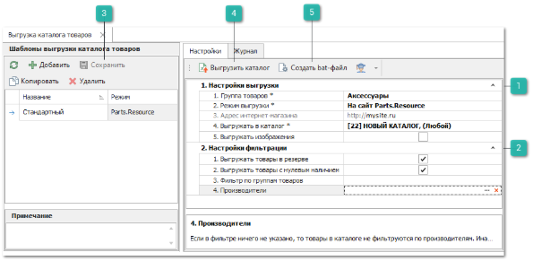
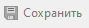
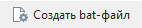

Для выгрузки шаблона на сайт **Parts.Resource** необходимо выполнить следующее:

**»** На первом шаге осуществляется настройка выгрузки:

::: info Примечание

При выгрузке каталога возможно создание нескольких шаблонов выгрузки, а также отображение хронологии процесса обработки каталога на сайте.

Подробнее о режиме выгрузки **На сайт Parts.Resource** читайте в [отдельном руководстве пользователя](https://product-doc.tradesoft.ru/ai_ar/5.8/vygruzka_katalogov_tovarov_iz_autointellekt.htm?ms=AwBABg%3D%3D&st=MA%3D%3D&sct=MA%3D%3D&mw=NDcx).

:::

 **Настройки выгрузки**

Блок содержит настройки:

- **Группа товаров** – указывается группа товаров в качестве основной группы товаров для выгрузки. Например, в справочнике групп товаров можно завести группы в соответствии с требуемыми каталогами на сайте. Одна группа – один каталог. А затем с помощью дополнительных групп у товаров наполнить требуемые каталоги;

- **Режим выгрузки*** – для выгрузки на сайт **Parts.Resource** указывается значение **На сайт Parts.Resource**. При выгрузке каталога содержимое выгружаемых групп товаров будет заменять соответствующие группы на сайте. Для имени учетной записи администратора CMS 1C-Битрикс по умолчанию передается значение **sync**. Для пароля учетной записи администратора CMS 1C-Битрикс используется значение настройки **Защитный токен** из раздела **Управление** ► **Настройки программы** ► **Настройки** ► **Обмен данными с Parts.Resource**;

- **Адрес интернет-магазина** – отображает адрес сайта **Parts.Resource**, на который будет выгружен каталог. Значение подставляется из настройки **Url интернет-магазина** раздела **Управление** ► **Настройки программы** ► **Настройки** ► **Обмен данными с Parts.Resource**;

- **Выгружать в каталог** – указывается название каталога на сайте **Parts.Resource**, в который будет выгружена информация о товарах;

- **Выгружать изображения** – при включении опции выгружаются изображения товаров и групп товаров из программы Parts.Intellect.

 **Настройки фильтрации**

Блок содержит настройки:

- **Выгружать товары в резерве** – фильтр определяет выгрузку позиции в резерве под клиентов;

- **Выгружать товары с нулевым наличием** – если опция включена, то в каталог попадают товары, отсутствующие на доступных складах (т.е. имеющие нулевое наличие);

- **Фильтр по группам товаров** – указываются группы товаров для выгрузки в каталог. При этом «пустые» группы удаляются уже на этапе формирования файла с каталогом;

- **Производители** – указываются производители товаров для выгрузки в каталог.

 **Сохранить**

Позволяет сохранить изменения в шаблоне.

::: info Примечание

Нельзя выполнить команды **Выгрузить каталог** и **Создать bat-файл**, если изменения шаблона не сохранены.

:::

 **Выгрузить каталог**

Позволяет осуществить выгрузку каталога товаров на сайт **Parts.Resource**.

 **Создать bat-файл** 

Позволяет создать исполняемый файл для автоматизации процесса выгрузки каталогов.

**»** Вызовите команду **Выгрузить каталог** на панели инструментов. Каталог товаров будет выгружен на сайт **Parts.Resource**.

Для автоматизации данной процедуры, можно воспользоваться командой **Создать bat-файл**. С ее помощью создается исполняемый bat-файл, который запускает программу, входит в указанную базу данных и осуществляет выгрузку каталога товаров. Данный bat-файл можно расположить в любом планировщике задач (например, планировщик Windows). Выгрузка каталога сопровождается записью лог-файла, в котором отражены результаты выполнения основных этапов выгрузки каталога. Файл расположен в папке с выгружаемым каталогом, имеет расширение "\*.log" и имя, совпадающее с именем выгружаемого каталога. Если лог-файл с таким именем уже существует, то в него дописывается пустая строка и продолжается логирование выполняемых операций.