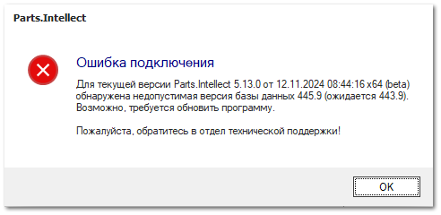

При попытке открытия базы данных выводится уведомление: *Ошибка подключения. Для текущей версии Parts.Intellect обнаружена недопустимая версия базы данных…*

**Причина** – программа была обновлена не на всех рабочих местах. С каждым обновлением программы повышается версия базы данных. При попытке подключения к базе данных из "старой" версии программы, выводится данное уведомление.

-*Решение** – выполнить обновление программы на всех рабочих местах.

::: details Читайте также

- [Обновление программы](../../../guide/installing/obnovlenie_programmy.md) 

:::