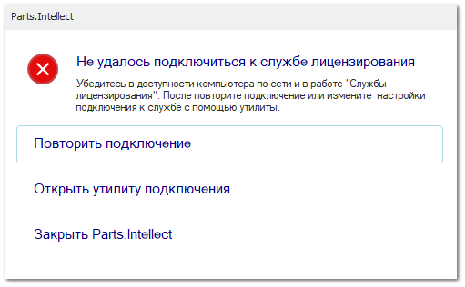

При запуске программы выводится уведомление: *Не удалось подключиться к службе лицензирования*

**Причина** – возможными причинами могут быть не запущенная на компьютере-сервере **Служба лицензирования** или если к ней не удалось подключиться по указанным **Адрес** и **Порт** компьютера, на котором она установлена, а так же отсутствие интернет-соединения.

**Решение**:

**»** Убедитесь, что **Служба лицензирования (Tradesoft.LicensingService.exe)** установлена на компьютере-сервере, запущена и активирована (меню Пуск – Компьютер – Средства администрирования Windows – Службы). Так же убедитесь, что на компьютере-сервере и компьютере, с которого производится подключение, присутствует интернет-соединение.

**»** В случае, если служба установлена, активирована и запущена, но уведомление все равно выводится, нажмите на форме кнопку **Повторить подключение**.

**»** В случае, если подключение к программе все еще не выполняется, то нажмите **Открыть утилиту подключения**. Введите ip-адрес и порт компьютера-сервера, на котором установлена служба (стандартно используется адрес localhost и 85 порт).

::: warning Внимание!

Если после выполнения данных рекомендаций не удалось соединится со **Службой лицензирования**, необходимо обратится в техническую поддержку компании Tradesoft.

:::