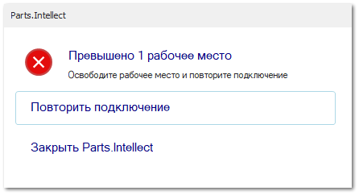

При запуске программы отображается диалоговое окно **Превышено N рабочих мест**.

**Причина** – вероятной причиной может быть превышение количества доступных рабочих мест по активированному серийному ключу продукта.

**Решение**:

**»** Убедитесь, что количество доступных рабочих мест по активированному ключу больше или равно количеству фактически запущенных Parts.Intellect. Информацию о доступных рабочих местах можно посмотреть в **Утилита активации/деактивации Parts.Intellect** с помощью команды **Информация о ключе**.

**»** В случае, если количество рабочих мест больше или равно количеству запущенных Parts.Intellect нажмите на кнопку **Повторить подключение**.