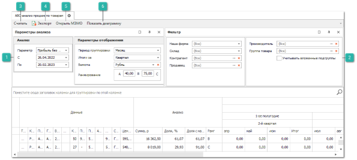
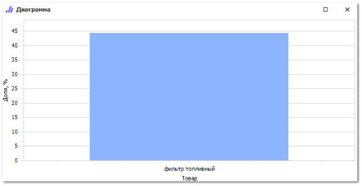

Чтобы сформировать **АВС – анализ по продажам** выполните следующие действия:

**»** Откройте раздел **Отчеты и анализ ► АВС – анализ по продажам**.  Отобразятся элементы выбранного пункта.

**»** Выберите требуемый вариант отчета:

- **По товарам** – анализ продаж по товарам;

- **По группам товаров** – анализ продаж товара с ранжированием по группам товаров;

- **По производителям** - анализ продаж товара с ранжированием по производителям товаров;

- **Сводный отчет** – анализ продаж товара с группировкой по периоду.

**»** Заполните необходимые параметры и фильтры для формирования отчета.

 **Параметры анализа**

Блок позволяет задать следующие параметры:

- **Параметр** – определяет вид отображения отчета (по сумме проданного товара/ количеству проданного товара) и документы по которым будет собираться статистика:

    - **Прибыль без учета ВК**, **КР** – статистика по товарным транзакциям без учета возвратов клиентов и корректировок расходов;

    - **Прибыль с учетом ВК**, **КР** – статистика по товарным транзакциям с учетом возвратов клиентов и корректировок расходов;

    - **Количество товара без учета ВК**, **КР** – статистика по товару без учета возвратов клиентов и корректировок расходов;

    - **Количество товара с учетом ВК**, **КР** – статистика по товару с учетом возвратов клиентов и корректировок расходов;

    - **Оборот по РН**, **ЗН**, **ВК**, **КР** – статистика по товарообороту из документов **Расходная накладная**, **Заказ-наряд** с учетом **Возвратов от клиента** и **Корректировок расхода**).

::: info Примечание

Параметр **Оборот по РН**, **ЗН**, **ВК**, **КР** присутствует в отчетах **По товарам**, **По производителям**.

:::

- **С**, **ПО** – период времени, за который будут собираться данные;

- **Период группировки** – период по которому будут группироваться данные в таблице (месяц, квартал, полугодие, год);

- **Ранжирование** – в данном поле задается процентное соотношение, определяющее группировку товара по АВС классификации. Введенное значение обозначает какой процент проданного товара от общего количества продаж должен быть у групп, статистика считается за весь период продаж.

- **Итоги за** – период группировки для итогового значения (месяц, квартал, полугодие, год);

- **Валюта** – выбор валюты для конвертации сумм в отчете с учетом действующего курса валюты. Параметр обязателен для заполнения. Доступен выбор только одной валюты;

::: info Примечание

Значение **Валюты** для столбцов **Последняя цена продажи** и **Последняя цена закупа** не пересчитывается, цены выводятся в той валюте, в которой была произведена операция.

:::

::: warning Внимание!

В **Сводном отчете** отсутствует блок **Параметры анализа**, статистика по умолчанию собирается по количеству товара с учетом возвратов от клиентов и корректировок расходов, **Период группировки**, **Итоги** и **Валюта** задается в **Фильтре для отчета**.

:::

 **Фильтр**

Блок позволяет задать следующие параметры фильтрации:

- **Наша фирма** – выбор **Нашей фирмы**, по документам которой будет сформирован отчет. Доступен выбор одной или нескольких фирм;

- **Склад** – значение склада, документы которого попадут в отчет. Доступен выбор одного или нескольких складов;

- **Производитель** – выбор производителя для формирования отчета. Доступен выбор одного или нескольких производителей, в зависимости от выбранного отчета. По умолчанию значение **Все**;

- **Группа товара** – выбор группы товаров, по которой будет формироваться отчет. Доступен выбор одной или нескольких групп, в зависимости от выбранного отчета. По умолчанию значение **Все**;

- **Учитывать вложенные подгруппы** – при активной настройке вложенные группы товаров будут отображаться в отчете;

Индивидуальные параметры фильтрации в отчетах:

- **Отчет по товарам**:

    - **Контрагент** – выбор контрагента, по которому будет сформирован отчет. Доступен выбор только одного **Контрагента**. По умолчанию значение **Все**;

    - **Продавец** – пользователь, созданные документы которого будут выведены в отчет. Доступен выбор только одного **Продавца**. По умолчанию значение **Все**.

- **Отчет по группам товаров**:

    - **Группировать по производителю** – при активной настройке группировка товаров производится по существующим группам товаров и производителям.

- **Сводный отчет**:

    - **Период** – период времени, за который будут собираться данные;

    - **Товары проданные впервые** – при активной настройке отчет будет сформирован по позициям, которые не продавались ранее заданного периода;

    - **Минимальный запас** – позволяет сформировать отчет по позициям для которых есть и для которых нет минимального запаса;

    - **Временная группировка** – период по которому будут группироваться данные в таблице (месяц, квартал, полугодие, год);

    - **Итоги** – позволяет вывести количественные итоги продаж товара: **Все**/ **Квартально**/ **Полугодовые**/ **Годовые**. По умолчанию значение не выводить.

 **Считать** 

Позволяет выполнить формирование отчета с учетом заданных параметров.

 **Экспорт**

Позволяет сформировать файл в формате **.xls** и **.xlsx**.

 **Открыть МЗМО**

Позволяет запустить **Мастер заказов на склад** по выбранным позициям.

 **Показать диаграмму**

Позволяет сформировать диаграмму по отчету.

::: info Примечание

Действия **Открыть МЗМО** и **Диаграмма** доступны только после формирования отчета.

:::

::: info Примечание

Действие **Диаграмма** отсутствует в **Сводном отчете**.

:::

**»** Нажмите на кнопку **Считать** на панели инструментов для того, чтобы сформировать отчет или выберите другие действия из доступных.

::: details Читайте также

- [Отчеты ABC-анализ продаж](../../../specification/otchety_i_analiz/abc-analiz_prodazh/abc-analiz_prodazh.md)

- [Формирование заказов с использованием Мастера заказов на склад](../../svoe_nalichie/upravlenie_nalichiem/formirovanie_zakaza.md) 

:::