**АВС – анализа продаж По группам товаров** содержит информацию о продажах в разрезе групп товаров в заданном периоде, а также их группировку по АВС признаку.

**Табличная часть** включает в себя следующую информацию:

## Блок Данные

Общая информация.

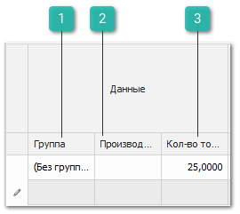

 **Группа**

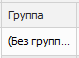

Выводит группу товаров из справочника **Товары**.

 **Производитель**

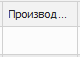

Выводит наименование производителя товара.

 **Кол-во товаров**

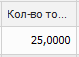

Выводит количество реализованного товара. Выводимое количество зависит от выбранного **Параметра**

## Блок Анализ

Данные по продажам товара.

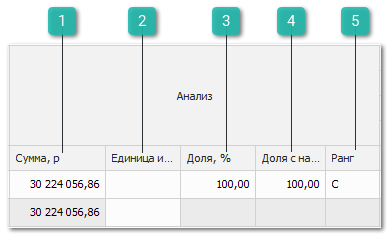

 **Сумма, р / Кол-во без учета ВК, КР / Кол-во с учетом ВК, КР** 

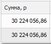

- Для отчетов, сформированных по **Параметрам**: **Прибыль без учета ВК, КР**; **Прибыль с учетом ВК, КР** – отображается колонка **Сумма**. Колонка выводит сумму реализованного товара за заданный период.

- Для отчетов, сформированных по **Параметру**: **Кол-во без учета ВК, КР** – отображается колонка **Кол-во** **без учета ВК, КР**. Колонка выводит количество реализованного товара без учета документов **Возврат от клиента** и **Корректировка расходной накладной**.

- Для отчетов, сформированных по **Параметру**: **Кол-во с учетом ВК, КР** – отображается колонка **Кол-во с учетом ВК, КР**. Колонка выводит количество реализованного товара с учетом документов **Возврат от клиента** и **Корректировка расходной накладной**.

 **Единица измерения**

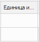

Выводит единицу измерения для товара.

 **Доля, %**

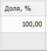

Выводит процент продаж по товару от общего количества продаж в разрезе заданного периода.

 **Доля с накопительным итогом, %**

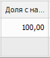

Выводит процент продаж по товару от общего количества продаж за весь период работы. Данное поле является определяющим для поля **Ранг**.

 **Ранг**

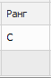

Выводит группу товара (**А**, **В** или **С**). Значение присваивается по столбцу **Доля с накопительным итогом, %** с учетом заданного **Ранжирования**.

## Блок Объемы по периодам 

Итоговые значения.

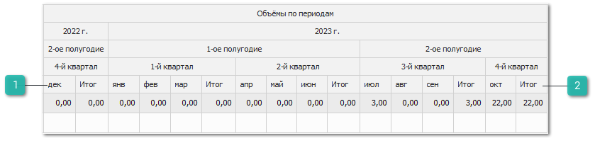

 **Колонки месяцев**

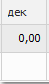

Выводит значение колонок **Сумма**/**Количество** блока **Анализ**, разбитое на месяцы. Значение может измениться в зависимости от **Параметра**, по которому был сформирован отчет.

 **Итого**

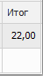

Выводит итоговое значение суммы/количества реализованного товара за квартал.

Также табличная часть содержит:  

- Значение столбцов **Сумма**/ **Кол-во** из блока **Анализ** разбитое на столбцы в зависимости от заданного периода группировки;

- **Итого** – итоговое значение суммы/ количества проданного товара (в разрезе периодов).

::: note Замечание

В разделе **АВС-анализ продаж** **по группам товаров** для каждого столбца доступны несложные расчеты. Для проведения расчетов необходимо нажать правой клавишей мыши на панели под столбцом и выбрать требуемый алгоритм: Сумма, Минимум, Максимум, Количество, Среднее, Нет. После выбора алгоритма доступен выбор **Режима** расчета:

- **Все строки** – значение будет рассчитываться по всем строкам; 

- **Выделенные** – значение будет рассчитываться по выбранным строкам; 

- **Смешанный** – значение может быть рассчитано по выбранным строкам, если выбрано больше одной строки или по всем, если выбрано только одна строка или не выбрано ни одной. 

Алгоритмы **Сумма** и **Среднее** доступны только для колонок с числовыми значениями.

:::

::: note Замечание

Для значений каждой колонки доступна фильтрация. Для этого необходимо навести мышку на название соответствующей колонки, нажать на значок   и выбрать признак для фильтрации – результаты будут отфильтрованы по точному совпадению.

:::

::: info Примечание

Числовые значения в отчетах округлены до сотых для того, чтобы увидеть число целиком на него необходимо нажать.

:::

::: details Читайте также

- [Справочник Товары](../../../specification/tovary_i_tseny/tovary/README.md) 

:::