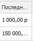

**АВС – анализ продаж По товарам** содержит информацию о продажах товара в заданном периоде, а также группировку товара по АВС-признаку.

**Табличная часть** включает в себя следующую информацию:

- блок **Данные** – общая информация.

 **Товар / Наименование**

Выводит наименование товара.

 **Код**

Выводит артикул товара.

 **Производитель**

Выводит наименование производителя товара.

 **Группа**

Выводит наименование группы товара.

 **Вес товара**

Выводит вес товара.

 **МЗ-ТЗ**

Выводит значение минимального запаса и точки заказа по позиции.

 **Кол-во**

Выводит количество реализованного товара. Выводимое количество зависит от выбранного **Параметра**

 **Последняя цена закупа**

Выводит цена закупа на товар из последней **Приходной накладной**.

 **Последняя цена продажи**

Выводит цену продажи из последней **Расходной накладной**.

 **Общее наличие на складах**

Выводит количество товара в свободном остатке и в резерве на момент формирования отчета.

 **Склады**

Выводит наименование склада на котором находится позиция.

 **Цена закупа из прайс-листа из наличия**

Выводит цену закупа, указанная в прайс-листе наличия.

 **Тип товара**

Выводит тип товара, указанный в карточке товара.

 **Свойство товара**

Выводит свойства типа товара, указанные в карточке товара.

- блок **Анализ** – данные по продажам товара.

 **Сумма, р / Кол-во без учета ВК, КР / Кол-во с учетом ВК, КР**

- Для отчетов, сформированных по **Параметрам**: **Прибыль без учета ВК, КР**; **Прибыль с учетом ВК, КР**; **Оборот по РН, ЗН, ВК, КР** – отображается колонка **Сумма**. Колонка выводит сумму реализованного товара за заданный период.

- Для отчетов, сформированных по **Параметру**: **Кол-во без учета ВК, КР** – отображается колонка **Кол-во** **без учета ВК, КР**. Колонка выводит количество реализованного товара без учета документов **Возврат от клиента** и **Корректировка расходной накладной**.

- Для отчетов, сформированных по **Параметру**: **Кол-во с учетом ВК, КР** – отображается колонка **Кол-во с учетом ВК, КР**. Колонка выводит количество реализованного товара с учетом документов **Возврат от клиента** и **Корректировка расходной накладной**.

 **Единица измерения**

Выводит единицу измерения для товара.

 **Доля, %**

Выводит процент продаж по товару от общего количества продаж в разрезе заданного периода.

 **Доля с накопительным итогом, %**

Выводит процент продаж по товару от общего количества продаж за весь период работы. Данное поле является определяющим для поля **Ранг**.

 **Ранг**

Выводит группу товара (**А**, **В** или **С**). Значение присваивается по столбцу **Доля с накопительным итогом, %** с учетом заданного **Ранжирования**.

- блок **Объемы по периодам** – итоговые значения:

 **Колонки месяцев**

Выводит значение колонок **Сумма**/**Количество** блока **Анализ**, разбитое на месяцы. Значение может измениться в зависимости от **Параметра**, по которому был сформирован отчет.

 **Итого**

Выводит итоговое значение суммы/количества реализованного товара за квартал.

::: note Замечание

В разделе **АВС-анализ продаж** **по товарам** для каждого столбца доступны несложные расчеты. Для проведения расчетов необходимо нажать правой клавишей мыши на панели под столбцом и выбрать требуемый алгоритм: Сумма, Минимум, Максимум, Количество, Среднее, Нет. После выбора алгоритма доступен выбор **Режима** расчета:

- **Все строки** – значение будет рассчитываться по всем строкам; 

- **Выделенные** – значение будет рассчитываться по выбранным строкам; 

- **Смешанный** – значение может быть рассчитано по выбранным строкам, если выбрано больше одной строки или по всем, если выбрано только одна строка или не выбрано ни одной.

Алгоритмы **Сумма** и **Среднее** доступны только для колонок с числовыми значениями.

:::

::: info Примечание

В отчете возможны отрицательные числа в таблице в случае возвратов товара от клиентов. Числовые значения в отчетах округлены до сотых для того, чтобы увидеть число целиком на него необходимо нажать. 

:::

::: note Замечание

Для значений каждой колонки доступна фильтрация. Для этого необходимо навести мышку на название соответствующей колонки, нажать на значок   и выбрать признак для фильтрации – результаты будут отфильтрованы по точному совпадению.

:::

::: details Читайте также

- [Документы Расходные накладные](../../../specification/prodazhi/rashodnye_nakladnye/rashodnye_nakladnye.md)

- [Документы Приходные накладные](../../../specification/sklad_i_zakupki/prihodnye_nakladnye.md)

- [Добавление карточки товара](../../nomenklatura/tovary/dobavlenie_kartochki_tovara.md) 

:::