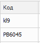
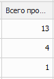

**АВС – анализа по продажам Сводный отчет** содержит информацию о продажах товара в заданном периоде, а также информацию о наличии минимального запаса и точки заказа по позиции из справочника **Товаров**.

**Табличная часть** включает в себя следующую информацию:

- блок **Товар** – общая информация:

 **Склад**

Выводит наименование склада, на котором находится позиция

 **Код**

Выводит артикул товара

 **Наименование товара**

Выводит наименование товара

 **Товар**

Выводит наименование товара

 **Остаток на доступных складах**

Выводит значение остатка на доступных складах

 **Общий остаток**

Выводит значение общего остатка на всех складах

 **Производитель**

Выводит наименование производителя

 **МЗ-ТЗ**

Выводит значение минимального запаса и точки заказа по позиции.

 **Всего продано**

Выводит количество проданного товара

- блок **Данные** – количество проданных товаров, разбитое по месяцам

::: note Замечание

Для значений каждой колонки доступна фильтрация. Для этого необходимо навести мышку на название соответствующей колонки, нажать на значок   и выбрать признак для фильтрации – результаты будут отфильтрованы по точному совпадению.

:::

::: info Примечание

Числовые значения в отчетах округлены до сотых для того, чтобы увидеть число целиком на него необходимо нажать. В отчете возможны отрицательные числа в таблице в случае возвратов товара от клиентов. 

:::

::: details Читайте также

- [Справочник Товары](../../../specification/tovary_i_tseny/tovary/README.md) 

:::