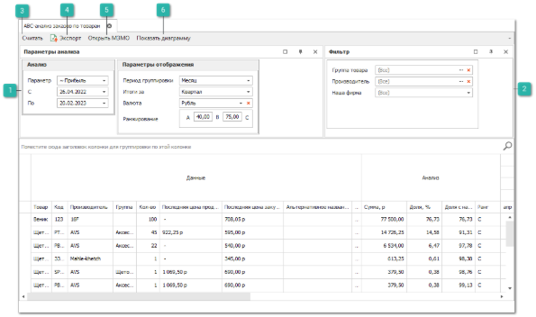
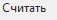

Чтобы сформировать **АВС – анализ по заказам** выполните следующие действия:

**»** Откройте раздел **Отчеты и анализ ► АВС – анализ по заказам**, выберите требуемый вариант отчета:

- **По поставщикам** – отчет позволяет проранжировать поставщиков из **Заказов поставщикам** по принципам ABC-анализа, оперируя оборотом по **Заказам поставщикам**;

- **По товарам** – отчет позволяет проранжировать товары из **Заказов клиентов** по принципам ABC-анализа, оперируя прибылью по ним в **Заказах клиентов**.

**»** Отобразятся элементы выбранного пункта.

 **Параметры анализа**

Блок позволяет задать следующие параметры:

- **Параметр** – определяет вид выведения отчета и принцип группировки:

    - **~Прибыль** – позволяет сформировать отчет по прибыли, сгруппированный по автомобилям;

    ::: info Примечание

    Во всех отчетах, за исключением отчета **АВС-анализ заказов по товарам** информация о заказанных товарах не выводится.

    :::

    - **Товары** – позволяет сформировать отчет по прибыли, сгруппированный по товарам;

    - **Оборот** – позволяет сформировать отчет, сгруппированный по поставщикам. С информацией о сумме заказов за заданный период каждому поставщику.

::: info Примечание

В зависимости от выбранного отчета значение **Параметров** отличается:

- **По маркам автомобилей** и **По моделям автомобилей** доступны: **~Прибыль** и **Товары**; 

- **По поставщикам** доступен: **Оборот**; 

- **По товарам** доступен: **~Прибыль**.

:::

- **С**, **ПО** – период времени, за который будут собираться данные;

- **Период группировки** – период по которому будут группироваться данные в таблице (месяц, квартал, полугодие, год);

- **Итоги за** – период группировки для итогового значения (месяц, квартал, полугодие, год);

- **Валюта** – выбор валюты для конвертации сумм в отчете с учетом действующего курса валюты. Параметр обязателен для заполнения. Доступен выбор только одной валюты;

::: info Примечание

Значение **Валюты** для столбцов **Последняя цена продажи** и **Последняя цена закупа** в отчете **По товарам** не пересчитывается, цены выводятся в той валюте, в которой была произведена операция.

:::

- **Ранжирование** – в данном поле задается процентное соотношение, определяющее группировку товара по АВС классификации. Введенное значение обозначает какой процент заказов по товару/ автомобилю от общего количества заказанного товара должен быть у групп. Статистика считается за весь период.

 **Фильтр**

Блок позволяет задать следующие параметры:

- **Наша фирма** – выбор **Нашей фирмы**, по документам которой будет сформирован отчет. Доступен выбор одной или нескольких фирм;

- **Марки автомобилей** – выбор марок автомобилей клиентов, по которым будет сформирован отчет;

- **Исключить заказы без автомобиля** – настройка позволяет исключить из результатов отчета заказы, в которых отсутствуют **Автомобили**;

::: info Примечание

**Отчет по товарам** также дополнительно содержит настройки:

- **Группа товара** – выбор группы товаров, по которой будет формироваться отчет. Доступен выбор одной или нескольких групп, в зависимости от выбранного отчета. По умолчанию значение **Все**; 

- **Производитель** – выбор производителя для формирования отчета. Доступен выбор одного или нескольких производителей, в зависимости от выбранного отчета. По умолчанию значение **Все**.

:::

 **Считать**

Позволяет запустить формирование отчета.

 **Экспорт**

Позволяет сформировать файл в формате **.xls** и **.xlsx**.

 **Открыть МЗМО**

Позволяет запустить **Мастер заказов на склад** по выбранным позициям.

 **Показать диаграмму**

Позволяет сформировать диаграмму по отчету.

::: note Замечание

В разделах **АВС-анализ по производителям** и **АВС-анализ по товарам** для каждого столбца доступны несложные расчеты. Для проведения расчетов необходимо нажать правой клавишей мыши на панели под столбцом и выбрать требуемый алгоритм: Сумма, Минимум, Максимум, Количество, Среднее, Нет. После выбора алгоритма доступен выбор **Режима** расчета:

- **Все строки** – значение будет рассчитываться по всем строкам; 

- **Выделенные** – значение будет рассчитываться по выбранным строкам; 

- **Смешанный** – значение может быть рассчитано по выбранным строкам, если выбрано больше одной строки или по всем, если выбрано только одна строка или не выбрано ни одной. Алгоритмы **Сумма** и **Среднее** доступны только для колонок с числовыми значениями.

:::

::: details Читайте также

- [ABC-анализ заказов](../../../specification/otchety_i_analiz/abc-analiz_zakazov/abc-analiz_zakazov.md)

- [АВС-анализ заказов По поставщикам](./po_postavshchikam.md)

- [АВС-анализ заказов По товарам](./po_tovaram.md) 

:::