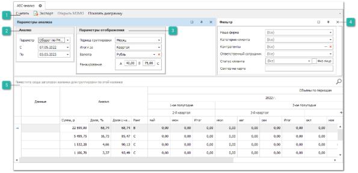
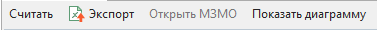
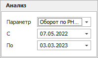
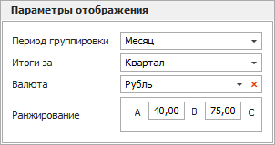
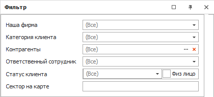
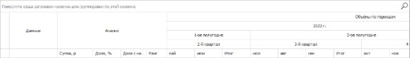

**АВС-анализ** производит АВС-анализ продаж по контрагенту по различным параметрам, которые задаются при формировании отчета.

Чтобы сформировать **АВС-анализ** выполните следующие действия:

**»** Откройте раздел **CRM** ► **Анализ клиентской базы** ► **АВС-анализ**.

**»** Заполните параметры анализа, при необходимости задайте фильтр.

 **Панель действий**

Панель действий содержит следующие команды:

- **Считать** – позволяет сформировать отчет с учетом заданных параметров;

- **Экспорт** – позволяет сформировать файл в формате **.xls** и **.xlsx**.;

- **Открыть МЗМО** – позволяет запустить **Мастер заказов на склад** по выбранным позициям;

- **Показать диаграмму** – позволяет сформировать диаграмму по отчету.

 **Анализ**

Блок содержит параметры:

- **Параметр** – документы, по которым будет собираться статистика продаж контрагенту:

    - **Оборот по РН, ЗН, ВК, КР** – статистика по товарным транзакциям с учетом возвратов клиентов;

    - **Прибыль по РН, ЗН, ВК, КР** – статистика по товарным транзакциям с учетом возвратов клиентов;

    - **Оборот по ВК** – статистика по товарным транзакциям, только по возвратам клиентов;

    - **Оборот по КР** – статистика по документам Корректировка расхода;

    - **Оборот по РН и ЗН** – статистика по товарным транзакциям без учета возвратов клиентов.

- **Дата начала и окончания периода** – промежуток времени, за который собирается информация.

 **Параметры отображения**

Блок содержит параметры:

- **Период группировки** – период времени, за который группировать данные в таблице;

- **Итоги за** – период, за который рассчитывать итоги;

- **Валюта** – валюта, в которой выводятся значения;

- **Ранжирование A \[N1\] B \[N2\] C** – параметры, на основании которых контрагентам присваивается та или иная группа (А, В или С):

    - если поле **Доля с накопительным итогом** < N1, контрагенту присваивается группа А;

    - если поле **Доля с накопительным итогом** > N2, контрагенту присваивается группа C;

    - для остальных ставится группа В.

 **Фильтр**

Блок содержит параметры фильтрации:

- **Наша** **фирма** – выбор **Нашей фирмы**, по документам которой будет сформирован отчет. Доступен выбор одной или нескольких фирм;

- **Категория** **клиента** – фильтр контрагентов по категории клиента;

- **Контрагент** – фильтр по списку контрагентов из справочника;

- **Ответственный** **сотрудник** – фильтр контрагентов по ответственному сотруднику;

- **Статус** **клиента** – фильтр контрагентов по статусу клиента;

- **Сектор** **карты** – фильтр контрагентов по сектору карты.

 **Табличная часть**

**Табличная часть** отчета включает в себя следующую информацию:

- **Данные** – общая информация:

    - **Клиент** – наименование товара;

- **Анализ** – данные по продажам товара:

    - **Сумма** – сумма реализованного товара за заданный период по контрагенту;

    - **Доля, %** – доля контрагента в обороте в разрезе заданного периода;

    - **Доля с накопительным итогом, %** – доля контрагента в обороте с накопительным итогом. Данное поле является определяющим для поля **Ранг**;

    - **Ранг** – группа товара (**А**, **В** или **С**). Значение присваивается по столбцу **Доля с накопительным итогом, %** с учетом заданного **Ранжирования**.

- **Объемы по периодам** – итоговые значения:

    - Значение столбцов **Сумма** из блока **Анализ** разбитое на столбцы в зависимости от заданного периода группировки;

    - **Итого** – итоговое значение суммы проданного товара (в разрезе периодов).

::: note Замечание

Для значений каждой колонки доступна фильтрация. Для этого необходимо навести мышку на название соответствующей колонки, нажать на значок   и выбрать признак для фильтрации – результаты будут отфильтрованы по точному совпадению.

:::

::: info Примечание

Числовые значения в отчетах округлены до сотых для того, чтобы увидеть число целиком на него необходимо нажать.

:::

::: note Замечание

В разделе **АВС-анализ** для каждого столбца доступны несложные расчеты. Для проведения расчетов необходимо нажать правой клавишей мыши на панели под столбцом и выбрать требуемый алгоритм: Сумма, Минимум, Максимум, Количество, Среднее, Нет. После выбора алгоритма доступен выбор **Режима** расчета:

- **Все строки** – значение будет рассчитываться по всем строкам; 

- **Выделенные** – значение будет рассчитываться по выбранным строкам; 

- **Смешанный** – значение может быть рассчитано по выбранным строкам, если выбрано больше одной строки или по всем, если выбрано только одна строка или не выбрано ни одной. Алгоритмы **Сумма** и **Среднее** доступны только для колонок с числовыми значениями.

:::

::: details Читайте также

- [Формирование заказов с использованием Мастера заказов на склад](../../svoe_nalichie/upravlenie_nalichiem/formirovanie_zakaza.md) 

:::