**RFM-анализ** позволяет получить информацию об активности клиентов за заданный промежуток времени по частоте, давности и сумме покупок. Согласно полученным показателям определяется лояльность клиента и присваивается определенная группа для проведения маркетинговых действий в соответствии с этой группой: массовые рассылки, обзвоны, персональные акции и т.д.

Алгоритм построения отчета:

- Для анализа отбираются данные по документам **Расходные** **накладные** на основе заданных параметров и фильтров анализа только среди контрагентов с признаком **Покупатель**.

- Для каждого контрагента вычисляется:

    - Показатель **Recency (давность покупки)** – определяется дата последней проведенной РН в рамках заданного интервала, после вычисляется разность между датой, указанной в параметре По (блока Временной интервал) и датой (документа) последней покупки.

    - Показатель **Frequency (Количество покупок)** – отбираются все проведенные РН и вычисляется их общее количество.

    - Показатель **Monetary (объем покупок)** – сумма покупок за заданный период (сумма всех проведенных документов РН за период).

- Полученные данные распределяются на ранги с учетом заданных интервалов в параметре анализа. Тем контрагентам, кто недавно осуществлял покупки, будет присвоено высшее значение ранга. Те, кто дольше всех не производил покупок, получат низшее значение.

- После совмещения значения рангов по каждому показателю каждый клиент получит код RFM, состоящий из трех цифр (трех значений рангов по каждому из параметров). Контрагенты, которые не совершали покупок за выбранный период попадают (по умолчанию) в сегмент 000.

Чтобы сформировать **RFM-анализ** выполните следующие действия:

**»** Откройте раздел **CRM** ► **Анализ клиентской базы** ► **RFM-анализ**. На начальной странице формирования **RFM-анализа** будет представлена справочная информация о целях и возможностях RFM-анализа.

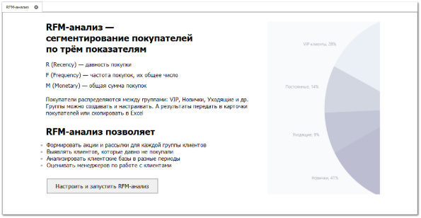

**»** Нажмите кнопку **Настроить** **и запустить RFM-анализ.** Откроется окно для указания параметров и диапазонов рангов RFM-анализа.

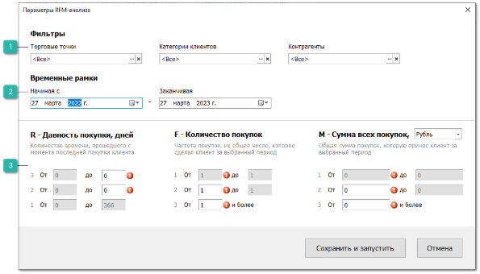

 **Фильтры**

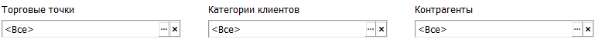

Блок содержит параметры фильтрации:

- **Торговые точки** – указывается торговая точка, по которой будет производиться анализ. В рамках анализа будут учитываться Расходные накладные, у которых поле **Торговая точка-автор** совпадает с выбранными значениями фильтра.

- **Категории клиентов** – указываются Категории контрагентов, которые будут участвовать в анализе;

- **Контрагенты** – указываются Контрагенты с признаком **Покупатель**, которые будут участвовать в анализе.

 **Временные рамки**

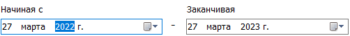

Блок содержит поля для указания диапазона дат, в рамках которых будет производиться анализ.

 **Показатели RFM-анализа**

Каждая секция показателя содержит 3 ранга. Ранг включает в себя 2 границы интервала (от и до) для определения сегмента. 

- Секция **R – Давность покупки, дней** – количество времени, прошедшего с момента последней покупки:

    - **Ранг 3**: Значение "от" (включительно) предустановлено и равно "0". Значение "до" вводится вручную.

    - **Ранг 2**: значение "от" (включительно) заполняется автоматически по формуле: (значение "до" Ранг 3)+1. Значение "до" вводится вручную.

    - **Ранг 1**: Значение "от" (включительно) заполняется автоматически по формуле: (значение "до" Ранг 2)+1. Значение "до" определяется, как максимальное количество дней в заданном интервале.

- Секция **F – Количество покупок** – частота покупок, их общее число, которое сделал клиент за выбранный период.

    - **Ранг 3**: Значение "от" (включительно) вводится вручную. Ранг не имеет границы диапазона.

    - **Ранг 2**: Значение "от" (включительно) вводится вручную. Значение "до" заполняется автоматически по формуле: (значение "от" Ранг 3) -1.

    - **Ранг 1**: Значение "от" (включительно) предустановленное и равно "1". Значение "до" заполняется автоматически по формуле: (значение "от" Ранг 2) -1.

- Секция **M – Сумма всех покупок** – общая сумма покупок, которую принес клиент за выбранный период:

    - **Ранг 3**: Значение "от" (включительно) вводится вручную. Ранг не имеет границы диапазона.

    - **Ранг 2**: Значение "от" (включительно) вводится вручную. Значение "до" заполняется автоматически по формуле: (значение "от" Ранг 3) -1.

    - **Ранг 1**: Значение "от" (включительно) предустановлено и равно "0". Значение "до" заполняется автоматически по формуле: (значение "до" Ранг 2) -1.

::: info Примечание

Для **Секции М** необходимо предварительно выбрать значение валюты анализа из выпадающего списка. По умолчанию для валюты устанавливается значение **Основной** **валюты** контрагента **Нашей** **Фирмы**. Все суммы по документам пересчитываются в валюту отображения анализа с учетом заданного курса валют. Выбранная валюта анализа отображается также в блоке **Параметры** в окне результатов анализа. 

:::

**»** Нажмите кнопку **Сохранить и запустить** для запуска процесса построения RFM-анализа. Отобразятся результаты анализа.

::: warning Внимание!

Параметры RFM-анализа сохраняются глобально в рамках базы данных, т.е. являются общими для всех пользователей базы.

:::

::: info Примечание

По результатам анализа можно разделить всех клиентов на группы и понять, кто из клиентов покупает у вас часто и много, кто — часто, но мало, клиентов без покупок и т.д. RFM использует поведение покупателей, чтобы определить, как работать с каждой группой клиентов для улучшения взаимодействия и повышение прибыли.

:::

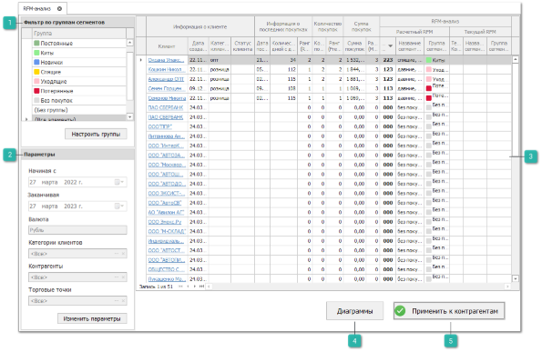

 **Фильтр по группам сегментов**

Позволяет осуществить фильтрацию проанализированных клиентов по **Группам сегментов**. Панель **Группа сегментов** содержит группы, разделяющие сегменты согласно предпочтениям пользователя. Ранжирование сегментов по группам позволит сформировать уникальную ценовую политику для каждой категории.

|Примеры маркетинговых стратегий для каждой группы сегментов|||||
| :-: | :- | :- | :- | :- |
|Цвет|Название группы|Описание|Маркетинговая стратегия|Сегмент|
||Лучшие|Совершали покупки часто, недавно и на большие суммы. Стоит работать с ними индивидуально.|Персональная работа: стоит предложить нечто самое ценное, например, золотую карту, или пригласить на отдельное мероприятие, выразить особую благодарность. |333|
||Постоянные|Тратили не много, но регулярно. Стоит стимулировать подарками и бонусами.|Можно предложить сопутствующие товары, подарок за сделанную покупку, программы лояльности, бонусы, что бы стимулировать вложения.|321, 322, 331, 332|
||Киты|Тратили большие суммы,  но от случая к случаю. Это ценные клиенты.|Возможно, индивидуальная работа: стоит изучить, что клиенты покупали, и предложить товар из схожей категории. Узнать, чего бы они хотели от компании в будущем. |223, 233, 323|
||Новички|Покупали недавно впервые. Стоит обратить внимание на эту группу клиентов.|Стоит помочь в выборе товара, как вариант, поздравить с покупкой, пригласить в соцсети, предложить выгодные акции. Это поможет установить крепкие отношения с клиентами всерьез и надолго.|311, 312, 313|
||Спящие|Не так давно совершали покупки, но перестали это делать. Стоит выяснить причины ухода.|Стоит выяснить, почему перестали быть активными, и предложить что-то новое. Можно рассказать об акциях, скидках, распродажах. Так, возможно, получится спровоцировать их на новые покупки.|221, 212, 213, 221, 222, 231, 232|
||Уходящие|В прошлом были хорошими покупателями. Стоит выяснить причины ухода.|Стоит выяснить о причинах ухода, и предложить новые выгодные предложения. Можно рассказать об акциях, скидках, распродажах. Так, возможно, получится оживить отношения с ними.|121, 122, 123, 131, 132, 133|
||Потерянные|Совершали покупку один раз и больше не покупали. Стоит рассказать об акциях и новых предложениях.|Стоит попробовать спровоцировать на большую активность, предложить что то новое. Можно рассказать об акциях, скидках, распродажах. Так, возможно, получится оживить отношения с ними.|111, 112, 113|
||Без покупок|Не совершали покупок за выбранный период.|Попробовать их спровоцировать на совершение покупки. Но не настаивать, если нет отклика, то не тратить время.|000|

Кнопка **Настроить группы** позволяет открыть справочник **Сегменты RFM**. Справочник **Группы сегментов** содержит:

- **Название** – наименование группы сегментов;

- **Описание** – справочная информация о группе сегментов;

- **Цвет** – позволяет задать определенный цвет для удобной идентификации группы в результатах анализа;

- Перечень сегментов, входящих в данную группу.

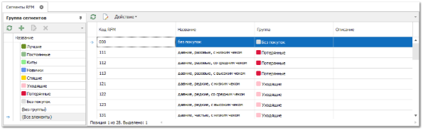

 **Параметры**

Содержит ранее заданные параметры анализа. Кнопка **Изменить параметры** позволяет открыть окно **Параметры RFM-анализа**, для внесения изменений.

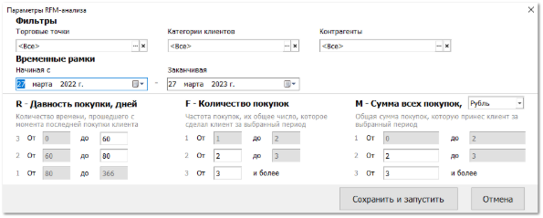

 **Табличная часть**

Содержит перечень контрагентов и полученные в процессе построения анализа данные.

- **Клиент** – контрагент, для которого производился анализ. При нажатии происходит переход в карточку контрагента;

- **Дата создания контрагента** – дата создания карточки контрагента в базе данных;

- **Категория клиента** – значение поля **Актуальная категория** из карточки контрагента;

- **Статус клиента** – значение поля **Статус клиента** из карточки контрагента;

- **Дата последней покупки** – дата последней проведенной РН;

- **Количество дней с даты последней покупки** – разница между датой конечного временного интервала, выбранного в **Параметрах RFM-анализа** и значением колонки **Дата последней покупки**;

- **Ранг (Recency)** – числовое значение ранга, который был вычислен с учетом заданных параметров;

- **Количество покупок** – общее количество проведенных РН за выбранный период;

- **Ранг (Frequency)** – числовое значение ранга, который был вычислен с учетом заданных параметров;

- **Сумма покупок** – общая сумма выбранных документов за заданный временной интервал. Высчитывается на основании поля **Сумма итого** выбранных РН;

- **Ранг (Monetary)** – числовое значение ранга, который был вычислен с учетом заданных параметров;

- **Расчетный код RFM** – совокупность значений рангов;

- **Название сегмента (расчетного)** – название сегмента, соответствующее полученному **Расчетному коду RFM**;

- **Группа сегмента (расчетного)** – название группы сегмента;

- **Текущий код RFM** – текущее значение свойства **RFM-сегмент** из карточки контрагента;

- **Название сегмента (текущего)** – текущее значение свойства **RFM-группа** из карточки контрагента.

 **Диаграммы**

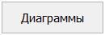

Позволяет отобразить результаты анализе в виде двух диаграмм:

- **Контрагенты по группам RFM** – круговая диаграмма, которая отображает распределение клиентов по **Группам сегментов RFM** и их процентное соотношение (Доля, %). Диаграмма строится на основании цветов **Групп сегментов**;

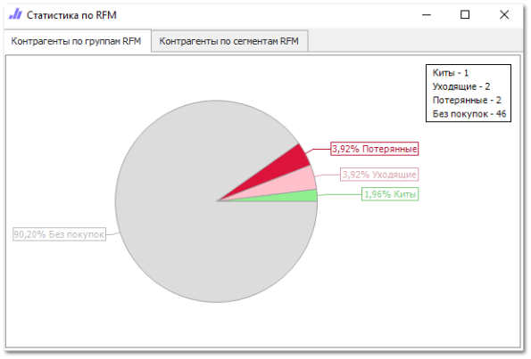

- **Контрагенты по сегментам RFM** – гистограмма, которая отображает количество клиентов в каждом сегменте.

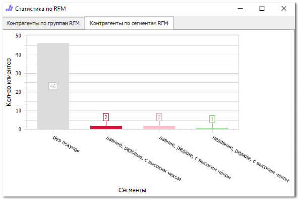

 **Применить к контрагентам**

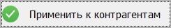

Кнопка **Применить к контрагентам** позволяет передать полученные в ходе анализа данные в карточку контрагента.

После выполнения команды в карточке клиента на вкладке **Контрагент** блок **Дополнительно** будут заполнены значения полей **RFM-группа** и **RFM-сегмент** на основании соответствующих полей анализа: **Расчетный код RFM** и **Группа сегмента (расчетного)**. Передача будет осуществляться для всех контрагентов, в результате переноса отобразится диалоговое окно с информацией о количестве переданных данных.

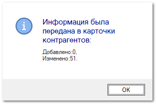