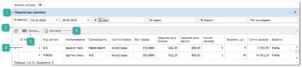
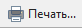
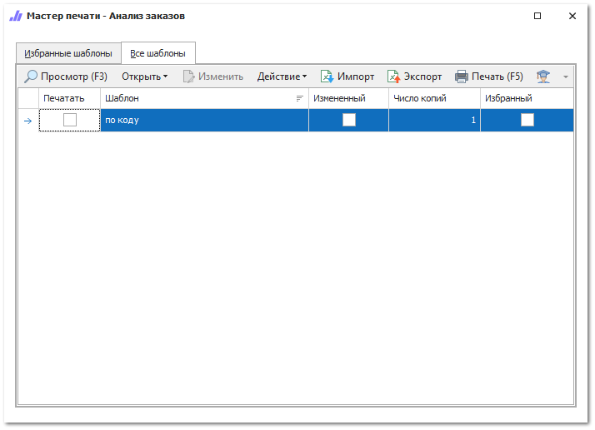
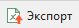

Чтобы сформировать отчет **Анализ заказов клиентов** выполните следующие действия:

**»** Откройте раздел **Отчеты и анализ** ► **Анализ заказов клиентов**. Отобразятся элементы выбранного пункта.

**»** Задайте параметры анализа. Отчет по заданным параметрам будет сформирован автоматически.

 **Параметры анализа**

Позволяет задать параметры для проведения **Анализа заказов клиентов**. 

- **За период** – период, за который будет сформирован отчет;

- **По коду** – в отчете будут отображены все артикулы товаров из документов **Заказы клиентов** за выбранный период;

- **По марке** – в отчете будут отображены все марки автомобилей из документов **Заказы клиентов** за выбранный период;

- **По модели** – в отчете будут отображены все модели автомобилей из документов **Заказы клиентов** за выбранный период;

- **По поставщику** – в отчете будут отображено количество заказов каждому поставщику за выбранный период.

 **Обновить**

Кнопка позволяет обновить данные в табличной части.

 **Печать**

Позволяет сформировать печатный документ по доступным шаблонам.

 **Экспорт**

Позволяет сформировать файл в формате **.xls** и **.xlsx**.

 **Табличная часть**

В зависимости от выбранного параметра формирования отчета, табличная часть содержит различный набор колонок:

Отчет сформированный **По коду**:

- **ID товара** – уникальный идентификатор товара;

- **Код детали** – артикул товара из **Заказа клиента**;

- **Наименование** – название товара;

- **Производитель** – наименование производителя товара;

- **Группа товара** – группа товара из справочника;

- **Вес товара** – вес товара из справочника;

- **Средняя цена продаж** – цена, рассчитываемая делением суммы **Цена продажи (с НДС)** за проданный товар из всех документов **Заказы клиентов** на количество единиц проданного товара;

- **Средняя цена закупа** – цена, рассчитываемая делением суммы **Закупочная цена (с НДС)** по всем **Приходам** из которых был реализован товар на количество единиц проданного товара;

- **Кол-во заказов** – количество **Заказов клиентов**, в котором фигурировал товар;

- **Заказано, шт** – общее количество товара во всех **Заказах клиентов**;

- **Сумма заказов** – общая сумма по товару в **Заказах клиентов**;

- **Валюта** – валюта документа **Заказ клиента**.

Отчет сформированный **По марке**:

- **Марка** – наименование марки автомобиля клиента из справочника **Автомобили**;

- **Кол-во заказов** – количество **Заказов клиентов** на данную марку автомобиля;

- **Средний год выпуска** – средний год выпуска автомобиля, считается как среднее значение из поля **Год выпуска** из справочника **Автомобили**;

- **Сумма заказов** – сумма заказанного товара за заданный период для автомобиля данной марки;

- **Валюта** – валюта документов **Заказы клиентов**, в которых фигурировал автомобиль.

Отчет сформированный **По модели**:

- **Марка** – наименование марки автомобиля клиента из справочника **Автомобили**;

- **Модель** – наименование модели автомобиля клиента из справочника **Автомобили**;

- **Кол-во заказов** – количество **Заказов клиентов**, в которых фигурировал автомобиль;

- **Средний год выпуска** – средний год выпуска автомобиля, считается как среднее значение из поля **Год выпуска** из справочника **Автомобили**;

- **Сумма заказов** – сумма заказанного товара за заданный период для автомобиля данной марки и модели;

- **Валюта** – валюта документов **Заказы клиентов**, в которых фигурировал автомобиль.

Отчет сформированный **По поставщику**:

- **Поставщик** – наименование поставщика из документа **Заказ поставщику**;

- **Кол-во заказов поставщику** – количество заказов данному поставщику за заданный период;

- **Заказано, шт.** – общее количество товаров, заказанных поставщику за заданный период;

- **Средняя цена продаж** – цена, рассчитываемая делением суммы **Цена продажи (с НДС)** за проданный товар из всех документов **Заказы клиентов** на количество единиц проданного товара;

- **Средняя цена закупа** – цена, рассчитываемая делением суммы **Закупочная цена (с НДС)** по всем **Приходам** из которых был реализован товар на количество единиц проданного товара;

- **Сумма заказов** – общая сумма заказов поставщику за заданный период;

- **Валюта** – валюта из документов **Заказы поставщику**.

::: details Читайте также

- [Документы Заказы клиентов](../../../specification/crm/zakazy_klientov.md)

- [Справочник Товары](../../../specification/tovary_i_tseny/tovary/README.md)

- [Справочник Автомобили](../../../specification/crm/avtomobili/README.md) 

:::