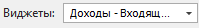

::: info Примечание

Доступ к разделу **Дашборд** и его отдельным виджетам регулируется соответствующим разрешением в разделе **Управление ► Настройки программы ► Роли пользователей ► блок Разрешения для роли пользователей ► Отчеты ► Дашборд**. По умолчанию раздел доступен всем пользователям.

:::

::: note Замечание

Изменить начальную страницу программы можно в разделе **Управление ► Настройки программы**, вкладка **Пользователи ► Настройки пользователя ► Основные**, настройка **Главная страница**.

:::

При открытии раздела виджеты автоматически формируются на странице по временному промежутку, заданному в разделе **Управление** **► Настройки программы ► Роли пользователей ► блок Разрешения для роли пользователей ► Отчеты ► Дашборд**.

 **Обновить** 

Позволяет обновить вкладку с виджетами.

 **Новый** 

Позволяет добавить новый виджет с типом: **Доходы**, **Прибыль**, **Продажи**, **Расходы**.

 **Виджеты** 

Позволяет включить/отключить видимость виджетов на вкладке.

 **Настройки** 

Позволяет выполнить команды:

- **Открыть общие настройки** – позволяет изменить параметры формирования всех виджетов. 

::: info Примечание

Команда **...** – **Настройки**, на панели инструментов отдельного виджета, позволяет изменить параметры формирования выбранного виджета.

:::
- **Упорядочить виджеты** – позволяет сбросить расположение виджетов до начального;

- **Сбросить настройки виджетов** –  позволяет сбросить настройки виджетов до значений по умолчанию.

 **Действия**

Для каждого виджета доступны команды:

- **Обновить** – позволяет обновить выбранный виджет;

- **Настройки** – команда для открытия настроек, с помощью которых можно менять параметры формирования выбранного виджета;

- **Скрыть** – позволяет отключить видимость выбранного виджета на вкладке;

- **Удалить** – команда для удаления выбранного виджета.

 **На весь экран/Восстановить**

Позволяет открыть виджет во всю вкладку **Дашборд**/восстановить размер виджета до прежнего размера.

**»** Для изменения параметров формирования виджетов откройте вкладку **Общие настройки**, с помощью команды **Открыть общие настройки**.

 **Дата от**

Позволяет задать дату начала отчетного периода для построения виджета.

 **Дата до**

Позволяет задать дату окончания отчетного периода для построения виджета.

 **Наши фирмы**

Позволяет осуществить выбор наших фирм, по которым будут отображены данные.

 **Торговые точки**

Позволяет осуществить выбор торговых точек, по которым будут отображены данные.

 **Валюта**

Позволяет осуществить выбор валюты из справочника **Валюты и курсы**, в которой будут отображены данные на виджете.

 **Применить**

Позволяет сохранить заданные параметры для построения виджетов.

 **Скрыть**

Позволяет скрыть панель настройки параметров виджетов.

**»** Задайте необходимые параметры построения виджетов и нажмите кнопку **Применить**. В результате все виджеты на странице будут обновлены в соответствии с заданными параметрами.

::: details Читайте также

- [Добавление складов и торговых точек](../../svoe_nalichie/dobavlenie_skladov_i_torgovykh_tochek.md)

- [Справочник Валюты и курсы](../../../specification/finansy/valjuty_i_kursy/README.md) 

:::