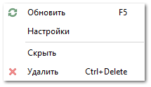

::: info Примечание

Доступ к разделу **Дашборд** и его отдельным виджетам регулируется соответствующим разрешением в разделе **Управление ► Настройки программы ► Роли пользователей ► блок Разрешения для роли пользователей ► Отчеты ► Дашборд**. По умолчанию раздел доступен всем пользователям.

:::

::: note Замечание

Изменить начальную страницу программы можно в разделе **Управление ► Настройки программы**, вкладка **Пользователи ► Настройки пользователя ► Основные**, настройка **Главная страница**.

:::

На виджете **Прибыль – Разница доходов и расходов** отображаются доходы и расходы, а также прибыль. Прибыль высчитывается как разница между доходами и расходами.

 **Действия**

Позволяет выбрать действие для работы с виджетом:

- **Обновить** – позволяет обновить виджет;

- **Настройки** – позволяет открыть вкладку **Настройки виджета**;

- **Скрыть** – позволяет скрыть виджет;

- **Удалить** – позволяет удалить виджет.

Настройки для формирования виджета:

 **Фильтры**

Блок содержит параметры:

- **Дата от** – дата начала отчетного периода для построения виджета;

- **Дата до** – дата окончания отчетного периода для построения виджета;

- **Наши фирмы** – выбор наших фирм, по которым будут отображены данные;

- **Торговые точки** – выбор торговых точек, по которым будут отображены данные;

- **Валюта** – выбор валюты из справочника **Валюты и курсы**, в которой будут отображены данные на виджете.

 **График**

Блок содержит параметры:

- **Группировка** – при проставлении флажка диаграмма будет иметь столбчатый вид. Построение будет выполняться с использованием данных из настройки **Показать данные по**;

- **Динамика** – при проставлении флажка диаграмма будет иметь линейный вид. Построение будет выполняться с использованием данных из настроек **Показать данные по** и **Построить график по**;

::: info Примечание

Флажки **Группировка** и **Динамика** являются взаимоисключаемыми. Построить виджет можно с использованием только одного из параметров.

:::
- **Построить график по** – варианты отображения данных виджета. Доступные значения по: **Дням**, **Неделям**, **Месяцам**.

::: details Читайте также

- [Журнал Финансовые транзакции](../../../specification/upravlenie/zhurnaly/finansovye_tranzaktsii.md)

- [Добавление складов и торговых точек](../../svoe_nalichie/dobavlenie_skladov_i_torgovykh_tochek.md)

- [Справочник Валюты и курсы](../../../specification/finansy/valjuty_i_kursy/README.md)

- [Справочник Статьи расходов/доходов](../../../specification/finansy/stati_rashodov_dohodov.md)

- [Справочник Счета и кассы](../../../specification/finansy/scheta_i_kassy.md)

- [Настройки программы - Роли пользователей - Справочники - Счета и кассы](../../../specification/upravlenie/nastrojki_programmy/roli_polzovatelej/spravochniki/scheta_i_kassy.md) 

:::