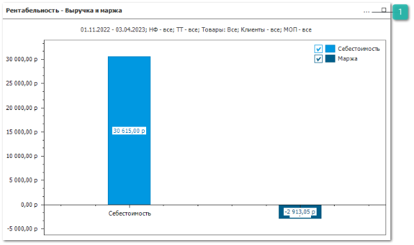
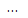
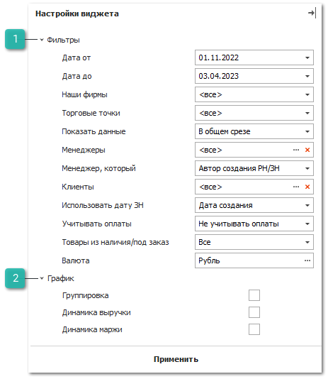

::: info Примечание

Доступ к разделу **Дашборд** и его отдельным виджетам регулируется соответствующим разрешением в разделе **Управление ► Настройки программы ► Роли пользователей ► блок Разрешения для роли пользователей ► Отчеты ► Дашборд**. По умолчанию раздел доступен всем пользователям.

:::

::: note Замечание

Изменить начальную страницу программы можно в разделе **Управление ► Настройки программы**, вкладка **Пользователи ► Настройки пользователя ► Основные**, настройка **Главная страница**.

:::

На виджете **Рентабельность – Выручка и маржа** отображается информация о продажах (маржа по всем товарам и по товарам из наличия и под заказ). Данные для виджета берутся из **Сводного отчета о прибыли по менеджерам** и журнала **Товарные транзакции**.

 **Действия**

Позволяет выбрать действие для работы с виджетом:

- **Обновить** – позволяет обновить виджет;

- **Настройки** – позволяет открыть вкладку **Настройки виджета**;

- **Скрыть** – позволяет скрыть виджет;

- **Удалить** – позволяет удалить виджет.

Настройки для формирования виджета:

 **Фильтры**

Блок содержит параметры:

- **Дата от** – дата начала отчетного периода для построения виджета;

- **Дата до** – дата окончания отчетного периода для построения виджета;

- **Фирмы** – выбор наших фирм, по которым будут отображены данные;

- **Торговые точки** – выбор торговых точек, по которым будут отображены данные;

- **Показать данные по** – способ подсчета и отображения графика. Доступные значения:

    - **В общем срезе** – построение виджета будет выполняться по общим показателям маржи и выручки, в соответствии с выбранным значением остальных настроек, без детализации по фирмам, торговым точка и менеджерам;

    - **По фирмам** – построение виджета будет выполняться по **Нашим фирмам**;

    - **По торговым точкам** – построение виджета будет выполняться по торговым точкам;

    - **По менеджерам** – построение виджета будет выполняться по менеджерам.

- **Менеджеры** – выбор менеджеров, по которым будет построен виджет;

::: info Примечание

При построении виджета по **Менеджерам** необходимо в поле **Менеджер который** выбрать, кем должен являться менеджер для того, чтобы данные по нему были учтены.

:::
- **Менеджер который** – выбор роли менеджера для построения виджета. Доступные значения:

    - **Автор документа**;

    - **Автор проводки документа**;

    - **Ответственный менеджер**.

- **Клиенты** – выбор клиентов из справочника **Контрагенты**, по которым будут отображены данные

- **Использовать дату ЗН** – выбор из выпадающего списка значения, которое задает какую дату **Заказ-наряда** система должна использовать для построения виджета. Для выбора доступны значения: **Дата создания**, **Дата начала работ**, **Дата завершения работ**, **Дата закрытия**;

- **Учитывать оплаты** – выбор условия оплаты документов для построения виджета. Доступные значения:

    - **Не учитывать оплаты** – в построении виджета будут участвовать все документы **Расходная накладная** и **Заказ-наряд** из журнала **Товарных транзакций**;

    - **Только полностью оплаченные РН и ЗН –** в построении виджета будут участвовать только документы **Расходная накладная** и **Заказ-наряд** из журнала **Товарных транзакций**, по которым сумма долга равна 0.

- **Товары из наличия/под заказ** – выбор товаров, по которым будут отражены данные по выручке и марже в виджете. Доступен выбор значений: **Все**, **Из наличия** и **Под заказ**. При построении отчета будет анализироваться дата создания **Заказов клиента** и **Приходных накладных** по этим товарам;

- **Валюта** – выбор валюты из справочника **Валюты и курсы**, в которой будут отображены данные на виджете.

 **График**

Блок содержит параметры:

- **Группировка** – флажок ставится для построения диаграммы с областями по выручке и марже, используя данные настройки **Построить график по**;

- **Динамика выручки** – флажок ставятся для построения линейного графика только по выручке, используя данные из настроек **Показать данные по** и **Построить график по**;

- **Динамика маржи** – флажок ставятся для построения линейного графика только по марже, используя данные из настроек **Показать данные по** и **Построить график по**;

::: info Примечание

Флажки **Группировка**, **Динамика выручки** и **Динамика маржи** являются взаимоисключаемыми. Построить виджет можно с использованием только одного из параметров.

:::

- **Построить график по** – варианты отображения данных виджета. Доступные значения по: **Дням**, **Неделям**, **Месяцам**.

::: info Примечание

Параметр **Построить график** **по** становиться доступным после проставления флажка в одном из пунктов: **Группировка**, **Динамика выручки**, **Динамика маржи**.

:::

::: details Читайте также

- [Сводный отчет о прибыли по менеджерам](../otchety_po_pribyli/svodnyj_otchet_o_pribyli_po_menedzheram.md)

- [Журнал Товарные транзакции](../../../specification/upravlenie/zhurnaly/tovarnye_tranzaktsii.md)

- [Журнал Финансовые транзакции](../../../specification/upravlenie/zhurnaly/finansovye_tranzaktsii.md)

- [Добавление складов и торговых точек](../../svoe_nalichie/dobavlenie_skladov_i_torgovykh_tochek.md)

- [Справочник Контрагенты](../../../specification/crm/klienty/kategorii_klientov.md)

- [Справочник Валюты и курсы](../../../specification/finansy/valjuty_i_kursy/README.md)

- [Справочник Статьи расходов/доходов](../../../specification/finansy/stati_rashodov_dohodov.md)

- [Справочник Счета и кассы](../../../specification/finansy/scheta_i_kassy.md)

- [Настройки программы - Роли пользователей - Справочники - Счета и кассы](../../../specification/upravlenie/nastrojki_programmy/roli_polzovatelej/spravochniki/scheta_i_kassy.md) 

:::